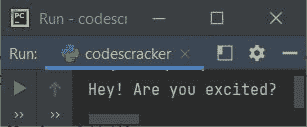
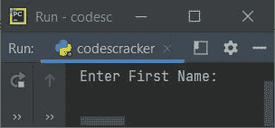
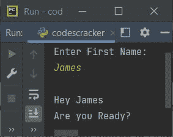

# Python 编程教程

> 原文：<https://codescracker.com/python/index.htm>

欢迎来到 Python 编程的世界。在这里，您将学习 Python，不仅通过理论，还通过代码。也就是说，每当这个主题需要实际的程序时，我都将它们和它们各自的输出包含在一起。

**注意:**这里所有用 Python 写的代码都是用 Python 最流行的 ide 之一测试过的，名为 **PyCharm** 。

**注:**在开始 Python 编程的教程之前，我们先来非常仔细地阅读一下 这里提供的所有东西，了解一下关于 Python 编程的一切，以及一些与 Python 相关的有趣的 问题。我知道这会花费你关键的时间，但是相信我，你是在<u>投资 你的时间在正确的道路上</u>。

所以在开始系列 Python 编程教程之前，我们先来看看一些用 Python 写的世界级应用，或者一些使用 Python 编程的大型跨国公司(MNC)。

### 用 Python 编写或使用 Python 的应用程序

在 IT 领域，顶级公司之一 Google 使用 Python 进行系统管理和系统构建。有大量用 Python 编程语言编写或使用 Python 编程语言的应用程序。以下是世界各地一些著名的应用程序列表:

*   **YouTube** 使用 Python 编程作为其后端(服务器端)开发，还有一些 其他语言是 [C](/c/index.htm) 、 [C++](/cpp/index.htm) ，或者 [Java](/java/index.htm) ，还有 Go。
*   **Google** 使用 Python 编程作为其后端，还有其他语言如 C、C++、 Java、Go、Node。
*   尽管 PHP 是**脸书**的核心语言，他们也使用 Python 作为其后端 开发，以及其他语言如 C++、Java、PHP (HHVM)、Hack、Erlang、D、XHP 和 Haskell。
*   同样，**雅虎**， **Pinterest** ， **Spotify** ， **Dropbox** ，**网飞**， **Reddit** 等。也用 Python。

甚至 **NASA** 和 **SpaceX** 也将 Python 编程语言用于许多目的，如测试、自动化等。

<u>如果这些跨国公司都用 Python，那么背后一定有很大的原因</u>。那些大道理都涵盖在 *里 Python 是用来做什么的？*一节，下面给出。很多时候，许多公司使用 Python 是因为它的多功能性和 灵活性。

## Python 是什么？

Python 是:

*   一个解释的高层
*   多用途的
*   面向对象的
*   程序的
*   功能的
*   结构化的
*   和反思

编程语言。在进入[之前，先简要介绍一下 Python 语言](/python/python-history.htm)的历史，也就是说，这种语言是由谁、在哪里、何时开发的。下面说一些 的问题，很多初学者在开始学习 Python 之前都会问。

我已经回答了所有这些与 Python 编程相关的问题，这提供了对这种语言的清晰理解，以及为什么使用这种语言和为了什么使用这种语言。

也就是说，如果你正在学习 Python 或者想要学习 Python，那么必须知道一件事，那就是，<u>投入时间学习 Python 编程好吗？</u>
让我们一探究竟。

### 为什么要学习 Python 编程？

尽管下面(在本节之后)提供了许多学习或启发您学习 Python 编程的原因，但主要原因是:

*   它有一个广泛的社区，这意味着如果在用 Python 编写程序或做任何项目或用 Python 做任何事情时出现任何问题。你可以在任何地方通过互联网找到并获得解决方案，因为它有大量的社区。
*   Python 有大量的库可以满足你的所有需求。
*   Python 是一种高度灵活的语言，这意味着它可以用来开发一个具有多种用途的程序。
*   Python 程序的开发速度比其他语言更快，因为它使用的代码更少，效率更高。

**注:** Python 是全世界需求量最大的语言之一。

### Python 是用来做什么的？

Python 可以用于许多目的，其中包括一些常见的目的:

*   web 开发: Python 也在 Web 开发领域有所发展。使用 Python 著名的 web 框架，如 *Django* 或 *Flask* ，你可以为你的网站编写快速且 安全的后端代码。在 Python 提供的所有 web 框架中，Django 是最著名和使用最广泛的。此外，它还具有高度的可扩展性。甚至 Django，像全栈 web 框架，也可以用于前端。
*   **数据科学:** Python 编程还有助于开发一个应用程序，该应用程序可以从各种应用程序的非结构化和结构化数据中提取知识 和见解。 *Scrapy* 是 Python 中使用最多的数据科学库之一，用于**数据挖掘**。如今，许多窃取者也在开发 web 废弃应用程序，从互联网上抓取东西。 *NumPy* 、 *Pandas* 和 *TensorFlow* 是三个最流行的用于**数据处理和建模**的 Python 数据 科学库。
*   **机器学习:** **NumPy** 和 **SciPy** 是 在使用 Python 的机器学习领域可以使用的两个著名的 Python 库。基本上，机器学习是迈向人工智能的一步 。就像人类学习一样，在你或我学习的地方，机器 也可以使用数据统计和你想提供的任何东西来学习。
*   人工智能:这是我认为 Python 几乎统治了所有其他 编程语言的领域。随着 Python 成为人工智能的趋势，我认为它是该领域使用最多的 语言。在使用 Python 的人工智能领域，*熊猫*和 *SciPy* 是最著名和最广泛使用的 库。
*   **数据可视化:** Python 编程也可以用来创建数据可视化 应用。数据可视化是指以图形的形式表示数据或信息。 *Matplotlib* 是可以用于 Python 中数据可视化的著名库之一。
*   **操作系统应用:**命令行 应用、系统管理、业务应用等操作系统的应用。，也可以使用 Python 编程语言开发。
*   **Python 中的桌面 GUI:***Tkinter*是著名的 Python 编程包 之一，可用于开发桌面图形用户界面(GUI)应用。
*   **移动应用开发:** *Kivy* 是用于 使用 Python 编程开发移动应用的著名框架之一。
*   视频游戏开发: Pygame 是一个用 Python 编写的库，用来开发多媒体相关的 东西，比如视频游戏。游戏的脚本引擎也可以用 Python 编程编写。
*   **机器人:**机器人也可以使用 Python 编程来创建。机器人有助于在互联网上或程序员需要部署的任何地方部署 自动化任务。机器人只在 预定义的任务上工作。

也就是说，Python 编程的主要用途是开发应用程序，用于:

*   测试
*   监视
*   任务自动化
*   数据分析
*   数据可视化
*   科学应用
*   等等。

### Python 好学吗？

这取决于你的技能。这意味着，如果你对任何编程语言都有基本的了解，比如 C、C++或 Java 等。，那么学习 Python 对你来说就成了一件轻而易举的事情。也就是说，理解用 Python 写的代码变得非常容易。

唯一的区别就是理解它的语法，像 Python 中使用的 [for loop](/python/python-for-loop.htm) ，和这些语言有很大的区别。条件语句也是不同的。它应该是，因为它是一种不同的语言。但是所有 事物的主要工作或任务像[循环](/python/python-loops.htm)或语句或任何其他事物像 [功能](/python/python-functions.htm)、[类](/python/python-classes-objects.htm)等。， 也是一样。

所以，如果你对任何编程语言都有基本的掌握，那么学习 Python 就像学习 [HTML](/html/index.htm) 。但是有时候你理解 代码会有一些困难。但是不要担心，我已经写了这里给出的每一个代码的解释。

如果你以前从未学过任何语言，那么你不必担心。因为 Python 是如此简单，甚至用 Python 中的[打印 Hello World 也可以使用一条语句来完成，如下所示，不像大多数其他语言需要 多行代码，甚至打印你的名字也是如此:](/python/program/python-program-print-hello-world.htm)

```
print("Hello World")
```

就是这样；这将在屏幕上打印字符串“Hello World”。现在你已经理解了这种语言的简单性。所以，不管你是谁，只要毫不犹豫地开始系列。也就是说，这里用 Python 编写的所有程序对初学者来说也很容易理解，因为我已经解释了每一个代码及其输出。而且相信我，大多数时候，不用看代码的解释，你就能理解代码。

有时候，当我在读用 Python 写的代码时，感觉就像在读一本书。这看起来像一个笑话，但是相信我，过一段时间，你也会意识到我为什么这么说。

### 学习 Python 需要多少时间？

好吧，这取决于你，你想在 Python 中深入多长时间或多深。但是 Python 的基础版本大多可以在一周、一个月或两个月内学会，这取决于你的技能。如果你是一名程序员，那么完成 Python 的基础知识几乎不需要 2 个月。

但是要成为专业人员或者成为 Python 的专家程序员，你需要给它一些时间。此外，你需要练习这里给出的每一个代码以及你自己练习的代码。

### Python 适合初学者吗？

结果，因为 Python 程序不那么罗嗦，所以对于初学者来说也更容易理解。在看到更少的代码来做一个程序后，更多的信心会自动在初学者的头脑中建立起来。Python 本质上提供了类似英语的代码，有时候感觉像是在看书。例如，下面给出的代码在 Python 中添加了两个数字:

```
a = 10
b = 20
sum = a+b
print(sum)
```

如果你看代码，就像，a 等于 10，b 等于 20，sum 等于 a+b，最后打印出总和。也就是 a+b 变成了 10+20，所以 30 就是上面的程序使用 [print()](/python/python-print-statement.htm) 函数产生的输出。就是这样。看到 Python 有多简单了吧？ 上面的程序也可以写成:

```
a, b = 10, 20
print(a+b)
```

上面给出的两个程序都产生 30 个输出。你看，Python 多简单。如果你没听懂，不要担心第二个节目或整个节目的第一句话。因为这只是一个演示，所以在接下来的教程中，您将逐一了解用 Python 编写的代码的各个方面。

### Python 为什么这么受欢迎？

因为它的灵活性、可伸缩性、快速开发和优异的性能。此外，Python 的受欢迎程度与日俱增，因为它是一种简单易学的编程语言，语法也很简单。

我认为，这个问题的答案已经在 Python 有什么用途一节中介绍过了。，这使得 Python 成为如此受欢迎的语言。

#### Python 可以用于黑客攻击吗？

是的，在开发用于黑客目的的代码时，Python 是一种非常强大的语言。我必须告诉你，Python 是全世界黑客最喜欢使用的语言之一。它是一种开源语言，有大量的库。

由于我已经回答了在开始 Python 系列教程之前必须要问的所有问题，现在是时候了解 Python 的背景，该语言是由谁、何时、何地开发的，以及所有这些细节。

## Python 是谁开发的？

Python 是由荷兰程序员吉多·范·罗苏姆开发的。

## Python 是在哪里开发的？

Python 是由 Centrum wisk unde & Informatica(CWI)开发的，这是一个全国性的数学和计算机科学研究机构。该研究所位于荷兰阿姆斯特丹科学园。这个研究所通常被称为 Python 编程语言的创建者网站。

## Python 是什么时候创建的？

Python 于 1991 年 2 月 20 日首次出现。

## Python 源代码的文件扩展名是什么？

Python 允许使用多个扩展名来命名文件。这里我提供了三种文件扩展名，可以用来命名用 Python 编写的源代码或程序:

*   **。py**——最常见的文件扩展名。我在这里创建的所有 Python 程序中都使用了这个扩展。
*   **。pyi**
*   **。pyw**

比如 **codescracker.py**

#### Python 受到了哪些语言的影响？

Python 受到了许多编程语言的影响，包括 C、C++、Java、Perl、Ada 和 Lisp 等等。

#### 哪些语言受到 Python 的影响？

Python 影响了大量的编程语言，包括 [JavaScript](/js/index.htm) 、Ruby、Swift 和 Go 等等。

### Python 简史

第一个发布的 Python 版本是 1991 年在 T2 发布的 Python 0.9.0。Python 2.0 在差不多 19 年后，也就是 2000 年 10 月 16 日发布。而 Python 3.0 发布于 2008 年，比 2.0 版本晚了八年。

**注:**Python 2 在 2020 年随着 Python 的 2.7.18 版本停产。

**注:**今天是 2021 年 9 月 02 日。而且截至目前，Python 的最新版本是 Python 3.9.6，发布于 2021 年 6 月 28 日。但正如官方所说，今天又有一个最新版本的 Python 要来了，那就是 Python 3.11.0a0，所以，在你看这篇文章的同时，可能看到的是这个版本或者最新版本。

**注:**Python 2.0(2000 年 10 月 16 日)-Python 2 . 7 . 18(2020 年 4 月 20 日)。Python 3.0(2008 年 12 月 3 日发布)-Python 3 . 9 . 6(2021 年 6 月 28 日)并继续前进...

### Python 的设计理念是什么？

这是在设计或开发“Python”语言时要记住的核心或主要方面的列表。也就是说，Python 的主要设计理念是:

*   漂亮总比丑陋好
*   简单比复杂好
*   显性比隐性好
*   复杂总比复杂好
*   扁平的比嵌套的好
*   稀疏比密集好
*   现在总比没有好
*   还有更多

### 一些著名的 Python IDEs

为了用 Python 编程或者使用 Python 开发应用程序，我们需要一个集成开发环境，或者简而言之，一个 IDE。因此，我提供了一个专门用于 Python 编程的著名 ide 列表。下面给出了 IDE 的列表以及它们的基本细节，比如 IDE 占用了多少磁盘空间，IDE 是用哪种语言编写的等等。：

| 集成驱动电子设备 | 磁盘空间(MB) | 写于 | 支持的操作系统 |
| 皮查姆 | 600-800 | Python 和 Java | Windows、MacOS、Linux |
| 黯然失色 | 150-200 | Java 和 C | Windows、MacOS、Linux |
| PyScripter | 50-150 | Python，Delphi，Object Pascal | Windows 操作系统 |
| 原子 | 87-180 | CoffeeScript、JavaScript、Less | Windows、MacOS、Linux |
| Spyder | 50-100 | Python, Qt | Windows、MacOS、Linux |

Python 的其他 ide 有 Emacs、PyDev、MS Visual Studio、Thonny 和 Wing 等。

**注意:** PyCharm 是 Python 最流行的 IDE。在过去的 4-5 年里，我一直在使用这个 IDE。

### Python 编程的著名 Web 框架

Python 中有很多可用的框架。但是首先，让我们回顾一些最著名和最广泛使用的 Python web 框架。

#### Python 全栈 Web 框架

下表仅列出了一些著名的 Python 全栈 web 框架。全栈 web 框架是指既用于后端开发又用于前端开发的框架。让我们来看看:

| 结构 | 开发者 | 许可证 |
| 姜戈 | Django 软件基金会 | 加州大学伯克利分校软件(Berkeley Software Distribution) |
| Web2py | 开源软件，马西莫·迪·皮埃罗 | GNU LGPLv3 |
| 涡轮齿轮 | 凯文·丹古尔，马克·拉姆 | 麻省理工学院，LGPL |

**注:**综上所述， **Django** 是 Python 中开发小型和大型 web 应用程序最常用的 web 框架。

#### Python 的非全栈 Web 框架

这一次，下表列出了两个众所周知的用于 Python 的非全栈 web 框架。非全栈 web 框架仅设计用于构建小型应用程序。

| 结构 | 开发者 | 许可证 |
| 瓶 | 阿明·罗纳彻 | 加州大学伯克利分校软件(Berkeley Software Distribution) |
| 樱桃派 | 罗伯特·布鲁尔 | 加州大学伯克利分校软件(Berkeley Software Distribution) |

**注:**综上所述， **Flask** 是 Python 中开发小型 web 应用最常用的 web 框架。

对于图形框架，使用这两个著名框架中的任何一个，即 **PyGame** 和 **Panda3d** 。

## Python 编程演示代码

由于上面已经介绍了 Python 编程的所有重要细节，所以让我们来看看用 Python 编写的一些代码。这些代码是给你看 Python 的演示的。你将在接下来的章节中了解一切。

```
print("Hey! Are you excited?")
```

产生完全相同的输出，如下面给出的快照所示。



**注意:**在下一章中，你将学习如何建立一个 [Python 环境](/python/python-environment-setup.htm)，演示如何编写和执行 Python 代码 。

下面是用 Python 编写的另一段代码:

```
print("Enter First Name: ")
name = input()
print("\nHey", name, "\nAre you Ready?")
```

该程序产生以下输出。该快照显示了上述 Python 代码产生的初始输出:



现在输入你的名字，说**詹姆斯**，然后按`ENTER`键查看以下输出:



**注意:**我已经单独用 Python 写了一个关于 [接收用户输入的深入教程。](/python/program/python-program-get-input-from-user.htm)

**注:**学习 Python 无需阅读理论，即通过阅读代码及其输出， 从 [Python 编程实例](/python/program/index.htm)开始。我用 Python 写了差不多 几千行代码。那很有帮助。但是我推荐你先看教程。 因为本教程包含了关于该主题的所有必要信息，以及一个示例 代码及其输出。

## Python 编程的热门话题

以下是 Python 编程语言的一些热门话题:

*   [Python 基本语法](/python/python-basic-syntax.htm)
*   [Python print()语句](/python/python-print-statement.htm)
*   [Python end (end=)参数](/python/python-end.htm)
*   [Python sep (sep=)参数](/python/python-sep.htm)
*   [Python 评论](/python/python-comments.htm)
*   [Python 运算符](/python/python-operators.htm)
*   [Python 如果... 否则如果...否则](/python/python-if-else-elif-statements.htm)
*   [Python for 循环](/python/python-for-loop.htm)
*   [Python while 循环](/python/python-while-loop.htm)
*   [Python break 语句](/python/python-break-statement.htm)
*   [Python 继续语句](/python/python-continue-statement.htm)
*   [Python range()函数](/python/python-range-function.htm)
*   [巨蟒日期&时间](/python/python-date-time.htm)
*   [Python 文件处理](/python/python-file-io.htm)
*   [Python open()函数](/python/python-open-function.htm)
*   [Python 类&对象](/python/python-classes-objects.htm)

## 开始 Python 教程之前给观众的消息

本 Python 编程教程是为所有想学习 Python 的人设计的。因此，如果你也对 Python 感兴趣，那么就跟随教程吧。

本教程是为所有人设计的——也就是初学者、中级 Python 程序员和那些希望提高自己在该领域的专业知识的人。

**注:**我在每一章中都尽可能多地包含了代码，以便为您提供最佳的理论和实践学习体验。需要时，所有代码都与各自的输出一起编写。

注意:我在这里写的所有代码都使用 PyCharm IDE。

## 学习者的一些先决条件

Python 适合初学者。因此，你可以在没有任何先验知识的情况下，从这里开始学习 Python。

唯一的先验知识是基本的计算机技能，这是为 Python 设置环境所需要的，这将在下一章中解释。

但是，如果您已经掌握了任何编程语言的一些基本命令，那么请相信我，您学习 Python 的速度会随着您的编程熟练程度而提高。让我们开始吧。祝你好运！😀

[Python 在线测试](/exam/showtest.php?subid=10)

* * *

* * *