# Python 环境设置

> 原文：<https://codescracker.com/python/python-environment-setup.htm>

在本教程中，您将了解如何为 Python 设置执行或运行 Python 程序的环境。

## 如何运行或执行 Python 程序？

要执行 Python 程序，通常有两种选择，如下所示:

1.  使用 **Python IDLE** 直接执行 Python 程序
2.  使用任何 Python IDE 执行 Python 程序，如 **PyCharm**

**注意-** 在这一系列的 Python 教程中，所有的程序都是在 **PyCharm** IDE 下创建和执行的。

现在的问题是，*为什么要用 PyCharm？*。以下是一些可能满足这个问题的答案:

*   它是免费的
*   它很轻
*   最适合 Python
*   为 Python 编程提供了更多的功能
*   它使开发变得更加容易和高效
*   提供许多内置的开发工具
*   最重要的特点是，它提供智能编码辅助。

**注意-** 在**智能编码辅助**下，我们将获得代码的完成和检查，以及实时错误 突出显示和许多其他功能，这在编码时对您有很大帮助。甚至我使用这个 IDE 已经有 4-5 年了。

在我看来, **PyCharm** IDE 的唯一缺点是，它在你的计算机系统中占用大约 600-800 MB 的空间。 这里是文件夹属性的快照，其中安装的 PyCharm IDE 是可用的，显示了占用的总空间:

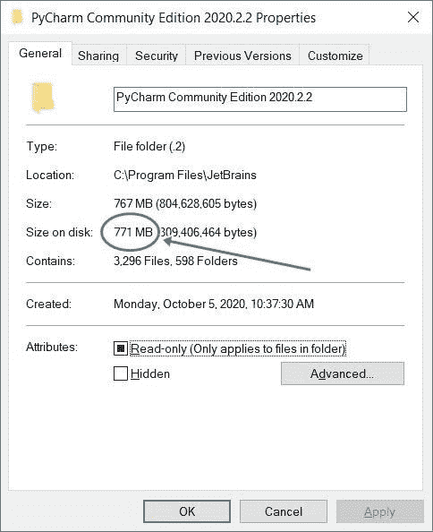

但是你不必担心大小。因为如果你的电脑规格不够，比如可用的存储空间不够。在那种情况下，我有一个解决办法。解决方法是 **Python IDLE** 。它需要大约 20-30 MB 的空间，能够直接执行 Python 程序。 安装 **Python IDLE** ，如本教程下面所述，并按照所有步骤使用这个非常轻量级的 Python 集成开发环境来设置环境。

### 使用 Python IDLE 进行环境设置

在这两种情况下，即直接使用 **Python IDLE** 或使用 **PyCharm IDE** 、 **Python** 软件 执行 Python 代码，都需要在你的 PC 上安装。也就是说， **Python** 软件必须在你的电脑中可用，以执行任何 Python 代码，无论是直接使用空闲的 ，还是使用任何虚拟 IDE，如 **PyCharm** 、 **Eclipse** 、 **PyDev** 或 **Spyder** 等。

因此，按照下面给出的所有步骤逐一安装和设置 **Python IDLE** ，这样你就可以运行或 执行你的 Python 代码了。

#### Python 空闲设置-步骤 1

因为，现在最新的 **Python** 版本是 **3.9.6** 。因此我从互联网上下载了这个开发软件。但是我建议你从网上下载最新版本的 **Python** 。

也就是从网上下载最新的 **Python** 。

**Note -** Download only from the official website "**python.org**".

**注意** -不要访问任何不知名的网站。

也就是打开网站**python.org**。这是打开的网站的快照:

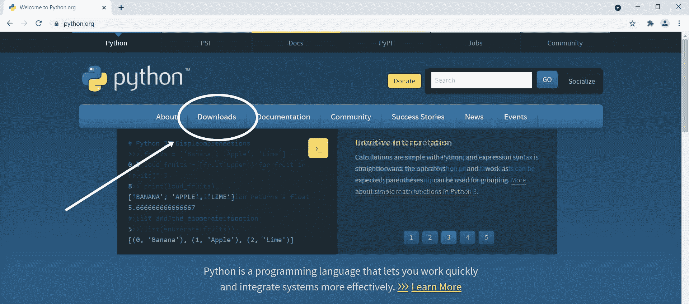

如上所示，点击主导航中的**下载**按钮，打开下载页面，如下所示:

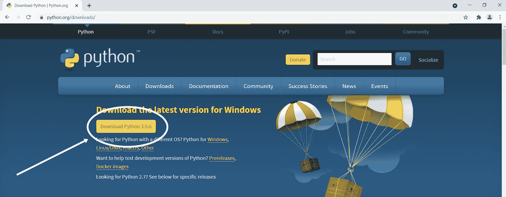

如上所述，点击**下载 Python 3.9.6** (如果 最新版本到来，该版本将在您访问时更改)。点击此按钮后下载开始。大小可能在 20-30 MB 左右

现在在你的系统中安装软件 **Python** 。安装后，按照下面给出的步骤操作

#### Python 空闲设置-步骤 2

如果你有 Windows 7，那么进入**开始** - > **所有程序**->**Python 3.9**->**空闲(Python 3.9 - 64 位)**。 如果您使用的是 32 位 Windows，那么您将看到 32 位，而不是 64 位

如果你有 Windows 10 (32 位或 64 位)，那么进入**开始**->**Python 3.9**->**空闲(Python 3.9 64 位)**。不管你的系统是什么，比如说 Linux，苹果 Mac 等等。按照类似的步骤打开 **Python IDLE** 。以下是 快照:

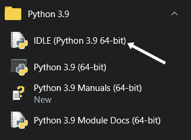

而这里是 Windows **IDLE Shell 3.9.6** 的快照。点击**闲置(Python 3.9 64 位)** 后打开的窗口如上图所示:

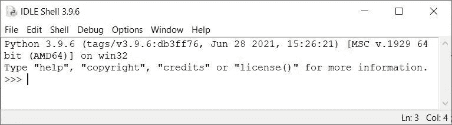

现在让我们直接使用这个 **Python Shell** 创建并执行一个 Python 程序。遵循下一步。

#### Python 空闲设置-步骤 3

随着 **Python Shell** 窗口的打开，导航到或点击**文件**->-**新文件**，如下图 所示:

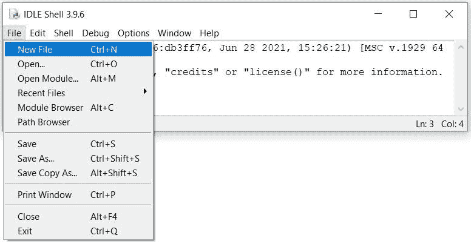

如上所述，导航后会打开一个新窗口。现在，在该窗口中键入以下代码:

```
print("Hey!, Welcome to codescracker.com")
```

如下图所示:

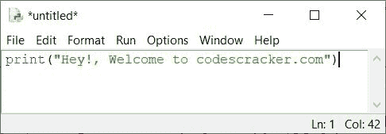

由于编写了最简单的 Python 代码，现在通过导航**文件**->-**另存为来保存代码...**如下图 所示:

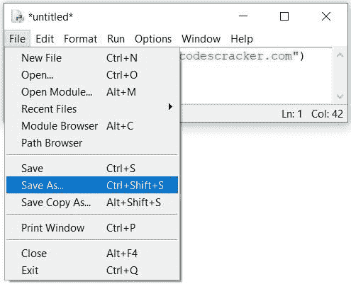

这是如上所述导航后打开的窗口:

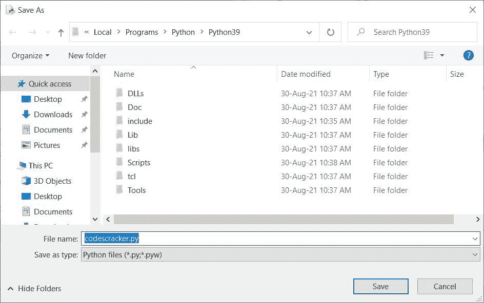

如上图所示，输入程序名，比如 **codescracker.py** ，然后按`ENTER`键。现在您的 Python 源代码已经保存。遵循下面给出的第 4 步。

#### Python 空闲设置-步骤 4

由于保存了 Python 源代码，因此这是执行或运行程序的时间。为此，要么导航至**运行** - > **运行模块(F5)** ，要么按下 **F5** 键运行程序。下面是生成的输出:

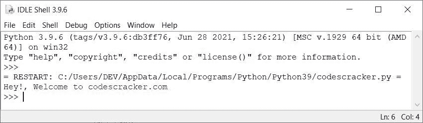

让我们创建另一个 Python 代码并执行它。代码如下:

```
print("Printing \"codescracker.com\" 10 times\n")
for i in range(10):
    print("codescracker.com")
```

写下这段代码，按下 **F5** 键运行它。下面是生成的输出:

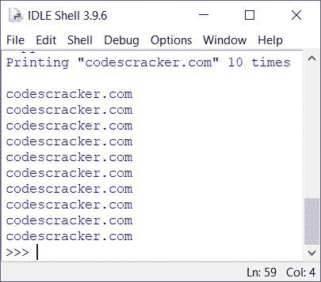

因为这只是一个如何执行 Python 程序的演示。因此，不要担心代码。以后你会逐步了解它的工作原理。

现在你可以使用 **Python IDLE** 直接执行 Python 代码。因此，要么你只能继续做下去，要么按照 的下一步指示，使用一个著名的 Python IDE**py charm**来执行 Python 代码。

**注意-** 在这两种情况下，都需要一个 **Python** 软件。

## 使用 PyCharm 执行 Python 程序

从网上下载 **PyCharm** 并安装。安装完成后，导航到**开始**->-**JetBrains**-> **py charm 社区版**。以下是 py charm**的初始窗口快照:**

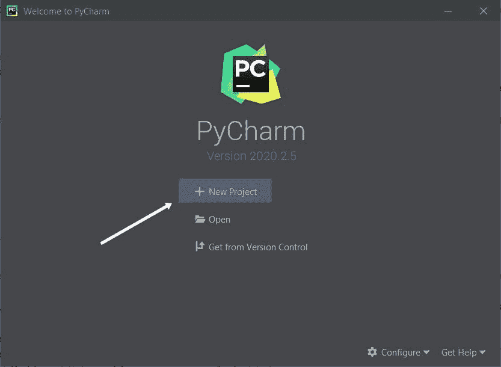

点击**新建项目**。这是新打开的窗口:

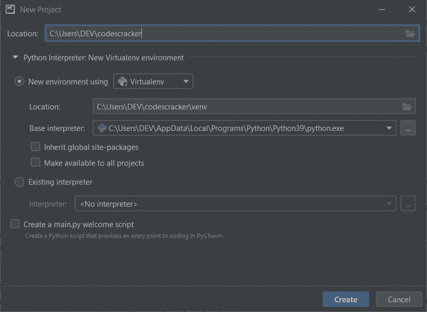

如上所述，在**位置**字段中输入 **codescracker** 并点击**创建**按钮。再次打开一个新窗口 。因此导航到**项目**->**codescracker**->**鼠标右键点击** - > **新建** - > **Python 文件**如下图所示:

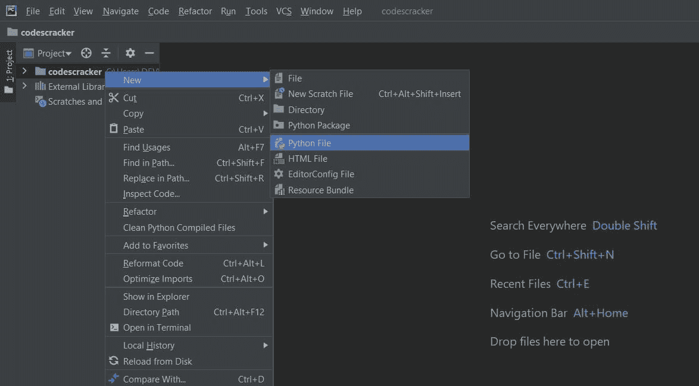

一个新的小窗口打开，如下图所示:

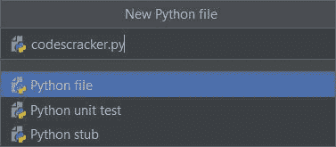

如上图，输入 **codescracker.py** 作为名字，然后按`ENTER`键。现在文件已经创建好了。现在再次输入您的 Python 代码。以下是键入 Python 代码后的快照:

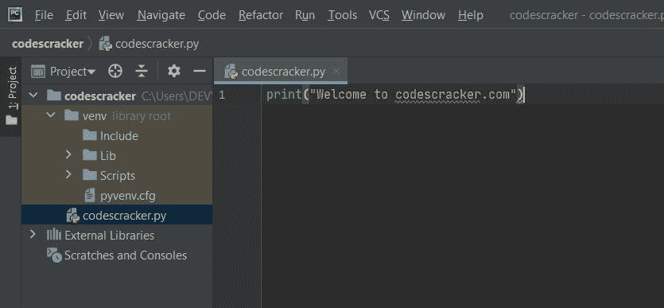

现在要运行这段代码，要么导航到**运行**->T3】运行->T5】回车键要么按下 **Shift + F10** 键，然后按下 **回车键**。从下一次开始，在按下 **Shift + F10** 键运行程序后，写入同一文件的程序不再需要按`ENTER`键。好了

[Python 在线测试](/exam/showtest.php?subid=10)

* * *

* * *