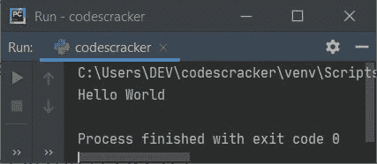
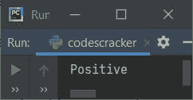
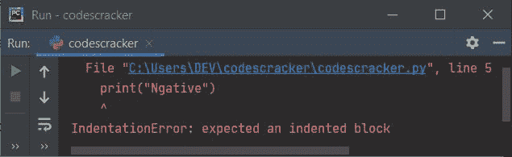
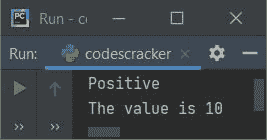

# Python 基本语法

> 原文：<https://codescracker.com/python/python-basic-syntax.htm>

Python 程序的基本语法意味着定义该程序中使用的语句和表达式的正确结构的规则。因此，在这一节中，我们查找 Python 程序的基本结构。或者如何编写 Python 程序来产生有效的输出。

不像其他大多数编程语言，如 [C](/c/index.htm) 、 [C++](/cpp/index.htm) 、 、 [Java](/java/index.htm) 等。Python 几乎没有提供简单的语法。也就是说，要用 Python 打印 Hello World，我们只需编写这条语句:

```
print("Hello World")
```

**注-** 即使分号也不要求放在语句的最后。这是 Python 非常简单的结构。

因为我已经用 py charm IDE 写了上面的程序。因此，在执行上述程序后，会产生以下输出:



无论您使用什么 IDE，输出都将是 **Hello World** 。

在学习 Python 的基本语法或者 Python 程序的基本结构的时候，主要要查的是程序的缩进。所以就来说说吧。

### 缩进是最重要的

现在的问题是，什么是缩进？
答案是，缩进指的是 Python 程序中一条 语句开头可用/给定的空格。在深入探讨之前，我们先来看看下面给出的程序:

```
val = 10
if val>0:
    print("Positive")
elif val<0:
    print("Negative")
```

上面的程序也可以写成:

```
val = 10
if val>0:
 print("Positive")
elif val<0:
 print("Negative")
```

两个程序产生相同的输出，即:



**注意-** 语句前的空格数由你/程序员决定，但是语句需要在同一个 代码块中。

下面给出的程序产生错误:

```
val = 10
if val>0:
    print("Positive")
elif val<0:
print("Negative")
```

上述 Python 程序产生的错误仅仅是由于其缩进造成的，如下图所示:



以下程序也会产生缩进错误:

```
val = 10
if val>10:
    print("Positive")
        print("The value is", val)
```

上述程序的结构应该是这样的:

```
val = 10
if val>0:
    print("Positive")
    print("The value is", val)
```

上述程序产生的输出是:



**注意-** 无论你提供什么样的空间，对于同一个代码块，空间必须是相同的。

您可以参考 Python 中的[从用户处获取用户输入，以获取在程序运行时接收任何用户输入时所需的所有 内容，并逐步进行描述。](/python/program/python-program-get-input-from-user.htm)

#### 更多示例

*   [获取用户的输入](/python/program/python-program-get-input-from-user.htm)
*   [加两个数](/python/program/python-program-add-two-numbers.htm)
*   [检查偶数或奇数](/python/program/python-program-check-even-odd.htm)
*   [检查是否为质数](/python/program/python-program-check-prime-number.htm)
*   [检查是否为元音](/python/program/python-program-check-vowel.htm)
*   [是否勾选闰年](/python/program/python-program-check-leap-year.htm)
*   [制作简单的计算器](/python/program/python-program-make-calculator.htm)

[Python 在线测试](/exam/showtest.php?subid=10)

* * *

* * *