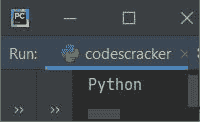
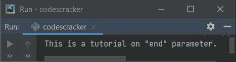
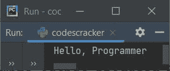
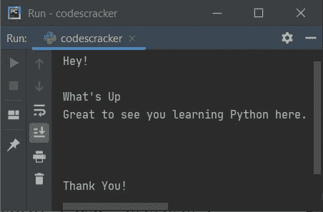
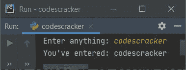
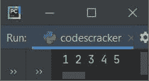

# print()中的 Python end (end=)参数

> 原文：<https://codescracker.com/python/python-end.htm>

创建这篇文章是为了涵盖 Python 中一个有趣的话题，那就是 [print()](/python/python-print-statement.htm) 的 **end** 参数。在 Python 的很多程序中都可以看到 **end** (end=)。因此我们必须了解它。

**end** 参数用于改变 Python 中 **print()** 语句的默认行为。也就是说，由于 **print()** 会在每次执行后自动插入一个换行符。因此，使用**结束**这可以改变。**结束**参数基本上是 用于定制或有时交互输出。 T13】

## Python 中 end 参数的好处

当然，我们可以使用 **end** 来跳过自动换行的插入。但是我们也可以用它来插入一个、两个或多个新行，只需使用一个 **print()** 。下面给出的例子说明了**端**在各个方面的使用。

## Python 结束参数语法

由于 **end** 是 **print()** 语句/函数的一个参数，因此其语法没有什么独特之处。也就是说， 使用**结束**的语法如下:

```
print(end="")
```

在双引号内，您可以根据需要插入任何内容，如空格、无空格、逗号、换行符(\n)等。

## Python 结束参数示例

本节包括几个例子，可以帮助你完全理解这个主题。让我们从下面给出的非常基本的一个开始。

### 不带空格和换行符的结束参数

这个程序使用了 **end** ，没有空格，也没有换行符。

```
print("Py", end="")
print("thon")
```

上面的程序产生如下图所示的输出:



### 以空格结束参数，不带换行符

下面给出的程序显示了如何在 Python 程序中添加一个或多个不带换行符的空格:

```
print("This is a tutorial on", end=" ")
print("\"end\" parameter.")
```

下面给出的快照显示了上述程序产生的示例输出:



### 以逗号、空格和无换行符结束参数

这是第三个**结束**参数的示例程序。这个程序展示了，我们如何使用**结束**来添加多个东西:

```
print("Hello", end=", ")
print("Programmer")
```

该计划产生:



**注-** 基本上，你在 **end=""** 双引号内提供的内容。您将获得各自的输出。

### 用一行、两行和多行换行符结束参数

因为默认情况下 **print()** 语句，总是插入/打印一个换行符。但是使用 **end** 作为它的参数，我们可以 修改它来打印所需的换行符数量，如下面给出的程序所示:

```
print("Hey", end="!\n\n")
print("What's Up", end="\n")
print("Great to see you learning Python here.", end="\n\n\n\n")
print("Thank You!")
```

现在，这个 Python 程序产生的输出与下面给出的快照完全相同:



您也可以将 **print()** 的一些消息/内容放在它的 **end** 参数中，如下面给出的程序所示:

```
print("H", end="ey!\n\n")
print("What", end="'s Up\n")
print("Great to see you ", end="learning Python here.\n\n\n\n")
print("Thank", end=" You!\n")
```

这个程序产生与前一个程序相同的输出。

### 将 print()的所有内容放入 end 参数中

你也可以把所有的东西放在 **end** 里面，如下面给出的程序所示:

```
print(end="Hey!\n\n")
print(end="What's Up\n")
print(end="Great to see you learning Python here.\n\n\n\n")
print(end="Thank You!\n")
```

同样，这个程序也产生与前面第二个程序相同的输出。

**注意-** 基本上是 **print()** 的 **end** 参数强制的，不会自动插入换行符。

### end 参数为用户输入提供交互式输出

这种类型的程序，其中 **end** 参数用于请求输入用户的一些输入，可能会出现很多次， 在同一行上接收输入，请求消息如下面给出的程序所示:

```
print("Enter anything: ", end="")
val = input()
print("You've entered:", val)
```

下面是用户输入的示例运行 **codescracker** :



### 使用 end 参数在单行中打印列表项

这就是任务，我们几乎每次都要用 **end** 的地方。因为当我们有一个包含大量元素的[列表](/python/python-lists.htm) 时，它需要大量的行，这有时看起来很奇怪。因此，使用**结束**，我们可以修改 它，如下面给出的程序所示:

```
nums = [1, 2, 3, 4, 5]
for n in nums:
    print(n, end=" ")
```

该计划产生:



[Python 在线测试](/exam/showtest.php?subid=10)

* * *

* * *