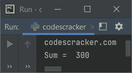
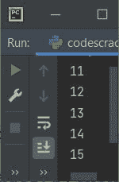
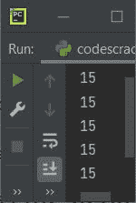

# Python 标识符

> 原文：<https://codescracker.com/python/python-identifiers.htm>

顾名思义，标识符是在 Python 程序中标识对象的名称。对象可以是[变量](/python/python-variables.htm)、[类](/python/python-classes-objects.htm)、 、[函数](/python/python-functions.htm)等。例如:

```
var = "codescracker.com"
a = 100
b = 200

def myfun():
    print(var)

class myclass:
    def sum(self, num_one, num_two):
        return num_one+num_two

myfun()
obj = myclass()
print("Sum = ", obj.sum(a, b))
```

在上面的程序中，标识符列表是:

*   定义变量
*   a
*   b
*   myfun
*   我的班
*   总和
*   数字一
*   数字二
*   目标文件

其中 **myfun** 和 **sum** 是用于命名函数的两个标识符， **myclass** 是用于命名类的另一个 标识符，所有其他的用于命名变量。基本上，标识符是 Python 程序的组成部分。上述程序产生的输出应该完全类似于:



不要担心代码，只看标识符。你会学到所有的东西，比如函数，类等等。在接下来的章节里。

**重要的** - <u>标识符不应该是关键字</u>。

**注-** <u>Python 是一种区分大小写的编程语言</u>。区分大小写意味着， **num** ， **Num** ， **NUM** ， ， **nUm** ， **nuM** 都是不同的变量或标识符。

### 如何在 Python 中命名标识符？

要在 Python 中命名标识符，我们可以使用字母(a-z，A-Z)、数字(0-9)和下划线(_)的组合。比如 **codescracker** 、 **codes_cracker** 、 **codes12cracker_** 、 **codes123** 等。

## Python 中命名标识符的规则

以下是命名或创建变量、类、函数等时必须遵循的规则列表。在 Python 中:

*   标识符必须以字母或下划线开头
*   Or 标识符不能以 a-z、A-Z 或 _(下划线)以外的任何字符开头
*   在 a-z、a-z 或 _ 之后，可以使用 A-Z、A-Z、0-9 和 _
*   Python 中的标识符不能使用 Python 的关键字命名
*   所以，我建议你在命名标识符之前先看看 [Python 关键字](/python/python-keywords.htm)的列表

## Python 标识符示例

让我们用 Python 创建一个程序证明 Python 是一种区分大小写的语言。也就是说，两个标识符说 **num** 和 **Num** 被编译器视为两个不同的标识符:

```
num = 11
Num = 12
NUM = 13
nUm = 14
nuM = 15

print(num)
print(Num)
print(NUM)
print(nUm)
print(nuM)
```

下面给出的快照显示了上述 Python 程序产生的确切输出:



你看！所有的标识符打印不同的值，但是如果它们的大小写被忽略，名称是相同的。如果 Python 不是区分大小写的语言，那么输出应该是 15，5 次。也就是说，如果用下面给出的程序替换上面的程序:

```
num = 11
num = 12
num = 13
num = 14
num = 15

print(num)
print(num)
print(num)
print(num)
print(num)
```

那么输出必须等于下面给出的快照:



[Python 在线测试](/exam/showtest.php?subid=10)

* * *

* * *