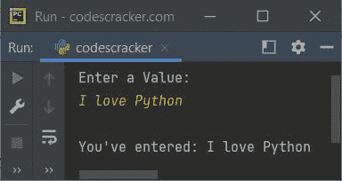
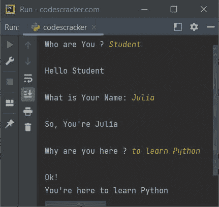

# Python 变量

> 原文：<https://codescracker.com/python/python-variables.htm>

Python 中的变量是指保留的内存位置，用于存储值。简单地说，我们可以说变量基本上是程序中使用的值的容器。

Python 不提供任何声明变量的命令。变量是在赋值时创建的。变量的类型取决于分配给它的值的类型。

Python 是一种区分大小写的语言。因此**我的名字**和**我的名字**是两个不同的变量。 例如:

```
myname = "codescracker"
myName = "codescracker.com"
MyName = "codes cracker"

print(myname)
print(myName)
print(MyName)
```

输出是:

```
codescracker
codescracker.com
codes cracker
```

**注-**[type()](/python/python-type-function.htm)函数用于查找 变量的类型。例如:

```
x = 10
print(type(x))

x = 10.45
print(type(x))

x = "Python Programming"
print(type(x))

x = True
print(type(x))

x = [12, 23, 453]
print(type(x))
```

输出是:

```
<class 'int'>
<class 'float'>
<class 'str'>
<class 'bool'>
<class 'list'>
```

变量 **x** 属于类 **int** ，当它保存值 **10** 时。同一个 变量，即 **x** 属于 **float** 类，当它持有值 **10.45** 时，以此类推。

看，同一个变量，即 **x** 改变了它的类，当一个不同类型的新值被初始化为 时。也就是说，无论我们如何初始化变量的值，它的类型都取决于值的类型。

**注-** 这是 Python 相对于其他语言如 **Java** 、**c++**、 **C++** 等的一大优势。因为它不需要在使用前声明变量。同样，单个变量可用于所有 类型的值。

类似这种优势，有多个东西是 Python 占优势的。在 Python 中，用更少的语句或代码，我们可以做同样更大的任务。或者我们可以说，使用 Python 用更少的代码做更多的事情。

## Python 中的变量命名规则

在 Python 中命名变量的简单规则是:

*   变量必须以字母(a-z，A-Z)或下划线字符(_)开头
*   变量的其余字符也可以使用字母数字字符(a-z，A-Z，0-9)创建，包括下划线字符(_)。

#### Python 中一些有效变量名的示例

以下是 Python 中一些有效变量名的列表:

*   -梅瓦尔
*   迈瓦尔
*   -梅瓦尔
*   迈瓦尔
*   my1val
*   my_1_val
*   我们所有人
*   My_1_Val_2

### Python 变量示例

涵盖了 Python 中变量的所有主题。因此，是时候举一些例子了，这些例子可能会提高你的 Python 技能。下面是第一个示例，演示了使用单个语句将单个值赋给多个变量:

```
x = y = z = 500
print(x)
print(y)
print(z)
```

输出是:

```
500
500
500
```

现在让我们考虑下面的例子:

```
a = 10
b = 20
c = 30
d = 40
e = 50

print(a)
print(b)
print(c)
print(d)
print(e)
```

该/上述程序也可以通过以下方式创建:

```
a, b, c, d, e = 10, 20, 30, 40, 50

print(a)
print(b)
print(c)
print(d)
print(e)
```

以上两个程序的输出是:

```
10
20
30
40
50
```

这是另一个程序，其中多个变量的多个值用一条语句初始化。同样，所有变量的值都使用一条 [print ()](/python/python-print-statement.htm) 语句打印出来:

```
a, b, c, d, e = 10, 20, 30, 40, 50

print(a, b, c, d, e)
```

现在这个程序的输出是:

```
10 20 30 40 50
```

下面是另一个程序，它接收用户的输入，将输入的值存储到一个变量中，比如说 **val** ，并在输出屏幕上打印出变量值:

```
print("Enter a Value: ")
val = input()
print("\nYou've entered:", val)
```

下面给出的快照显示了上述程序的示例运行，用户输入 **I love Python** 作为输入:



要在消息的同一行获得输入，使用 [end=](/python/python-end.htm) 参数，这样 会跳过在 **print()** 末尾插入的自动换行符。

下面是另一个示例，演示了如何存储用户在程序运行时提供的值，并在输出屏幕上打印变量值:

```
print("Who are You ? ", end="")
x = input()

print("\nHello", x)
print("\nWhat is Your Name: ", end="")
x = input()
print("\nSo, You're", x)

print("\nWhy are you here ? ", end="")
x = input()
print("\nOk!\nYou're here", x)
```

用户输入**学生**、**茱莉亚**和**学习 Python** 的示例运行如下面给出的快照 所示:



[Python 在线测试](/exam/showtest.php?subid=10)

* * *

* * *