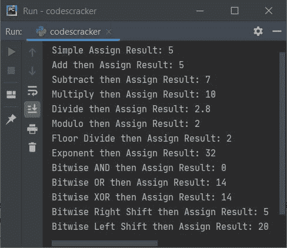

# Python 运算符

> 原文：<https://codescracker.com/python/python-operators.htm>

Python 中的操作符与数学中的操作符一样，即+、-、*等操作符。用于执行操作。现在这两个问题出现在我们的脑海中:

1.  将要执行哪些操作？
2.  手术在哪里进行？

这两个问题的答案是:

1.  这是由所用的运算符决定的。
2.  关于变量和值。

例如，以下程序显示对两个变量执行加法运算(使用+)，对两个值执行减法运算(使用-):

```
a = 20
b = 10
c = a + b
print(c)

res = 100 - 50
print(res)
```

该程序产生如下图所示的输出:


如你所见，加法运算是在 **a** 和 **b** 上执行的，无论结果如何，都会将 初始化为 **c** 变量。在第二种情况下，直接对两个值，即 **100** 和 **50** 执行减法运算，同样，无论结果值是什么，都会被初始化为 **res** 变量。

**注-** 关于[运算符优先级](/python/python-operator-precedence.htm)和 [运算符模块](/python/python-operator-module.htm)，请参考其单独教程。

## 运算符的类型

Python 中使用的运算符分为 7 类，如下所示:

1.  算术运算符
2.  赋值运算符
3.  比较运算符
4.  逻辑运算符
5.  按位运算符
6.  标识运算符
7.  成员运算符

现在让我们简单地讨论一下所有这些操作符，并为每一类都设计好示例程序。

## 算术运算符

为了在 Python 程序中执行算术运算，我们有算术运算符。下表列出了所有可用的算术运算符、语法和示例。以变量值为例， **a = 5** 和 **b = 3** :

| 操作员 | 名字 | 句法 | 输出 |
| + | 添加 | c = a + b | c = 8 |
| - | 减法 | c = a - b | c = 2 |
| * | 增加 | c = a * b | c = 15 |
| / | 分开 | c = a / b | c = 1.6666666666666667 |
| % | 系数 | c = a % b | c = 2 |
| ** | 指数运算 | c = a ** b | c = 125 |
| // | 楼层划分 | c = a // b | c = 1 |

**重要**—**/**(除法)与**/**(地板除法)运算符的区别是，除法运算符除法， 返回精确的除法结果值。而底除法运算符进行除法运算，然后取结果值的底数值 。比如 **5/3** 给**1.6666666666667**，而 **5//3** 给 **1** 。这里<u>底值 表示小于或等于原始结果</u>的整数值(整数)。

**注意**—*** ***运算符在应用于变量或值时，例如 **a ** b** ，它会被 视为 **a <sup>b</sup>** 。因此， **5 ** 3** 被当作**5<sup>3</sup>15】处理，结果为 **125** 。**

下面给出的程序使用了所有的算术运算符。创建此程序是为了消除您所有的疑问(如果有的话):

```
a = 5
b = 3
c = a + b
print(a, "+", b, "=", c)
c = a - b
print(a, "-", b, "=", c)
c = a * b
print(a, "*", b, "=", c)
c = a / b
print(a, "/", b, "=", c)
c = a % b
print(a, "%", b, "=", c)
c = a ** b
print(a, "*", b, "=", c)
c = a // b
print(a, "//", b, "=", c)
```

下面给出的快照显示了该程序产生的示例输出:


## 赋值运算符

在 Python 编程中，为了给变量赋值(设置)或重新赋值，我们有另一类名为赋值运算符的运算符。下表列出了所有用于赋值的运算符及其语法和示例。

| 操作员 | 名字 | 句法 | 输出 |
| = | 简单赋值 | b = a | 如果 a = 5
那么，b = 5 |
| += | 添加然后分配 | b += a | 如果 a = 5，b = 0
那么，b = 5 |
| -= | 减去然后赋值 | b -= a | 如果 a = 5，b = 12
那么，b = 7 |
| *= | 乘法然后赋值 | b *= a | 如果 a = 5，b = 2
那么，b = 10 |
| /= | 除法然后赋值 | b /= a | 如果 a = 5，b = 14
那么，b = 2.8 |
| %= | 模然后赋值 | b %= a | 如果 a = 5，b = 27
那么，b = 2 |
| //= | 楼层划分然后分配 | b //= a | 如果 a = 5，b = 14
那么，b = 2 |
| **= | 指数然后赋值 | b **= a | 如果 a = 5，b = 2
那么，b = 32 |
| &= | 按位然后赋值 | b &= a | 如果 a = 10，b = 4
那么，b = 0 |
| &#124;= | 按位或然后赋值 | b &#124;= a | 如果 a = 10，b = 4
那么，b = 14 |
| &Hat; = | 按位异或然后赋值 | b &Hat; = a | 如果 a = 10，b = 4
那么，b = 14 |
| >>= | 按位右移然后赋值 | b >>= a | 如果 a = 1，b = 10
那么，b = 5 |
| <<= | 按位左移然后赋值 | b <<= a | 如果 a = 1，b = 10
那么，b = 20 |

下面给出的程序实现了上面所有的操作符。创建这个程序是为了让你更好地理解赋值操作符:

```
a = 5
b = a
print("Simple Assign Result:", b)

a = 5
b = 0
b += a
print("Add then Assign Result:", b)

a = 5
b = 12
b -= a
print("Subtract then Assign Result:", b)

a = 5
b = 2
b *= a
print("Multiply then Assign Result:", b)

a = 5
b = 14
b /= a
print("Divide then Assign Result:", b)

a = 5
b = 27
b %= a
print("Modulo then Assign Result:", b)

a = 5
b = 14
b //= a
print("Floor Divide then Assign Result:", b)

a = 5
b = 2
b **= a
print("Exponent then Assign Result:", b)

a = 10
b = 4
b &= a
print("Bitwise AND then Assign Result:", b)

a = 10
b = 4
b |= a
print("Bitwise OR then Assign Result:", b)

a = 10
b = 4
b &Hat;= a
print("Bitwise XOR then Assign Result:", b)

a = 1
b = 10
b >>= a
print("Bitwise Right Shift then Assign Result:", b)

a = 1
b = 10
b <<= a
print("Bitwise Left Shift then Assign Result:", b)
```

以下是 Python 中赋值运算符程序产生的输出:



在赋值运算符中，表达式:

```
b += a
```

基本上是的简称，或与相同:

```
b = b + a
```

## 比较运算符

为了在 Python 编程中比较两个变量或直接值，我们有比较运算符。这些运算符用于比较任何两个实体。下面的表格显示了所有的比较操作符和语法，以及它的例子。这个例子采用了两个变量，即 **a** 和 **b** 。这两个变量的值分别是 **a = 12** 和 **b = 7** :

| 操作员 | 名字 | 句法 | 输出 |
| == | 平等的 | a == b | 错误的 |
| ！= | 不相等 | 答！= b | 真实的 |
| > | 大于 | a > b | 真实的 |
| < | 不到 | a < b | 错误的 |
| >= | 大于或等于 | a >= b | 真实的 |
| <= | 小于或等于 | a <= b | 错误的 |

下面给出的程序使用了所有这些比较运算符。因为比较运算符用于比较两个值。因此，在打印比较结果时，我们只能得到 True 或 False 形式的输出。例如，语句， **a < b** 返回 True，如果 a 的值小于 b，否则返回 False。让我们看看下面给出的例子 :

```
a = 12
b = 7
print("\n---------", a, "==", b, "?--------")
print(a == b)
print("\n---------", a, "!=", b, "?--------")
print(a != b)
print("\n---------", a, ">", b, "?--------")
print(a > b)
print("\n---------", a, "<", b, "?--------")
print(a < b)
print("\n---------", a, ">=", b, "?--------")
print(a >= b)
print("\n---------", a, "<=", b, "?--------")
print(a <= b)
```

下面是生成的输出:


## 逻辑运算符

为了连接两个或多个表达式并计算其逻辑输出，我们有另一个运算符类别，名为逻辑运算符。下表显示了所有逻辑运算符及其语法和输出。a、b、c 三个变量的初始值分别为 **a=12** 、 **b=7** 、 **c=9** :

| 操作员 | 句法 | 返回 |
| 和 | a > b 和 a < c | 错误的 |
| 或者 | a > b 或 a < c | 真实的 |
| 不 | 不是(a > b) | 错误的 |

下面给出的例子使用了所有这三个逻辑运算符:

```
a = 12
b = 7
c = 9
print(a > b and a < c)
print(a > b or a < c)
print(not(a > b))
```

下面是产生的输出:


## 按位运算符

本节包括所有可以在 Python 语言中使用的按位运算符。要了解所有这些位运算符是如何执行运算的，请参考示例中的[位运算符，以简单了解 位运算符的所有内容。现在，下面给出的表格显示了所有的按位操作符以及语法 和输出。以两个变量 a 和 b 为例，它们的值应该是 **a = 10** 和 **b=3** :](/computer-fundamental/bitwise-operators.htm)

| 操作员 | 名字 | 句法 | 输出 |
| & | 按位 AND | a & b | Two |
| &#124; | 按位或 | a &#124; b | Eleven |
| &Hat; | 按位异或 | a &Hat; b | nine |
| ˜ | 按位非 | (a) | -11 |
| << | 按位左移 | a << b | one |
| >> | 按位右移 | a >> b | Eighty |

以下示例使用了所有这些按位运算符:

```
a = 10
b = 3
print(a, "&", b, "=", a & b)
print(a, "|", b, "=", a | b)
print(a, "&Hat;", b, "=", a &Hat; b)
print("˜", a, "=", ˜a)
print(a, ">>", b, "=", a >> b)
print(a, "<<", b, "=", a << b)
```

该程序产生的输出是:


## 标识运算符

在 Python 编程中，为了确定一个变量或一个值是否属于某种类型或类，我们有另一类操作符，称为 Identity operator。基本上是用来识别变量或值的。下表列出了可以在 Python 中使用的标识运算符以及语法和示例。以 a 和 b 变量为例，其值为**a =【1，2，3】**，**b =【4，5】**:

| 操作员 | 句法 | 返回 |
| 是 | a 是 b | 错误的 |
| 不是 | a 不是 b | 真实的 |

以下示例实现了 Python 中的这两个标识运算符:

```
a = [1, 2, 3]
b = [4, 5]
c = a
print(a is b)
print(a is c)
print(a is not b)
print(a is not c)
```

下面给出的快照显示了这个 Python 程序产生的示例输出:


## 成员运算符

这是 Python 中使用的最后一类运算符。这一类命名的成员操作符基本上用于检查一个特定值是否是任何特定列表、字符串、元组的成员。下表列出了成员运算符的语法、示例和输出。以名为 **a** 的变量为例，其初始值为**a =【1，2，3】**:

| 操作员 | 句法 | 例子 | 输出 |
| 在 | a 中的*元素* | 2 英寸 | 真实的 |
| 不在 | *元素*不在 | 4 英寸 | 错误的 |

让我们看看下面给出的例子，以便更好地理解上面两个成员运算符:

```
a = [1, 2, 3]
print(2 in a)
print(4 in a)
print(2 not in a)
print(4 not in a)
```

该程序生成的示例输出显示在下面给出的快照中:


让我们看看另一个例子，它展示了 Python 编程中成员运算符(运算符中的**)的著名用法:**

```
a = ["python", "operators", "tutorial"]
print("Enter an element to check for existence in list: ")
elem = input()
if elem in a:
    print("\nIt is available")
else:
    print("\nIt is not available")
```

下面是这个程序在提供了 **python** 作为输入后产生的示例输出:


#### 更多示例

以下是在 Python 中使用运算符的更多示例:

*   [加两个数](/python/program/python-program-add-two-numbers.htm)
*   [检查偶数或奇数](/python/program/python-program-check-even-odd.htm)
*   [检查是否为质数](/python/program/python-program-check-prime-number.htm)
*   [检查是否为元音](/python/program/python-program-check-vowel.htm)
*   [是否勾选闰年](/python/program/python-program-check-leap-year.htm)
*   [制作简单的计算器](/python/program/python-program-make-calculator.htm)
*   [打印乘法表](/python/program/python-program-print-multiplication-table.htm)
*   [找出三个数字中最大的一个](/python/program/python-program-find-largest-of-three-numbers.htm)

[Python 在线测试](/exam/showtest.php?subid=10)

* * *

* * *