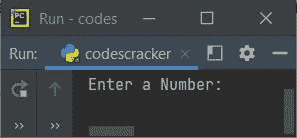
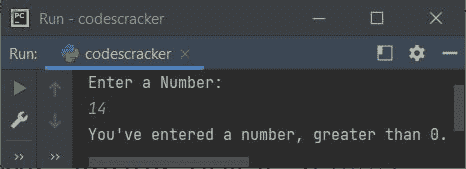
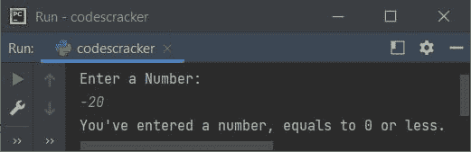
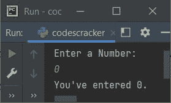
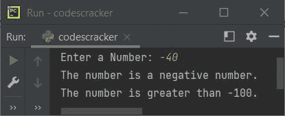

# Python 决策语句

> 原文：<https://codescracker.com/python/python-decision-making.htm>

Python 中的所有语句，用于决定程序中其他指定语句的执行顺序。即 Python 中的决策语句，有助于根据所需或给定的条件控制程序。

## 决策陈述的类型

基本上有 4 种决策陈述。以下是所有这四种决策陈述的列表:

*   [if 语句](/python/python-if-else-elif-statements.htm)
*   [如果...else 语句](/python/python-if-else-elif-statements.htm)
*   [如果... 否则如果...else 语句](/python/python-if-else-elif-statements.htm)
*   [嵌套 if 语句](/python/python-if-else-elif-statements.htm)

在一个单独的教程中，所有这些决策语句都有详细的示例描述。因此，所有的链接都指向一个单独的教程页面。

## Python 决策示例

因为所有决策语句都在单独的教程中描述。因此，这里我们只看到基于那些语句的基本示例程序。让我们创建一个简单的示例，演示 Python 中的决策语句:

```
print("Enter a Number: ")
val = int(input())

if val>0:
    print("You've entered a number, greater than 0.")
```

上述程序产生的初始输出显示在下面给出的快照中:



现在输入一个数字，比如说 **14** ，然后按`ENTER`键查看输出，如下图所示:



在上面的程序中，第一条语句:

```
print("Enter a Number: ")
```

打印信息，**在输出屏幕上输入数字:**。第二种说法是:

```
val = int(input())
```

使用 **input()** 接收输入的数字，使用 **int()** 将该值转换为整数类型，最后 将该值初始化为 **val** 变量。所以 **val=14** ，如果用户输入 14 作为输入。现在，如果 得到评估，则**的条件。也就是说， **val > 0** 或 **14 > 0** 评估为真，因此程序流程进入 **if** 主体内 。和声明:**

```
print("You've entered a number, greater than 0.")
```

您输入了一个大于 0 的数字。输出屏幕上的。就是这样。现在让我们修改上面的程序，使用 的两个决策语句:

```
print("Enter a Number: ")
val = int(input())

if val>0:
    print("You've entered a number, greater than 0.")
else:
    print("You've entered a number, equals to 0 or less.")
```

下面是用户输入 **-20** 的运行示例:



在上面的程序中，如果条件 **val > 0** 评估为真，那么如果的主体则程序流程转到**，否则 转到**的主体**。下面是创建的第三个程序，它使用了三个决策语句:**

```
print("Enter a Number: ")
val = int(input())

if val>0:
    print("You've entered a number, greater than 0.")
elif val==0:
    print("You've entered 0.")
else:
    print("You've entered a number, less than 0.")
```

下面是它在用户输入 **0** 的情况下运行的示例:



在上面的程序中，如果得到求值，首先是**的条件，如果条件求值为假，那么 **elif** 的条件 得到求值。**

如果**的条件 if** 评估为真，则程序流程转到其主体。否则，如果 **elif** 的条件评估为真，则程序流程进入其主体。如果两个条件都评估为假，则程序流程 转到 **else** 的主体。

**注-** 您可以提供尽可能多的条件，使用多个 **elif** ，位于 **if** 和 **else** 之间。

这里是最后一个程序，它使用了所有的决策语句，包括嵌套的 **if** :

```
print("Enter a Number: ", end="")
val = int(input())

if val>0:
    if val<10000:
        print("The number is less than 10000.")
    else:
        print("The number is a big number.")
elif val==0:
    print("You've entered 0.")
else:
    print("The number is a negative number.")
    if val>-100:
        print("The number is greater than -100.")
```

以下是用户输入 **-40** 的示例输出:



#### 更多示例

*   [检查偶数或奇数](/python/program/python-program-check-even-odd.htm)
*   [是否检查质数](/python/program/python-program-check-prime-number.htm)
*   [是否检查字母](/python/program/python-program-check-alphabet.htm)
*   [是否检查元音](/python/program/python-program-check-vowel.htm)
*   [是否勾选闰年](/python/program/python-program-check-leap-year.htm)
*   [制作简单的计算器](/python/program/python-program-make-calculator.htm)

[Python 在线测试](/exam/showtest.php?subid=10)

* * *

* * *