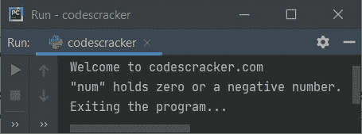

# Python 中的 if elif else 语句

> 原文：<https://codescracker.com/python/python-if-else-elif-statements.htm>

**if** 、 **if-else** 或 **if-elif-else** 语句是 Python 世界中使用最多的语句。因为这些给 提供了在程序中实现的条件。基于这些条件，程序可以自动或动态地做出决定。因此，在没有完全理解这些陈述之前，不要前进。这就像 Python 编程的基本构建 块。

因此，我在一个教程中提供了所有这三个条件语句，以及它的描述、语法和易于理解的例子。这篇文章涉及:

*   如果语句
*   如果...else 语句
*   如果... 否则如果...else 语句
*   嵌套 if，if...否则，如果... 否则如果...else 语句

## 如果语句

使用了 **if** 语句，这里我们只需要处理一个条件。也就是说，程序仅使用一个 条件做出决定，如果为

 **### if 语句语法

在 Python 程序中使用 if 语句的语法是:

```
if expression:
    statement(s)
```

**表达式**表示**条件表达式**代码。如果被执行，则**的**语句**，仅当 的**条件 _ 表达式**代码评估为**真**。否则，如果**体，程序流程不会进入**。**

### if 语句示例

因为如果完成了**的理论部分。因此，让我们举几个例子，来清楚地了解一下 的说法。这里有一个很基本的例子，用 **if** 语句:**

```
num = 10
print("Welcome to codescracker.com")
if num>0:
    print("\"num\" holds a positive number.")
print("Exiting the program...")
```

上述程序产生的输出是:


现在让我们修改上面的程序。也就是说，让我们用一个值初始化变量 **num** ，该值是一个负数，如下面给出的程序中的 所示，然后再次运行该程序以查看其新的输出:

```
num = -10
print("Welcome to codescracker.com")
if num>0:
    print("\"num\" holds a positive number.")
print("Exiting the program...")
```

现在，该程序产生以下输出:


从上面给出的两个示例程序中可以看出。在第一个程序中，条件， **num > 0** 或 **10 > 0** 将 评估为**真**，因此程序流进入 **if** 的主体并执行其主体块中存在的所有语句。 因为，我只写了一条语句，所以只有那条语句被执行，打印出**“num”是一个正数。** 开输出。

剩下的两个打印声明，那就是一个写在**上面的如果**和第二个写在**下面的如果**的身体，难道 不关心**如果**。这两个声明总是会被打印出来。

现在在第二个程序中，由于这次 **num** 的值是 **-10** ，因此条件 **num > 0** 或 **-10 > 0** 评估为**假**。因此程序流不会进入 **if** 体内。所以消息 **“num”持有一个正数。**不会在第二个程序中打印。

让我们再举一个 Python 的 **if** 语句的例子，为您提供一个线索，如何在密码保护程序中使用 if 语句:

```
print("Welcome to codescracker.com")
print("Enter Your Password: ", end="")
pwd = input()
if pwd == "123&commat;codescracker":
    print("\nAccess Granted!")
```

下面给出的快照显示了在提供 **123 &命令后，上述程序产生的样本输出；codescracker** 作为用户输入:


也就是说，如果用户输入正确的密码，他/她只能访问一些特殊的部分或功能。在上面的程序中，我只给了你一个提示，关于如何使用一个 **if** 语句来保护某个部分。因为这只是一个演示程序， 所以我直接将输入的密码与任何随机密码进行比较，如**123&commat；编码员**。但是在工作应用中， 通常我们从数据库中获取用户的密码，然后与他/她输入的密码进行核对。

### 没有条件表达式的 if 语句

**注-****if**语句中使用的 **conditional_expression** 基本上是一个布尔表达式。布尔表达式意味着 一个返回**真**或**假**的表达式。也就是说，在评估布尔表达式之后，我们可以得到 真或假。

我们也可以用直接变量或对象替换 **if** 语句的 conditional_expression。在这种情况下，变量 或对象的值是什么，决定是否进入 **if** 的体内。

这些是值的列表，都被认为是**假**:

*   Zero
*   0.0 或任何相当于 0 的值
*   没有人
*   错误的
*   '(这是一个单引号，即' ')
*   ""
*   ()
*   []
*   {}

除了上面的值列表之外，所有其他的值都被认为是**真值**，如 **1** 、 **24** 、**真值**、**、【codescracker】** 等。

如上所述，如果变量的值为 **0** 或**假**，那么它将被视为**假**，如果的主体，则程序流永远不会 转到那个**。否则所有变量的值(如 1，2，-2，-4 等。)包括**真**被视为 真**真**，因此程序流程进入 **if** 体。让我们举一个例子来全面了解它。**

```
num_one = 10
num_two = 0
num_three = True
num_four = False
num_five = -10

if num_one:
    print("The value of \"num_one\" is", num_one)
if num_two:
    print("The value of \"num_two\" is", num_two)
if num_three:
    print("The value of \"num_three\" is", num_three)
if num_four:
    print("The value of \"num_four\" is", num_four)
if num_five:
    print("The value of \"num_five\" is", num_five)
```

该程序产生如下图所示的输出:


### 一行中的 if 语句

如果在 **if** 的主体内部，只有一条语句，那么我们可以在一行中创建 **if** 。下面是其使用 **if** 的语法:

```
if expression: statement
```

下面给出的例子显示了在一行中创建了整个 **if** 块的 **if** 语句程序:

```
num = 10
if num>0: print("Positive")
```

在输出上打印正。但是如果 **if** 体中有多条语句可用，则不能使用单行 **if** 块。

## 如果...else 语句

**如果...else** 语句基本上是 **if** 语句的改进版本。也就是说，在 Python 的 **if** 语句中， 只有当提供的条件为真时，我们才能执行某组语句，否则当条件评估为假时， 则什么也不执行。但是为了改变，**如果...创建 else** 也是为了即使当条件 评估为假时也执行某组语句。

也就是说，使用 **if...否则我们会有两个身体。一个是 **if** ，第二个是 **else** 。如果条件评估为真，则执行 **if** 的主体语句 ，否则执行 **else** 的主体语句 。**

### 如果...else 语法

让我们来看看 **if 的语法...else** 语句:

```
if expression:
    statement(s)
else:
    statement(s)
```

如您所见，使用 **else** ，我们能够在 **if** 的条件评估为假时执行语句。

### 如果...else 示例

在编程的世界里，如果不把事情付诸实践，我们就不能清晰完整地理解事情。因此，我已经给你提供了所有必要的程序，让你对这个主题更加专注和全面的理解。现在在这个**如果...else** 示例部分，我采用了与为 **if** 提供的相同示例，即:

```
num = 10
print("Welcome to codescracker.com")
if num>0:
    print("\"num\" holds a positive number.")
else:
    print("\"num\" holds zero or a negative number.")
print("Exiting the program...")
```

上述程序产生的输出显示在下面给出的快照中:


现在让我们改变上面的程序，就像在 **if** 的例子中那样:

```
num = -10
print("Welcome to codescracker.com")
if num>0:
    print("\"num\" holds a positive number.")
else:
    print("\"num\" holds zero or a negative number.")
print("Exiting the program...")
```

现在，这一次，因为我们有一个 **else** 块，它是 **if** 的对应块，当条件评估为假时，我们能够执行一些语句集合 。下面是它的运行示例:



如你所见，当条件 **num > 0** 或 **-10 > 0** 评估为假时，那么程序流程转到 **else** 的主体，执行其主体中所有可用的语句。由于在上面的程序中，我只在 **else** 的主体中创建了一条语句，因此这条语句被执行，打印出的**“num”包含零或负数。**输出，如上面给出的快照中的 所示。

现在让我们使用 **if-else** 重新创建那个密码保护程序，它是在 **if** 部分创建的。因为，我将 使用 **if-else** 创建相同的程序，因此它提供了良好的用户体验(UX)。因为使用 **else** ，我们能够 向用户提供消息，显示如果他们输入错误的密码会发生什么，如下面给出的程序所示:

```
print("Welcome to codescracker.com")
print("Enter Your Password: ", end="")
pwd = input()
if pwd == "123&commat;codescracker":
    print("\nAccess Granted!")
else:
    print("\nAccess Denied!")
```

这是用户输入 **codescracker** 作为密码的运行示例。由于密码是**123&commat；codescracker** ，而不是 **codescracker** ，因此您将看到以下输出:


### 如果...没有条件表达式的 else

让我们举最后一个 **if-else** 语句的例子。我希望这将清除所有剩余的疑问(如果有的话)...否则:

```
num_one = 10
num_two = 0
num_three = True
num_four = False
num_five = -10

if num_one:
    print("The value of \"num_one\" is", num_one)
else:
    print("The value of \"num_on\" is", num_one)
if num_two:
    print("The value of \"num_two\" is", num_two)
else:
    print("The value of \"num_two\" is", num_two)
if num_three:
    print("The value of \"num_three\" is", num_three)
else:
    print("The value of \"num_three\" is", num_three)
if num_four:
    print("The value of \"num_four\" is", num_four)
else:
    print("The value of \"num_four\" is", num_four)
if num_five:
    print("The value of \"num_five\" is", num_five)
else:
    print("The value of \"num_five\" is", num_five)
```

该计划产生:


正如你所看到的，要么是语句 **if** 被执行，要么是它的语句 **else** 被执行，但不是在所有五种 if 情况下都被执行...目不斜视 座。

### 如果...else 在一行中

这可以在[三元运算符](/python/python-ternary-operator.htm)的帮助下完成。我已经创建了一个单独的教程 关于三元运算符或单行 if...Python 的 else 语句。请随意参考，该教程为您提供了关于该主题的 的深入学习。

## 如果... 否则如果...else 语句

要使用多个条件，我们需要 **if... 否则如果...else** 语句。在如果... 否则如果...否则， **elif** 被认为是 *else if*

### 如果... 否则如果...else 语法

以下是用于 **if 的语法... 否则如果...else** 语句。我们可以创建任意多布尔表达式。

```
if expression_1:
    statement(s)
elif expression_2:
    statement(s)
elif expression_3:
    statement(s)
.
.
.
elif expression_n:
    statement(s)
else:
    statement(s)
```

**如果... 否则如果...else** 的语法(如上所述)的工作方式是:

*   首先对**表达式 1** 进行求值
*   如果 **expression_1** 评估为 **True** ，那么程序流进入这个 **if** 的主体并评估 它的所有**语句**
*   并且如果 **expression_1** 评估为**假**，则程序流程进行到第一个 **elif** 并且评估 expression _ 2
*   如果 **expression_2** 评估为 **True** ，那么程序流进入这个 **elif** 的主体，并评估 它的所有**语句**
*   并且如果**表达式 _2** 评估为**假**，则程序流程进行到第二 **elif** 并且评估 表达式 _3
*   如果 **expression_3** 评估为 **True** ，那么程序流进入这个 **elif** 的主体，并评估 它的所有**语句**
*   这个过程继续，直到最后一个表达式或**表达式 _n**
*   只有当最后一个表达式(expression_n)评估为**假**时，才会执行 **else** 的**语句**
*   当执行**的表达式时，如果... 否则如果...否则**语句，任何表达式评估为**真**，然后 程序流转到该主体并执行其所有语句。而整个**的其余部分如果... 否则如果...否则**块被跳过
*   也就是说，评估所有表达式的过程将继续，直到我们得到 **True** 。否则，如果所有条件评估为 为**假**，则 **else** 主体的语句被执行。

### 如果... 否则如果...else 示例

让我们再看一下本教程的第一个例子，更好地理解我们在哪里以及为什么使用 **if... 否则如果...else** 语句:

```
num = 10
print("Welcome to codescracker.com")
if num>0:
    print("\"num\" holds a positive number.")
elif num==0:
    print("\"num\" holds 0.")
else:
    print("\"num\" holds a negative number.")
print("Exiting the program...")
```

上述程序产生的输出与第一个程序的输出完全相同，如下图所示:


现在让我们修改程序，在一个程序中有变量 **num** ，其值为 **1** 、 **0** 、 **-1** ，如下面给出的程序中的 所示:

```
num = 1
print("\n--------When \"num = 1\"----------")
if num>0:
    print("\"num\" holds a positive number.")
elif num==0:
    print("\"num\" holds 0.")
else:
    print("\"num\" holds a negative number.")

num = 0
print("\n--------When \"num = 0\"----------")
if num>0:
    print("\"num\" holds a positive number.")
elif num==0:
    print("\"num\" holds 0.")
else:
    print("\"num\" holds a negative number.")

num = -1
print("\n--------When \"num = -1\"----------")
if num>0:
    print("\"num\" holds a positive number.")
elif num==0:
    print("\"num\" holds 0.")
else:
    print("\"num\" holds a negative number.")
```

上述程序产生的输出是:


## 嵌套 if，if...否则，如果... 否则如果...else 语句

我们还可以将一个条件语句嵌套在另一个条件语句中，如下面给出的程序所示:

```
print("Enter any Number: ", end="")
num = int(input())

if num>0:
    if num>10:
        print("It is greater than 10.")
    elif num>100:
        if num>50:
            print("It is greater than 50.")
        else:
            print("It is greater than 100.")
    elif num>500:
        print("It is greater than 500.")
    elif num>1000000:
        print("It is greater than 1000000.")
    else:
        print("It is less than 10.")
elif num==0:
    print("It is 0.")
else:
    if num>-10:
        print("It is between -1 to -9.")
    else:
        print("It is less than -9.")
```

以下是用户输入 600 的运行示例:


**注-** 从上面的程序可以看出，由于第一个 **if** 的表达式里面第一个 **if** ，即 T6】num>10 或 **600 > 10** 求值为 **True** 。因此，剩余的所有表达式(属于 **elif** s)都不会得到 的求值，而是程序流进入这个 **if** 的主体，并打印出消息说**它大于 10。**。相同缩进中剩余的所有条件语句都被跳过。

要获得嵌套条件语句的更多程序，请参考[查找三个数中的最大值](/python/program/python-program-find-largest-of-three-numbers.htm)。在那里，我创建了一个嵌套了 **if 的程序... 否则如果...else** 在单个程序中包含 **18 个**条件语句。

#### 更多示例

这些是您可能想练习的示例程序列表。所有这些程序都包含 **if、if-else 或 if-elif-else**T2 语句:

*   [检查偶数或奇数](/python/program/python-program-check-even-odd.htm)
*   [是否检查质数](/python/program/python-program-check-prime-number.htm)
*   [是否检查元音](/python/program/python-program-check-vowel.htm)
*   [是否勾选闰年](/python/program/python-program-check-leap-year.htm)
*   [制作简单的计算器](/python/program/python-program-make-calculator.htm)
*   [检查阿姆斯特朗与否](/python/program/python-program-check-armstrong.htm)

[Python 在线测试](/exam/showtest.php?subid=10)

* * *

* * ***