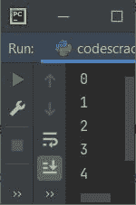
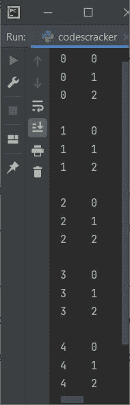
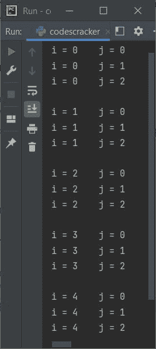

# Python 中的循环

> 原文：<https://codescracker.com/python/python-loops.htm>

单词“loop”是指由弯曲的曲线产生的形状。意味着，在循环中运行，连续运行。同样，Python 中的 loop 用于多次执行一个代码块。

## Python 中的循环类型

Python 中有 3 种类型的循环，包括嵌套循环。以下是所有这三个循环的列表:

*   [为循环](/python/python-for-loop.htm)
*   [`while`循环](/python/python-while-loop.htm)
*   嵌套循环

**注意-** 嵌套循环是两种类型，即可以嵌套**，或者**可以嵌套**，或者 两者的组合。无论程序员需要什么。这两种类型的嵌套循环将在循环的单独教程中介绍。**

## Python 循环示例

由于对和**的**和**循环都有详细描述，在单独的教程中。因此，本文仅 包括这些循环的一些基础知识。详情可以参考关于它的单独教程。另外，下一个教程是关于**循环的 关于**。现在，让我们举一个例子，说明 Python 中的循环:**

```
for i in range(5):
    print(i)
```

Python 中上述循环程序产生的输出显示在下面给出的快照中:



由于上面的程序使用**作为**循环，因此让我们创建相同的程序，使用**而**循环:

```
i = 0
while i<5:
    print(i)
    i = i+1
```

这个程序，产生与前一个程序完全相同的输出。如您所见，Python 中两个循环的主要任务是多次执行一段代码。也就是说，在第一个程序中，下面的代码(单个语句):

```
print(i)
```

被执行 5 次。而在第二个程序中，下面的代码块(多条语句):

```
print(i)
i = i+1
```

也会被执行 5 次。即程序流在循环的同时不断进入**的主体，每次都有新的 **i** (循环变量)值，直到条件 **i < 5** 评估为假。**

## Python 中的嵌套循环

下面是一个示例程序，演示了 Python 中嵌套循环的概念和用法:

```
for i in range(5):
    for j in range(3):
        print(i, "\t", j)
    print()
```

上述程序产生的输出是:



上面的程序也可以写成这样，以产生更容易理解的输出:

```
for i in range(5):
    for j in range(3):
        print("i =", i, "\t", "j =", j)
    print()
```

这是上面程序产生的输出，这一次:



**注意-**[range()函数](/python/python-range-function.htm)生成一个数字序列。如果只给它提供一个 参数，那么它将生成一个从 0 到比参数值小 1 的数字序列。 例如， **range(5)** 返回/给出 **0，1，2，3，4** 。

因此，如果将 **range()** 替换为其返回的数字序列，上面的程序变成:

```
for i in 0, 1, 2, 3, 4:
    for j in 0, 1, 2:
        print(i, "\t", j)
    print()
```

程序仍然产生相同的输出。你可以自己去看看。

所以，与其浪费时间写这些序列，我们需要 **range()** 。所以很多时候，我们 用这个函数为 Python 中的循环迭代**。我们也可以迭代字符串，列表等。迭代这些对象在单独的教程中描述 。**

同样的嵌套循环程序也可以使用 **while** 循环来创建，如下图所示的程序:

```
i = 0
while i<5:
    j = 0
    while j<3:
        print(i, "\t", j)
        j = j+1
    print()
    i = i+1
```

产生与前一个程序完全相同的输出。

#### 更多示例

*   [打印乘法表](/python/program/python-program-print-multiplication-table.htm)
*   [打印质数](/python/program/python-program-print-prime-numbers.htm)
*   [求一个数的阶乘](/python/program/python-program-find-factorial-of-number.htm)
*   [花样程序](/python/program/python-program-print-star-pyramid-patterns.htm)
*   [相加两个矩阵](/python/program/python-program-add-two-matrices.htm)
*   [矩阵乘法程序](/python/program/python-program-matrix-multiplication.htm)

[Python 在线测试](/exam/showtest.php?subid=10)

* * *

* * *