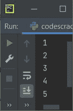

# Python 中的`for`循环

> 原文：<https://codescracker.com/python/python-for-loop.htm>

Python 中的循环的**用于多次执行某个代码块。本文旨在为 Python 中的循环提供 *的所有版本。也就是说，这篇文章涉及:***

*   使用**对**循环迭代[字符串](/python/python-strings.htm)
*   使用**对**循环迭代[列表](/python/python-lists.htm)
*   使用 [range()函数](/python/python-range-function.htm)为循环迭代
***   **对于具有**范围的**回路()**，按规定值启动*   **为**循环，带**范围()**，开始并按指定值递增*   使用 **range()** 反向或向后迭代循环的***   **for** 循环用 [else 语句](/python/python-if-else-elif-statements.htm)*   [中断循环的**中的语句**](/python/python-break-statement.htm)*   [继续循环的**中的语句**](/python/python-continue-statement.htm)*   [为循环传递**中的语句**](/python/python-pass-statement.htm)*   用于循环的嵌套****

 ******先来看看循环的**语法。然后在 **Python`for`循环示例**部分，一个接一个，所有 以上版本的 **for** 循环都用示例程序进行了描述。**

## Python`for`循环语法

在 Python 中对循环使用**的语法是:**

```
for loop_variable in sequence:
   statement_1
   statement_2
   statement_3
   .
   .
   .
   statement_n
```

或者，

```
for loop_variable in sequence:
   body of the loop
```

## Python`for`循环示例

本节借助示例程序逐一描述循环的**的所有版本。**

### 使用`for`循环迭代字符串

循环的*可用于逐个迭代字符串中的所有字符，如下面给出的程序所示:*

```
string = "codescracker"
for c in string:
    print(c)
```

上述程序产生的输出显示在下面给出的快照中:


上面的程序也可以写成:

```
for c in "codescracker":
    print(c)
```

上述程序的预演如下:

*   在第一次迭代时，字符串“codescracker”的第一个字符，即“c”被初始化为循环变量，即 **c**
*   所以使用 [print()函数](/python/python-print-statement.htm)，打印出 **c** 的值，也就是‘c’得到
*   在第二次迭代中，字符串“codescracker”的第二个字符，即“o”被初始化为循环变量，即 **c**
*   再次使用 *print()* ，打印出 **c** 的新值，即‘0’
*   这个过程继续，直到字符串“codescracker”的最后一个字符，即“r”
*   这样，字符串中的所有字符都被一个接一个地打印出来，如上面给出的快照所示

也就是说，无论您提供什么:

```
for c in 
```

被视为一个*序列*。因为在上面的程序中，有一个字符串“ **codescracker** ”。因此， 字符串被视为一个序列，也就是字符序列。例如，如果用下面给出的 程序修改上述程序:

```
for c in "codescracker", 2, True, 'c', 3.4:
    print(c)
```

然后，这一次:

```
"codescracker", 2, True, 'c', 3.4
```

被视为序列。因此，一个接一个地，所有五个元素被一个接一个地打印出来，如下面给出的快照所示:


**注意-** 任何东西都可以作为循环的**中的序列，在 Python 中是可迭代的。**

因为 **int** 对象是不可迭代的。因此以下程序:

```
for c in 1234:
    print(c)
```

产生如下图所示的错误:


### 使用`for`循环迭代列表

还可以使用 *for* 循环来迭代该列表，如下面给出的程序所示:

```
mylist = [1, 2, 3, 4, 5]
for i in mylist:
    print(i)
```

上述程序产生的输出是:



上面的程序也可以写成:

```
for i in [1, 2, 3, 4, 5]:
    print(i)
```

或者

```
for i in 1, 2, 3, 4, 5:
    print(i)
```

上述程序的试运行，与前面程序描述的试运行方式相似。也就是说，所有五个元素都被逐一初始化为 **i** (上述程序的循环变量)。并且 **i** 的值被打印出来，如上面给出的输出中的 所示。

下面是另一个程序，使用 **for** 循环来迭代列表:

```
mylist = ['P', 'Y', 'T', 'H', 'O', 'N']
for i in mylist:
    print(i)
```

现在上面的程序产生的输出是:

```
P
Y
T
H
O
N
```

这是另一个程序，用**代替**循环来迭代单词列表:

```
mylist = ['python', 'on', 'codes', 'cracker']
for i in mylist:
    print(i)
```

下面给出的快照显示了上述程序产生的输出:


这一次，列表包含四个单词，并且列表通过元素进行迭代，而不管元素是什么，也就是说，它是数字、字符还是单词等等。元素被逐一迭代。

### 使用 range()函数迭代`for`循环

就我过去 5-6 年用 Python 编程所见。很多时候， **for** 循环附带了**【range()】** 功能。也就是大多数时候，我们需要**中的 **range()** 进行**循环。下面是一个最简单的**的 Python 代码，用于带有 **range()** 的** 循环。

```
for i in range(10):
    print(i)
```

下面给出的快照显示了使用 Python 中的 循环的**中的 **range()** 函数的上述程序产生的示例输出:**


在上面的程序中，**范围(10)** 生成一个从 0 开始的数，递增 1，并在 9 处停止(比值 10 少 1 )。也就是说， **0，1，2，3，4，5，6，7，8，9** 是由 **range()** 产生的 10 个数字。所有的数字被一个接一个地打印出来，就像之前的程序一样。

### 对于范围为()的循环，从指定值开始

如果给 **range()** 提供两个参数。然后，迭代从第一个参数的值开始。让我们 创建另一个版本的程序，它使用**作为**循环，使用 **range()** 。这次，我向 **range()** 提供了两个 参数:

```
for val in range(10, 20):
    print(val)
```

现在上面的程序产生的输出是:


**注-** 关于 Python 中 [range()函数的所有细节，在单独的教程 中提供。](/python/python-range-function.htm)

### 对于范围为()的循环，以指定值开始并递增

要将循环变量的值增加指定的值，我们需要向 **range()** 提供三个参数。 因为，如果你提供两个参数，那么第一个参数指示迭代从哪里开始，第二个参数 指示迭代从哪里停止。但是提供了第三个参数，表示将循环变量增加第三个参数的 值。让我们看看下面给出的程序:

```
for val in range(2, 22, 2):
    print(val)
```

循环迭代从 2 开始，每次递增 2，在 20 处停止，或者在 22(第二个参数)前减 2，如下面给出的输出所示:


### 使用 range()反向或向后迭代`for`循环

为了向后或反向迭代循环的**，我们需要向 **range()** 函数提供 3 个参数。第一个 参数是值，迭代从这里开始。第二个参数是迭代停止的值。第三个参数 的值必须是负数，以便在每次迭代中减少循环变量。如果提供-1，那么循环 变量每次递减 1。**

```
for val in range(10, 0, -1):
    print(val)
```

即第一个参数 **10** 指的是迭代开始的数字，第二个参数**0**T6】指的是结束，但不加 0，迭代在数字前一位停止，即 **1** ，最后第三个参数 加-1(-1)，以便反向迭代。

上述程序产生的输出显示在下面给出的快照中:


**注-** 第三个参数，用于递增/递减循环变量。如果第三个参数值是正的 形式，那么循环变量将增加该值。否则，如果第三个参数的值为负，那么 循环变量的值每次都会减少该值。

下面是另一个程序，反向打印值，每次递减 2:

```
for val in range(10, 0, -2):
    print(val)
```

上述程序产生的输出是:

```
10
8
6
4
2
```

### 带有 else 语句的`for`循环

与循环的**一起使用的 **else** ，用于在**循环的**执行结束时执行该语句:**

```
for i in range(5):
    print(i)
else:
    print("Loop Execution finished!")
```

上述程序产生的输出是:


###`for`循环中的`break`语句

**break** 语句或循环的**内的关键字，一般用于退出循环，而不执行 完成或循环的剩余迭代**

```
mylist = [1, 2, 3, 4, 5, 6, 7, 8]
for i in mylist:
    if i==6:
        break
    print(i)
```

在上面的程序中，下面的代码块:

```
if i==6:
    break
```

用于在 **i** 的值等于 6 时退出循环。上述程序产生的输出将是:

```
1
2
3
4
5
```

###`for`循环中的`continue`语句

循环的**内的 **continue** 语句，通常用于强制程序流以新的迭代 开始，而不执行同一循环内 **continue** 关键字/语句后的剩余语句。**

```
mylist = [1, 2, 3, 4, 5, 6, 7, 8]
for i in mylist:
    if i==6:
        continue
    print(i)
```

从上面的程序中，当条件 **i==6** 评估为真时，程序流程进入 **if** 块。并且**继续**关键字被执行。这迫使程序流继续新的迭代，而不在同一个循环中执行 **continue** 关键字之后的语句。也就是说，语句:

```
print(i)
```

当 **i** 的值为 6 时，不执行。上述程序产生的输出显示在下面给出的 的快照中:


参见， **6** 在输出屏幕上不可用。

### 在`for`循环中传递语句

**通道**什么也不做。因此，它被用在程序的语法需要语句的地方，但是我们不需要放置或执行任何语句。让我们来看看下面给出的程序，它使用 Python 中 **内的 **pass** 语句进行**循环:

```
print("Before \"for\" loop.")

for i in range(5):
    pass

print("After \"for\" loop.")
```

输出应该是:

```
Before "for" loop.
After "for" loop.
```

下面是另一个程序在 Python 的循环的**中使用**传递**:**

```
print("Before \"for\" loop.")

for i in range(10):
    if i==5 or i==6:
        pass
    else:
        print(i)

print("After \"for\" loop.")
```

这一次，输出应该是:


即，当 **i** 的值变为等于 5 或 6 时，则条件评估为真，并且程序流 进入的**的**块的 **if。这里**传递**只是传递下一个迭代 的程序流，而不做任何事情。**

## Python 中嵌套的`for`循环

Python 中的循环也可以嵌套在另一个循环中。例如，下面给出的程序将一个循环的**嵌套在另一个 循环中:**

```
for i in range(5):
    for j in range(i+1):
        print("*", end=" ")
    print()
```

上述程序在循环的嵌套**上产生的输出为:**


以下是上述程序的简短预演:

*   在第一次迭代时，0 被初始化为 **i** 。由于 0 小于 5，因此程序流程进入 循环，其中 **i=0**
*   在循环内部，还有另一个**用于**循环
*   因此，在循环的内部**的第一次迭代中，0 被初始化为 **j** 。由于 0 小于**I+1**T10 或 **0+1** 或 **1** ，因此程序流程进入内循环**
*   在第二个循环中，带有空格的星号( ***** )被输出
*   [端](/python/python-end.htm)用于改变 **print()** 的默认行为。也就是说，不是 在每次**打印()**后插入新行。上面程序中的**结束**，强制 **print()** 插入一个空格
*   现在 **j** 的值增加了 1。所以 **j=1** 。但 **j** 的值，即 **1** 不小于 **i+1** 或 **1** 。因此，程序流不会进入该循环
*   因此循环的第二个**之后的 **print()** 被执行。这会在输出屏幕上插入一个新行**
*   现在， **i** 的值增加。所以 **i=1** 。并且 **i** 的值，即 1 小于 5，因此程序流再次进入循环内部
*   在循环内部，因为有另一个**用于**循环。因此循环的第二个**再次开始执行。 这次用 **i=1** 。即最初 **j=0** ，小于 **i+1** 或 **1+1** 或 **2** ，因此 程序流程进入**循环的第二个**内。因此带有空格的 ***** 被打印出来**
*   现在 **j=1** 再次小于 **i+1** 或 **2** 。因此会打印另一个带有空格的 ***** 。
*   但在第三次迭代时， **j=2** 不小于 **2** 。因此，现在，执行停止
*   然后执行 **print()** ，插入一个新行
*   现在， **i** 的值再次增加 1。也就是现在的 **i=2** 。由于 2 再次小于 5，因此 程序流程再次进入循环内部
*   这个过程继续，直到条件评估为假

#### 关于`for`循环的更多示例

*   [求一个数的阶乘](/python/program/python-program-find-factorial-of-number.htm)
*   [打印质数](/python/program/python-program-print-prime-numbers.htm)
*   [花样程序](/python/program/python-program-print-star-pyramid-patterns.htm)
*   [打印弗洛伊德的三角形](/python/program/python-program-print-floyd-triangle.htm)
*   [相加两个矩阵](/python/program/python-program-add-two-matrices.htm)

[Python 在线测试](/exam/showtest.php?subid=10)

* * *

* * *******