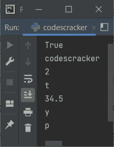

# Python 中的 while 循环

> 原文：<https://codescracker.com/python/python-while-loop.htm>

Python 中的 **while** 循环，用于多次执行某个代码块。我已经包含了所有版本的 循环。也就是说，这篇文章涉及:

*   **while** 循环示例
*   **而**循环为无限循环
*   如何在循环时停止**的无限执行**
*   **while** loop with [break 关键字](/python/python-break-statement.htm)
*   **while** 循环用[继续关键字](/python/python-continue-statement.htm)
*   **while** 用[循环传递关键字](/python/python-pass-statement.htm)
*   **而**循环用[列表](/python/python-lists.htm)
*   **而**循环用[否则](/python/python-if-else-elif-statements.htm)阻塞
*   **而**以单线循环
*   最后，嵌套的 **while** 循环

## Python while 循环语法

Python 中使用 **while** 循环的语法是:

```
while expression:
   statement(s)
```

其中**表达式**是指条件表达式。该表达式也可以直接与**真**或 **假**一起使用。或任何必须返回 True/False 结果的条件表达式。

如果条件表达式评估为真，那么程序流进入**内部，同时**循环的块和 执行其主体中所有可用的语句。否则，如果条件评估为假。那么程序流 不执行它的语句和整个**的执行，而**循环停止。

在执行完所有在**体中可用的语句后，while** 循环。再次对循环的条件表达式 求值。这个过程一直持续到条件表达式的计算结果为假。现在让我们借助下面给出的示例程序来实际理解 **while** 循环。

## Python while 循环示例

让我们创建一个最简单的 Python 程序，它使用了 **while** 循环。也就是下面给出的程序 用 python 演示了 **while** 循环:

```
i=1
while i <= 10:
    print(i)
    i = i+1
```

以下是上述 python 程序生成的示例输出:


上述程序的预演如下:

*   由于程序的第一条语句是，`i=1`。因此，最初 **1** 被初始化为 变量 **i** 。所以 **i=1**
*   现在开始执行第二条语句或在循环中执行
***   即条件 **i < = 10** 或 **1 < = 10** 评估为**真**。因此程序流程进入循环内部*   在循环内部，有两条语句。因此，两个语句都是一个接一个执行的*   也就是说，语句`print(i)`打印出 **i** 的值。也就是说， **1** 被打印在输出上*   使用第二个语句， **i** 的值增加 1。所以现在 **i=2***   因为当循环时**的所有语句都被执行。因此，程序流再次用新的值 **i** 评估循环的条件 表达式***   也就是说，表达式 **i < = 10** 或 **2 < = 10** 再次评估为**真***   因此，程序流再次进入循环。*   因此 **2** 被打印在输出上，并且 **i** 的值使用 **while** 循环的第二条语句递增。现在 **i=3***   当循环再次被求值时，**的条件表达式被求值。也就是说， **i < = 10** 或 **3 < = 10** 第三次评估为真***   这个过程继续，直到条件评估为假**

 ****重要-** 当循环时，不要忘记从**的主体内部更新(递增/递减)循环变量。否则， 循环将永远继续执行。**

这里是另一个关于 **while** 循环的例子。这个程序 [接收来自用户](/python/program/python-program-get-input-from-user.htm)的输入。并且程序继续 接收来自用户的输入，直到用户输入**学习 python** 作为输入:

```
print("Hey! Welcome")
print("What are you doing here ?")
what = input()

while what != "learning python":
    what = input("What ?\n")

print("Right.")
```

下面是 Python 中上述 **while** 循环示例的一些运行示例。下面是上面的 程序产生的初始输出:


现在键入你的答案说**我不知道**，并按`ENTER`键将输入存储在**什么**变量中。 现在使用 **what** 变量得到的输入与 string **学习 python** 得到的比较。如果所做的**的值 不等于该字符串，那么程序流进入循环内部，并接收另一个输入。以下是输出:**


既然，**不知道**不等于**学 python** 。因此，另一个 **input()** 语句得到执行 ，它接收来自用户的另一个输入。下面是在 codescracker 上学习用户输入**的另一个示例:**


同样，第二个输入也不等于在 **while** 循环的条件表达式中提供的字符串。因此 程序将再次接收输入。这是第三次样本运行。不过这次有了必需的输入，那就是**学习 python** :


### while 循环为无限循环

如果 **while** 循环的条件表达式总是评估为真，那么该循环进行无限的 执行。举个例子，

```
while True:
   statement(s)
```

或者

```
while 0<10:
   statement(s)
```

或者

```
while "codescracker" == "codescracker":
   statement(s)
```

等等。由于第一个循环本身使用了 **True** 关键字，因此循环将永远执行下去。在第二个 **while** 循环的条件表达式中，条件 **0 < 10** 总是评估为真。因此，该循环 总是无限地继续执行。第三个**和**循环也是如此。

两个表达式，即 **0 < 10** 和**“codescracker”= =“codescracker”**间接指**真**。 因为这两个条件表达式总是评估为真。

### 如何停止 while 循环的无限执行？

为了停止无限执行 **while** 循环，我们需要更新循环变量，或者从循环体内部使用 **break** 关键字。让我们看看怎么做。

### 带有 break 关键字的 while 循环

**break** 关键字用于退出循环。或者它可以用于跳过循环的剩余执行。

```
i = 1
while True:
    val = 2*i
    print(val)
    i = i+1
    if i>10:
        break
```

上述程序产生的输出显示在下面给出的快照中:


上面的**程序在**循环时是这样创建的，循环继续执行，直到[的条件 if](/python/python-if-else-elif-statements.htm)，即 **i > 10** 评估为真。也就是说，如果 条件评估为真，则程序流进入其块或 **if** 的主体，并且 **break** 语句 得到执行，从而在循环时停止**的剩余执行。**

### 带有 continue 关键字的 while 循环

**continue** 关键字用于跳转到下一次迭代，跳过循环体的剩余语句 的执行，如果在关键字之后可用的话。

```
i = 9
while i<=20:
    i = i+1
    if i%2 != 0:
        continue
    print(i)
```

这个程序打印从 10 到 20 的所有偶数(如果是偶数，包括这两个数字)。下面给出的快照显示了上述程序产生的示例输出:


### 带有 pass 关键字的 while 循环

**pass** 关键字不做任何事情。它可以用作代码或代码块的占位符，将来必须实现 。

```
mystr = "codescracker"
count = 0

while count < len(mystr):
    count = count+1
    pass

print("Length of String =", count)
```

下面是上述程序产生的输出:


但是，上面的程序也可以不用**通过**来编写，输出也是一样的。下面是同样的程序没有 **通行证**:

```
mystr = "codescracker"
count = 0

while count < len(mystr):
    count = count+1

print("Length of String =", count)
```

我已经在单独的教程中提供了关于 **pass** 的所有细节。另外 [在另一个单独的教程中比较了 pass 与 continue](/python/python-pass-vs-continue.htm) 。

### 使用列表循环时

下面给出的程序使用 list 作为 **while** 循环的条件表达式。

```
mylist = ['p', 'y', 34.5, 't', 2, 'codescracker', True]

while mylist:
    print(mylist.pop())
```

上述程序产生的输出显示在下面给出的快照中:



在上面的程序中，使用 **pop()** 方法从末尾弹出或者 [删除列表元素](/python/program/python-delete-element-from-list.htm)。

下面是另一个程序，使用 **while** 循环来实现 list。这个程序接收 列表的大小和元素。然后在输出屏幕上打印列表元素，使用 **while** 循环:

```
print("Enter the Size: ", end="")
tot = int(input())
i = 0
mylist = list()
print("Enter", tot, "Numbers: ", end="")

while i<tot:
    val = int(input())
    mylist.insert(i, val)
    i = i+1

i = 0
print("\n-------The List is-------")

while i<tot:
    print(mylist[i], end=" ")
    i += 1
```

下面是它的示例运行，其中用户输入 **6** 作为大小， **23，24，25，26，39，40** 作为六个元素:


[结束](/python/python-end.htm)用于跳过使用 [print()函数](/python/python-print-statement.htm)自动插入新行。

### while 用 else 块循环

带有 **else** 语句的 **while** 循环，用于在完成循环的 执行后，使用 **else** 执行语句。例如:

```
i = 9
while i<=20:
    i = i+1
    if i%2 != 0:
        continue
    print(i)
else:
    print("All even numbers from 10 to 20 are given above")
```

下面是这个 Python 程序产生的输出，显示了使用 **else** 语句和 **while** 循环:


## 在单行中循环时

Python 中的 **while** 循环也可以写成单行。下面是一个在单行中使用循环的例子:

```
i = 1
while i <= 10: print(5 * i); i += 1
```

上述程序产生的输出是:

```
5
10
15
20
25
30
35
40
45
50
```

## 嵌套 while 循环

就像[用于循环](/python/python-for-loop.htm)， **while** 循环也可以嵌套在另一个 **while** 循环中。下面是一个例子，演示了 Python 中嵌套的 **while** 循环的使用:

```
print("Enter any Number: ")
n = int(input())
print("Enter Number of Rows: ")
no_of_rows = int(input())
i = 0
j = 0

while i<no_of_rows:
    while j<i+1:
        print(n, end=" ")
        j = j+1
    j = 0
    i = i+1
    print()
```

下面是上述程序产生的初始输出:


现在输入一个数字，比如说 **1** ，然后输入行数，比如说 **5** 以将 **1** 打印成五行，第一行一个 “1”，第二行两个“1”，第三行三个“1”，第四行四个“1”，第五行 和五个“1”，如下图所示:


#### 更多示例

*   [打印乘法表](/python/program/python-program-print-multiplication-table.htm)
*   [打印质数](/python/program/python-program-print-prime-numbers.htm)
*   [求一个数的阶乘](/python/program/python-program-find-factorial-of-number.htm)
*   [矩阵乘法程序](/python/program/python-program-matrix-multiplication.htm)

[Python 在线测试](/exam/showtest.php?subid=10)

* * *

* * ***