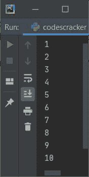
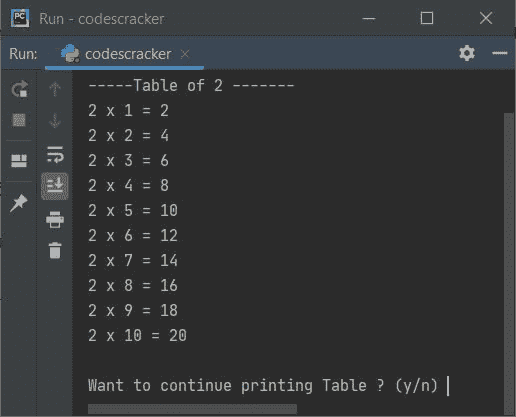
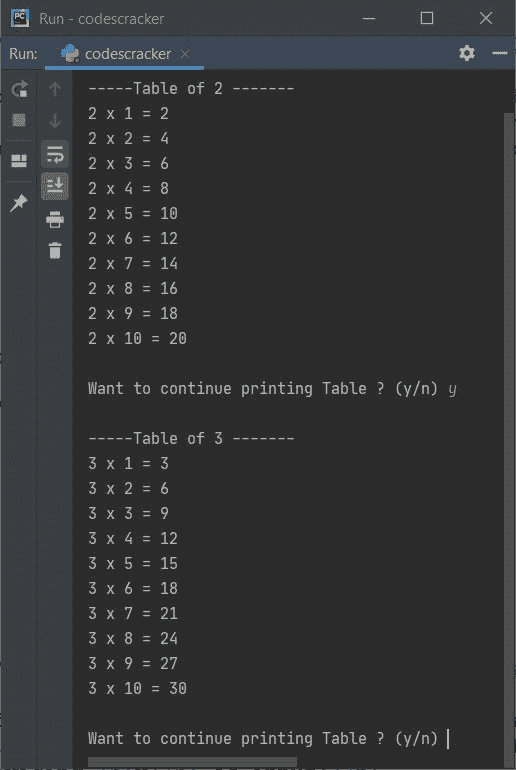
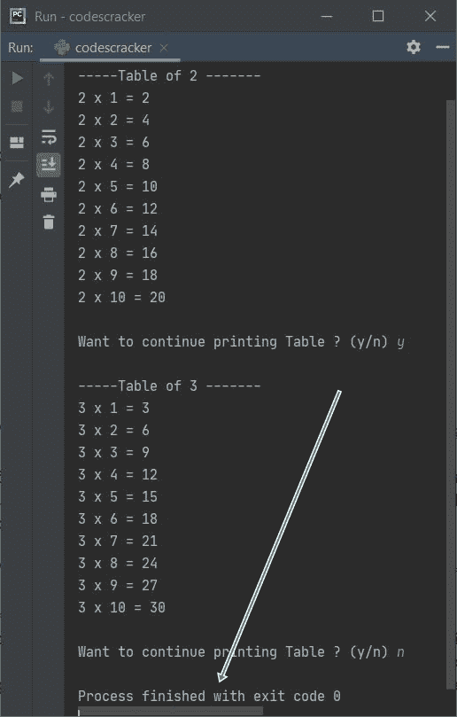
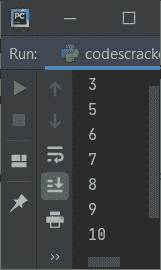
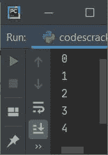
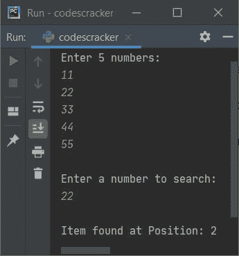

# Python 中的`break`语句

> 原文：<https://codescracker.com/python/python-break-statement.htm>

本教程涵盖了 Python 中第二常用的条件语句之一，名为 **break** 。在这里，我向 提供了关于 **break** 关键字或语句的所有细节及其简单示例。这篇文章涉及:

*   什么是 **break** 语句？
*   **break** 语句的语法
*   **中断**语句的例子
*   **中断[中的](/python/python-while-loop.htm)**语句，同时循环
*   **中断嵌套的**中的**语句，同时**循环
*   **为循环中断[中的](/python/python-for-loop.htm)**语句

## 什么是`break`语句？

Python 中的 **break** 语句用于退出一个[循环](/python/python-loops.htm)。换句话说，我们使用 **break** 关键字来终止整个/完整循环在其缩进中的剩余执行。不要担心定义， 在理解下面给出的[例子](/python/program/index.htm)后，你会了解它的一切。

## Python 中`break`语句的语法

使用 **break** 关键字的语法只是关键字本身。因此，它的语法是:

```
break
```

就是这样。除了关键字本身，我们不需要其他任何东西。

## Python 中`break`语句的示例

现在让我们来看一些关于 **break** 关键字或语句的例子。让我们以**中断**语句中的 **而**循环为例。

###`while`循环中的`break`语句

该程序在**和**循环中包含**中断**。

```
count = 0
while True:
    count = count+1
    if count>10:
        break
    print(count)
```

该程序产生如下图所示的输出:



从上面的输出可以看出，当变量**计数**变得大于 10 时。也就是说，当 **计数**的值变为 11 时，则条件**计数> 10** 评估为**真**，因此如果的主体和语句 **break** 被执行，则程序流程进入 [内部，这使得循环留给 进一步执行，或者在循环的同时简单地终止**的剩余执行。**](/python/python-if-else-elif-statements.htm)

让我们再举一个 **break** 关键字/语句的例子，这对你理解在 Python 中使用 **break** 的好处很有帮助:

```
num = 2
while True:
    mul = 1
    print("\n-----Table of", num, "-------")
    while mul<=10:
        print(num, "x", mul, "=", num*mul)
        mul += 1
    print("\nWant to continue printing Table ? (y/n) ", end="")
    confirm = input()
    if confirm == 'n':
        break
    num += 1
```

这是上述程序产生的初始输出:



打印完 **2** 的表格后，程序询问用户是否要打印下一张表格，或者是否要跳过或停止 的表格打印。确认时，输入 **y** 打印下一张表，否则输入 **n** 停止。例如，在提供 **y** 作为输入后，下面给出的输出 产生:



因为当循环被给出时**的条件是**真**，它总是被评估为真，因此 循环的执行永远不会结束，直到并且除非你使用 **break** 关键字。为此，我们必须输入 **n** 作为输入，以便 条件 **confirm=='n'** 评估为真，并且程序流进入 **if** 主体并执行 **break** 关键字，这有助于退出/离开循环，如下面给出的运行示例所示:**



#### 嵌套`while`循环中的`break`语句

这个程序在一个**中使用 **break** 关键字，而**循环出现在另一个 **while** 循环中:

```
count = 0
while count<10:
    count = count+1
    while count<5:
        if count==3:
            break
        count = count+1
    print(count)
```

该程序产生以下输出:



上述程序的执行过程如下:

*   首先 **0** 被初始化为**计数**
*   现在条件**计数< 10** 或 **0 < 10** 评估为真
*   因此，程序流进入**的主体，而**循环
*   在循环体内，第一条语句，即 **count = count+1** 被执行
*   因此**计数+1** 或 **0+1** 或 **1** 被初始化为**计数**
*   现在条件**计数< 5** 或 **1 < 5** 评估为真
*   因此，程序流进入循环体内(内部**而**循环)
*   并且条件**计数==3** 或 **1==3** 评估为假
*   因此，如果阻塞，程序流不会进入**的主体**
*   而是执行语句 **count = count+1** (在内部循环中)
*   即**计数+1** 或 **1+1** 或 **2** 被初始化为**计数**
*   因为内部循环的所有语句都被执行了
*   然后程序流程再次评估该条件
*   因此，条件**计数< 5** 被再次评估
*   这一次，再次**计数< 5** 或 **2 < 5** 评估为真
*   因此，程序流再次进入循环
*   并且条件**计数==3** 或 **2==3** 再次评估为假
*   现在**计数+1** 或 **2+1** 或 **3** 被初始化为**计数**
*   程序流程再次评估内部循环的条件。这个过程继续，直到条件评估为假
*   也就是说，条件**计数< 5** 或 **3 < 5** 再次评估为真
*   因此，程序流再次进入这个循环
*   但是这一次，**的条件如果**，即**计数==3** 或 **3==3** 评估为真
*   因此程序流进入这个 **if** 的主体
*   并且使用 **break** 关键字，我们已经离开了循环(内部**而**循环)
*   也就是说，使用 **break** ，其最近的父循环的剩余执行被终止或停止
*   退出循环后，使用 **print ()** 语句，打印出 **count** 的值。也就是 **3**
*   当执行循环时，外部**的所有语句**
*   因此，它的条件再次得到评估。这个过程一直持续到条件评估为假
*   也就是说，条件**计数< 10** 或 **3 < 10** 再次评估为真
*   因此，程序流再次进入循环，并且**计数+1** 或 **3+1** 或 **4** 被初始化为**计数**
*   并且评估内部循环的条件，**计数< 5**
*   也就是说，条件**计数< 5** 或 **4 < 5** 评估为真
*   因此程序在这个内部循环中流动
*   在该循环内，条件(如果**)**计数==3** 或 **4==3** 评估为假**
*   因此程序流不会进入它的主体。相反，它增加了计数的值
***   也就是说，**计数**的值现在等于 5*   而这次内循环的条件，即**计数< 5** 或 **5 < 5** 评估为假*   因此，内 **while** 循环的执行从现在开始停止。因为从现在开始，每一次条件都评估为假*   现在，从 5 到 10 的值一个接一个地输出*   也就是说，值 **1** 、 **2** 和 **4** 不会被打印出来**

 **###`for`循环中的`break`语句

下面给出的程序使用**中的 **break** 语句进行**循环:

```
for i in range(10000000):
    if i==5:
        break
    print(i)
```

下面是它的示例输出:



如你所见，使用 **break** 语句，当 **i** 的值等于 5 时，我已经停止了循环的剩余执行。

让我们再举一个例子，展示一下 **break** 语句最重要的用法:

```
nums = list()
print("Enter 5 numbers: ")
for i in range(5):
    nums.append(int(input()))

print("\nEnter a number to search: ")
n = int(input())

for i in range(5):
    if n==nums[i]:
        print("\nItem found at Position:", i+1)
        break
```

以下是用户输入的示例运行，11，22，33，44，55 作为五个数字， **22** 作为要搜索的数字:



**注意-****break**关键字有助于节省不必要的代码执行。从上面的程序可以看出，当我们的工作完成时，也就是找到元素时。那么我们不需要执行或搜索更多的剩余元素。 因此使用 **break** 关键字，我们简单地从循环中退出。就是这样。

[Python 在线测试](/exam/showtest.php?subid=10)

* * *

* * ***