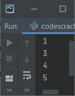
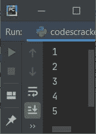
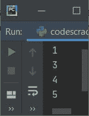
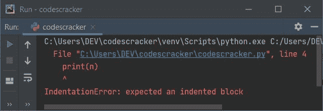

# Python 中的 pass 语句

> 原文：<https://codescracker.com/python/python-pass-statement.htm>

顾名思义， **pass** 语句什么也不做，因为它被视为空语句。现在可能，这个问题可能 出现在你的脑海里:

*   如果 **pass** 语句什么都不做，那么我们为什么需要/使用它或者 Python 为什么提供这个语句？

这个问题的答案可能是根据程序员的需要。但我已经为上述问题提供了两个充分的理由/答案，即:

*   我们可以在任何需要语句的地方使用 **pass** 语句来避免语法错误。并且只有当程序 的那个部分不需要采取任何行动时。
*   如果我们将来想要添加一些代码块，我们也可以使用 **pass** 语句。也就是说，简而言之， **pass** 语句 也可以作为占位符，用于我们将来想要编写的任何代码块

**重要的**-**pass**语句什么也不做，它只是在语法上需要避免语法错误的时候才需要，但是 实际上什么也不做。也就是说，如果程序需要提供语句，但我们什么都不想做，那么我们可以使用**传递** [关键字](/python/python-keywords.htm)或语句。

## pass 语句的语法

**pass** 的完整语句是空的，但是 **pass** 关键字本身，因此如果我们谈论它的语法， 那么它就是关键字 **pass** 如下所示:

```
pass
```

我们可以在整个 Python 程序中的任何地方使用 **pass** 语句，比如:

*   我们可以在条件块中使用它
*   我们可以在用户自定义的[函数](/python/python-functions.htm)中使用它
*   我们也可以在[类](/python/python-classes-objects.htm)中使用它

## pass 语句的示例

**pass** 语句的理论部分完成。因此，是时候学习它的例子了。这个例子非常有助于理解 像 Python 这样的计算机编程世界中的主题:

```
nums = [1, 2, 3, 4, 5]
for n in nums:
    if n==2:
        pass
    else:
        print(n)
```

下面给出的快照显示了上面的示例程序对 **pass** 语句产生的示例输出:



从上面的示例输出中可以看到，数字 **2** 被跳过打印。因为使用了 [if 语句](/python/python-if-else-elif-statements.htm)， 我已经应用了条件 **n==2** ，这说明，每当 **n** 的值等于 2 时，那么程序流就进入 **if** 的 体。而在**的主体内，如果**，我已经使用了**传递**语句，那就什么都不做了。

由于 **pass** 语句什么也不做，它只是传递它所在的块或主体。让我们再举一个例子， 与前面的节目有关:

```
nums = [1, 2, 3, 4, 5]

for n in nums:
    if n==2:
        pass
    print(n)
```

这一次，程序在输出中产生所有五个数字，如下图所示:



不同于 [continue](/python/python-continue-statement.htm) 强制循环继续下一次迭代，跳过 rest 语句，它位于同一缩进中 **continue** 关键字的下方，以执行。迷茫？我们举个例子来区分这两者:)

```
nums = [1, 2, 3, 4, 5]

for n in nums:
    if n==2:
        continue
    print(n)
```

该程序产生以下输出:



要么**传递**作为未来代码的占位符，要么用于避免语法错误。例如，下面的程序:

```
nums = [1, 2, 3, 4, 5]
for n in nums:
    if n == 3:
    print(n)
```

产生如下图所示的错误:



因此，为了避免这些类型的语法错误，我们使用 **pass** 语句，如下面给出的程序所示:

```
nums = [1, 2, 3, 4, 5]
for n in nums:
    if n == 3:
        pass
    print(n)
```

[Python 在线测试](/exam/showtest.php?subid=10)

* * *

* * *