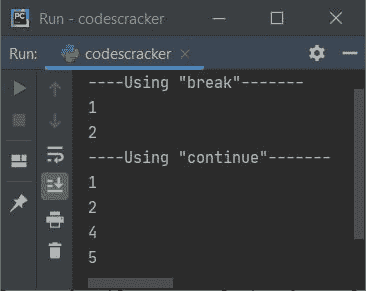

# Python 中中断和继续的区别

> 原文：<https://codescracker.com/python/python-break-vs-continue.htm>

本教程旨在消除您对 Python 编程语言中两个条件语句的著名比较之一的疑问，即 [break](/python/python-break-statement.htm) 和`continue`语句。

## 中断与继续

下表区分了**中断**和**继续**关键字:

| 破裂 | 继续 |
| 离开循环 | 跳转到下一个迭代 |
| 跳过整个循环的剩余执行 | 对于当前迭代，跳过循环内剩余语句的执行 |
| 如果条件总是评估为真，则有用 | 如果希望在任何特定的迭代中跳过循环内某些语句的执行，这是很有用的 |

## 中断与继续示例

我相信，在理解了下面给出的示例程序后，你会对 Python 中的**break**vs . **continue**关键字有完整的理解。也就是说，这两个关键字或语句是如何在 Python 编程中使用的:

```
nums = [1, 2, 3, 4, 5]

print("----Using \"break\"-------")
for n in nums:
    if n == 3:
        break
    print(n)

print("----Using \"continue\"-------")
for n in nums:
    if n == 3:
        continue
    print(n)
```

该程序产生如下图所示的输出:



从上面的程序中可以看出，第一块代码，也就是:

```
for n in nums:
    if n == 3:
        break
    print(n)
```

仅打印 **1、2** 。因为，当 **n** 的值变为 3 时，那么条件 **n == 3** 或 **3 == 3** 评估 为真，并使用 **break** 终止循环的执行。而第二部分，也就是下面这段代码:

```
for n in nums:
    if n == 3:
        continue
    print(n)
```

打印除 3 以外的所有数字。因为，当条件 **n == 3** 评估为真时，因此使用 continue，程序 流程跳转到循环的下一次迭代，并且关键字 **continue** 之后的剩余语句，即 **print (n)** 被跳过。

[Python 在线测试](/exam/showtest.php?subid=10)

* * *

* * *