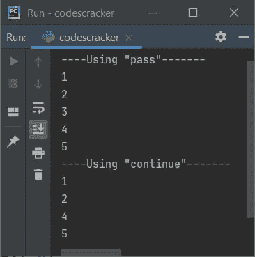

# Python 中传递和继续的区别

> 原文：<https://codescracker.com/python/python-pass-vs-continue.htm>

本文旨在消除您对 Python 语言的两个条件语句的所有疑问，即 [pass](/python/python-pass-statement.htm) 和 [continue](/python/python-continue-statement.htm) 语句。 我相信，在理解了这里提供的所有东西后，你会对这两个陈述或关键词有完整的了解。

## 通过与继续

下表区分了 Python 编程语言的 **pass** 和 **continue** 语句:

| 及格 | 继续 |
| 无所作为 | 跳转到下一个迭代 |
| 在语法上需要时需要，但实际上不需要 | 当希望跳过当前迭代循环中剩余语句的执行时，需要此选项 |
| 可用作未来代码的占位符 | 不能用作未来代码的占位符 |

### 传递与继续示例

示例对于理解任何计算机编程语言(如 Python)的主题都有很大帮助。因此，在这里，我也创建了一个示例，向您轻松展示这两种说法之间的区别:

```
nums = [1, 2, 3, 4, 5]

print("----Using \"pass\"-------")
for n in nums:
    if n == 3:
        pass
    print(n)

print("----Using \"continue\"-------")
for n in nums:
    if n == 3:
        continue
    print(n)
```

该程序产生以下输出:



从上面的输出可以看出， **pass** 语句什么都不做，而 **continue** 语句跳过剩余语句的执行 ，也就是说， **continue** 跳转到下一次迭代，而 **pass** 则不执行。

[Python 在线测试](/exam/showtest.php?subid=10)

* * *

* * *