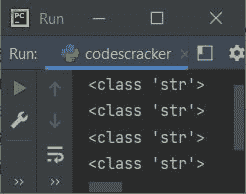

# Python 数据类型

> 原文：<https://codescracker.com/python/python-data-types.htm>

Python 中的数据类型基本上是数据的一个属性，它告诉编译器或解释器如何解释它的值。例如，如果我们有一个数值类型的数据，就意味着，它可以用来执行算术运算。

## Python 7 内置数据类型

数据类型表示值的类型，并确定如何在 Python 程序中使用该值。以下是 7 种内置数据类型的列表:

1.  文本类型
2.  数字类型
3.  序列类型
4.  映射类型
5.  设置类型
6.  布尔型
7.  二进制类型

让我们简要描述一下这 7 种内置数据类型，一个接一个，并附上示例程序。但是在开始之前，让我们先了解一下我们如何得到数据的类型，一个变量持有。

### 如何获得数据的类型，一个对象(变量)持有？

为了找到并打印数据的类型，一个变量保存在 Python 中，我们需要使用 **type** 方法。下面是一个示例程序， 演示了它:

```
myvar = 10
print(type(myvar))
```

上述 Python 程序产生的输出显示在下面给出的快照中:


从上面的输出中可以看出，因为变量 **myvar** 保存的值 **10** 是一个整数值， 因此输出结果显示，变量 **myvar** 属于类 **int** 。

### Python 文本数据类型

在 Python 中， **str** 类属于文本数据类型的范畴。该数据类型保存所有的 [字符串](/python/python-strings.htm)值。这里有一个例子:

```
myvar = 'c'
print(type(myvar))
myvar = "c"
print(type(myvar))
myvar = "codescracker.com"
print(type(myvar))
myvar = "Hey, What's Up!"
print(type(myvar))
```

下面是它的示例输出:



上述程序也可以创建为:

```
a, b, c, d = 'c', "c", "codescracker.com", "Hey, What's Up!"
print(type(a))
print(type(b))
print(type(c))
print(type(d))
```

您将得到与前一个程序相同的输出。

### Python 数字数据类型

在数字数据类型的类别下，我们有:

*   **int**——例如:123
*   **浮动** -例如:3.49
*   **复杂**——比如:95+4j。这里 95 是实数，而 4 是虚数

下面是一个使用数字数据类型的示例程序。我使用了三个具有三个不同数值的变量，如 **int** 、 **float** 和 **complex** :

```
a, b, c = 123, 3.49, 95.4j
print(type(a))
print(type(b))
print(type(c))
```

上述程序产生的输出将是:

```
<class 'int'>
<class 'float'>
<class 'complex'>
```

### Python 序列数据类型

这是我们必须了解的另一个重要的数据类型。这种数据类型按顺序处理值。序列允许我们在同一个变量中存储多个相同/不同类型的值。以下是序列类型列表:

*   [列表](/python/python-lists.htm) -由逗号分隔的多个元素(值)的集合。所有元素必须存放在方括号内， 即[]。列表可以改变，意味着列表是可变的。
*   [tuple](/python/python-tuples.htm) -与 list 相同，但所有元素必须存储在圆括号内，即()。而元组不能被改变，意味着 元组是不可变的。
*   [range](/python/python-range-function.htm) -它生成一个不可变的序列。例如，range(5)生成或返回 0，1，2，3，4

**注意-** 要详细了解这三个主题，请参考其单独的教程。

让我们举一个例子，在 Python 中使用所有这三种类型的序列:

```
var = [1, "codescracker", True, 23.4, 234]
print(type(var))
var = (1, "codescracker", True, 23.4, 234)
print(type(var))
var = range(10)
print(type(var))
```

上述程序产生的输出将是:

```
<class 'list'>
<class 'tuple'>
<class 'range'>
```

### Python 映射数据类型

[字典](/python/python-dictionary.htm)属于 Python 中映射数据类型的类别。在字典中，每个条目都在一对 键和值中。由于每一项(元素)都是键和值对的形式，因此属于 映射数据类型的范畴。

像 list 一样，dictionary 也是可变的。以下示例显示了 Python 中的映射类型:

```
var = {'day': 'Thursday', 'month': 'September', 'year': '2021'}
print(type(var))
var = {1: 'day', 2: 'month', 3: 'year'}
print(type(var))
```

现在，上述程序产生的输出将是:

```
<class 'dict'>
<class 'dict'>
```

### Python 集合数据类型

在这个数据类型类别下，我们基本上有两种类型。以下是这两种类型的列表:

*   set -它允许存储多个元素的集合，用逗号分隔。所有元素都必须存储在大括号 中，即{}。集合是可变的。
*   frozenset -它还允许存储多个元素。要创建它，首先创建一个列表，然后使用 **frozenset()**来冻结列表。冷冻集是不可变的。

下面是一个例子，使用了两种类型。

```
var = {"Liam", "Noah", "Oliver"}
print(type(var))
var = ["Elijah", "William", "Benjamin", "Lucas"]
var = frozenset(var)
print(type(var))
```

现在，如果您执行这个程序，那么产生的输出将完全类似于:

```
<class 'set'>
<class 'frozenset'>
```

### Python 布尔数据类型

当我们需要评估两个可能值中的一个时，比如说**真**和**假**，就会用到布尔数据类型。 下面是一个例子，演示了 Python 中的布尔数据类型:

```
var = True
print(type(var))

var = False
print(type(var))

print(type(True))
print(type(False))
```

上面的 Python 程序产生的输出(演示布尔数据类型)将是:

```
<class 'bool'>
<class 'bool'>
<class 'bool'>
<class 'bool'>
```

### Python 二进制数据类型

大多数时候，Python 中的二进制数据类型用于提高性能。以下是三种二进制类型的列表:

*   **字节** -字节类型的值基本上是一个字节序列，准备存储在内存或磁盘中。 使用 **bytes()** 来转换字符串、数字等。转换成字节序列。或者在**b’**和【T6’中放入字符串或数字 等。比如 **b'codescracker.com'** 或者**bytes(" codescracker . com ")**。Bytes 对象是不可变的。
*   bytearray -这是一个字节数组。所以类似于字节。但与字节不同，它是可变的。
*   **memory view**—**memory view**对象将 C 级缓冲区接口公开为 Python 对象。也就是说， **memoryview()**用于创建 memory view 对象，将**字节的**类型值作为其参数传递。

这里有一个例子，演示了这三种二进制类型。

```
var = b"codescracker"
print(type(var))

var = bytes("codescracker", "utf-8")
print(type(var))

var = bytearray(10)
print(type(var))

var = memoryview(bytes(10))
print(type(var))
```

下面给出的快照显示了上述 Python 程序产生的示例输出:


从上面的程序中，下面的语句:

```
var = bytes("codescracker", "utf-8")
```

使用 **utf-8** 编码方法对字符串 **codescracker** 进行编码。

### 关于 Python 数据类型的大型程序

这是最后一个示例程序，涵盖了 Python 中的所有数据类型。首先，我将所有类型的值初始化为一些变量，然后打印值和类型。让我们来看看:

```
a = 'c'
b = "c"
c = "codescracker"

d = 12
e = 43.93
f = 43j

g = ["Henry", "Alexander"]
h = ("Mason", "Michael", "Ethan")
i = range(5)

j = {"Name": "Daniel", "Age": 38}

k = {"Owen", "Aiden"}
l = frozenset(g)

m = True
n = False

o = bytes(c, "utf-8")
p = bytearray(b, "utf-8")
q = bytearray(c, "utf-8")
r = memoryview(bytes(d))
s = memoryview(bytes(c, "utf-8"))
t = memoryview(bytearray(d))
u = memoryview(bytearray(c, "utf-8"))

print("--------------------------------------------------------------------")
print("Variable\t Value\t\t\t\t\t\t\t\t Type")
print("--------------------------------------------------------------------")
print("a\t\t\t", a, "\t\t\t\t\t\t\t\t\t", type(a))
print("b\t\t\t", b, "\t\t\t\t\t\t\t\t\t", type(b))
print("c\t\t\t", c, "\t\t\t\t\t\t", type(c))
print("d\t\t\t", d, "\t\t\t\t\t\t\t\t", type(d))
print("e\t\t\t", e, "\t\t\t\t\t\t\t\t", type(e))
print("f\t\t\t", f, "\t\t\t\t\t\t\t\t", type(f))
print("g\t\t\t", g, "\t\t\t", type(g))
print("h\t\t\t", h, "\t\t", type(h))
print("i\t\t\t", i, "\t\t\t\t\t\t", type(i))
print("j\t\t\t", j, "\t\t", type(j))
print("k\t\t\t", k, "\t\t\t\t\t", type(k))
print("l\t\t\t", l, "\t", type(l))
print("m\t\t\t", m, "\t\t\t\t\t\t\t\t", type(m))
print("n\t\t\t", n, "\t\t\t\t\t\t\t\t", type(n))
print("o\t\t\t", o, "\t\t\t\t\t", type(o))
print("p\t\t\t", p, "\t\t\t\t\t", type(p))
print("q\t\t\t", q, "\t\t", type(q))
print("r\t\t\t", r, "\t", type(r))
print("s\t\t\t", s, "\t", type(s))
print("t\t\t\t", t, "\t", type(t))
print("u\t\t\t", u, "\t", type(u))
```

**说真的！**，我是说这么多横向制表符(\t)。下面给出的快照显示了由 这个关于 Python 中数据类型的大型程序产生的样本输出:


#### 更多示例

*   [将华氏温度转换为摄氏温度](/python/program/python-program-convert-fahrenheit-to-celsius.htm)
*   [将十进制转换成二进制](/python/program/python-program-convert-decimal-to-binary.htm)
*   [将八进制转换成二进制](/python/program/python-program-convert-octal-to-binary.htm)

[Python 在线测试](/exam/showtest.php?subid=10)

* * *

* * *