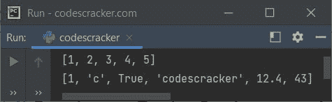
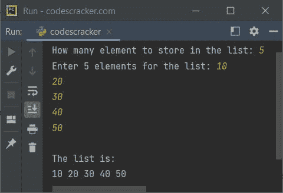

# Python 列表

> 原文：<https://codescracker.com/python/python-lists.htm>

Python 中的 List 是一个内置的[数据类型](/python/python-data-types.htm)，用于在 中存储多个条目，一个单独的[变量](/python/python-variables.htm)。也就是说，当我们需要在一个 单变量中存储数据集合时，我们使用 list。

**注-** 列表项为<u>排序</u>、<u>可变</u>、<u>允许重复</u>。

列表项是有序的，意味着列表中的所有项(元素或值)都是有编号的。例如，如果有一个名为 **mylist** 的列表，那么 **mylist[0]** 引用第一个元素，而 **mylist[1]** 引用第二个元素，以此类推。

列表项是可变的，意味着我们可以在初始化后进一步改变列表项。

列表项允许重复值，这意味着在一个特定的列表中，可能有两个或更多的项具有相同的值。

## 用 Python 语法创建一个空列表

可以通过以下两种方式创建空列表:

1.  使用方括号。也就是 **[ ]**
2.  使用 **list()** 构造函数

### 使用方括号创建一个空列表

以下是使用方括号在 Python 中创建空列表的语法:

```
listName = []
```

### 使用 List()构造函数创建一个空列表

要使用 **list()** 构造函数创建空列表，请使用以下语法:

```
listName = list()
```

## 用 Python 语法创建列表

以下是用 Python 创建值列表的语法:

```
listName = [value1, value2, value3, ..., valueN]
```

其中**值 1** 、**值 2** 、**值 3** 等。可以是任何数据类型，如整数、浮点、 布尔、字符串、字符等。也可以是一个列表。

另一种创建列表的方法是使用 **list()** 构造函数。下面是语法:

```
listName = list((value1, value2, value3, ..., valueN))
```

**注意-** 记住双括号。

## 用 Python 创建并打印一个列表——示例

这是列表中的第一个例子。此示例程序创建一个列表，然后在输出屏幕上按原样打印该列表。

```
mylist = [1, 2, 3, 4, 5]
print(mylist)

mylist = [1, 'c', True, "codescracker", 12.4, 43]
print(mylist)
```

同样的程序也可以这样创建:

```
mylist = list((1, 2, 3, 4, 5))
print(mylist)

mylist = list((1, 'c', True, "codescracker", 12.4, 43))
print(mylist)
```

下面给出的快照显示了上面的 Python 代码在 list 上产生的输出:



如前所述，列表是 Python 中的一种内置数据类型。该列表可用于在单个变量中存储多个值，如上面给出的程序所示。也就是说，使用第一条语句将值 **1、2、3、4、5** 初始化为 单个变量，比如说 **mylist** 。使用第三个语句定义一个列表的类似操作。

**注-** 列表项的索引方式是第一项存储在第 0 <sup>第</sup>索引处，而第二项存储在第 1 <sup>第</sup>索引处，依此类推。

### 列表可以包含不同类型的元素吗？

是的，当然。列表元素可以是相同或不同的[类型](/python/python-data-types.htm)。 这里有一个例子:

```
x = [12, 'c', 32.54, "codes", True]
print(x)
```

输出将是:

```
[12, 'c', 32.54, 'codes', True]
```

## 使用索引访问和打印列表元素

列表中的元素可以通过前向索引或后向(负向)索引使用其索引来访问。下面给出的快照显示了正向和反向索引:


也就是说，要访问名为 **mylist** 的列表的第一个元素，我们需要使用 **mylist[0]** ，而 要访问列表的最后一个元素，我们需要使用 **mylist[-1]** 。下面的例子展示了如何使用前向索引来访问和打印列表元素。

```
mylist = [1, 2, 3, 4, 5]
print(mylist[0])
print(mylist[1])
print(mylist[2])
print(mylist[3])
print(mylist[4])
```

这个 Python 程序产生的输出是:

```
1
2
3
4
5
```

下面是另一个程序，展示了我们如何使用反向索引来访问列表中的元素:

```
mylist = [1, 2, 3, 4, 5]
print(mylist[-1])
print(mylist[-2])
print(mylist[-3])
print(mylist[-4])
print(mylist[-5])
```

以下是该程序产生的输出:

```
5
4
3
2
1
```

我知道上面的程序看起来不可思议，因为如果列表中有更多的元素，那么编写带有索引号的 **print()** 语句，对于所有的元素来说，是不可能的，而且也要花费太多的时间。因此， 我们需要使用循环来打印列表元素。下面给出了基于它的示例程序。

## Python 使用循环打印列表元素

这个程序做的工作和前一个程序一样。唯一的区别是它的方法。也就是说，这个程序使用**代替**循环来完成工作:

```
mylist = [1, 2, 3, 4, 5]
for element in mylist:
    print(element)
```

您将得到与前一个程序相同的输出。

### 使用循环在单行中打印列表的所有元素

大多数时候，我们需要在一行中打印所有的列表元素。因此，这个程序展示了如何用 Python 编码，以便在单行中打印列表元素，而不是多行:

```
mylist = [1, 2, 3, 4, 5]
for element in mylist:
    print(element, end=" ")
```

下面是它的输出:

```
1 2 3 4 5
```

**注意-****结束参数**用于跳过自动换行的插入，使用 **print()** 。

## Python 创建并打印用户输入的列表

现在让我们创建另一个列表示例程序，它允许用户定义列表的大小和元素。已定义的列表元素将在输出屏幕上打印出来:

```
print("How many element to store in the list: ", end="")
n = int(input())
print("Enter", n, "elements for the list: ", end="")
mylist = []
for i in range(n):
    val = input()
    mylist.append(val)

print("\nThe list is:")
for i in range(n):
    print(mylist[i], end=" ")
```

使用用户输入的 **5** 作为列表大小，使用 **10、20、30、40、50** 作为其五个元素的示例运行，在下面给出的快照中显示了 :



## Python 列表长度-查找列表的长度

当使用 list 时， **len()** 函数在 Python 的大部分程序中起着重要的作用，特别是当使用其元素由用户在程序运行时定义的 list 时。因为在那种情况下，函数 **len()** 会找到列表的长度，当然，这个长度在大多数时候起着至关重要的作用。让我们拿 来看一个最简单的例子，使用**的 len()** 函数:

```
mylist = [1, 2, 3, 4, 5]
print("\nLength of List =", len(mylist))
```

以下是它的示例输出:

```
Length of List = 5
```

另一种不使用 **len()** 方法查找并打印列表长度的方法是:

```
mylist = [1, 2, 3, 4, 5]
count = 0
for element in mylist:
    count = count+1
print("\nList contains", count, "items.")
```

上述程序产生的输出是:

```
List contains 5 items.
```

## Python 列表切片-向前

以下是 Python 中分割列表的语法:

```
listVariable[startIndex, endIndex, step]
```

其中 **startIndex** 是切片开始的起始索引号。该指标下的要素为 <u>包含</u>。 **endIndex** 是切片停止的最后一个索引号。该索引处的元素为 <u>排除</u>。而**步骤**是在我们需要对一个列表的条目进行切片时使用的，同时在切片时跳过中间的每第 N 个 <sup>元素。</sup>

**注-** 默认情况下， **startIndex** 值为 0， **endIndex** 值等于 列表的长度， **step** 值等于 1。

在考虑 Python 中列表切片的例子之前。让我们看看下面的列表:

```
mylist = [1, 2, 3, 4, 5, 6, 7, 8, 9, 10]
```

现在:

*   mylist[0:] 给出或返回[1，2，3，4，5，6，7，8，9，10]
*   my list[:]给出[1，2，3，4，5，6，7，8，9，10]
*   mylist[:10] 给出[1，2，3，4，5，6，7，8，9，10]
*   mylist[2:4] 给出[3，4]
*   mylist[2:8:3] 给出[3，6]
*   mylist[2:9:3] 给出[3，6，9]
*   mylist[::3] 给出[1，4，7，10]

这是 Python 中列表切片的一个例子。这个程序以多种方式对一个名为 **mylist** 、 的列表进行切片，这样所有列表切片(向前)的概念都将很容易用一个程序来清除:

```
mylist = [1, 2, 3, 4, 5, 6, 7, 8, 9, 10]

print("The original list is:")
print("mylist =", mylist)

print("\nList slicing example:")
print("mylist[0:] =", mylist[0:])
print("mylist[:] =", mylist[:])
print("mylist[:10] =", mylist[:10])
print("mylist[2:4] =", mylist[2:4])
print("mylist[2:8:3] =", mylist[2:8:3])
print("mylist[2:9:3] =", mylist[2:9:3])
print("mylist[::3] =", mylist[::3])
```

下面给出的快照显示了上面的 Python 代码在列表切片上产生的示例输出:


## Python 列表切片-向后

索引 **-1** 处的元素将被视为列表的最后一个元素，而索引 **-lengthOfList** 处的元素将被视为列表的第一个元素。下面是一个使用 <u>负</u>索引的列表切片示例:

```
mylist = [1, 2, 3, 4, 5, 6, 7, 8, 9, 10]

print("The original list is:")
print("mylist =", mylist)

print("\nList slicing example (using backward indexing):")
print("mylist[-10:] =", mylist[-10:])
print("mylist[-8:] =", mylist[-8:])
print("mylist[:] =", mylist[:])
print("mylist[:-1] =", mylist[:-1])          # second index's value is excluded
print("mylist[:-4] =", mylist[:-4])
print("mylist[-4:-2] =", mylist[-4:-2])
print("mylist[-8:-2:3] =", mylist[-8:-2:3])
print("mylist[-9:-2:3] =", mylist[-9:-2:3])
print("mylist[-10:-1:3] =", mylist[-10:-1:3])
print("mylist[::3] =", mylist[::3])
```

上面 Python 代码的运行示例显示在下面给出的快照中:


## Python List Append -向列表中添加新元素

因为列表项是可变的，所以我们可以随时向列表中添加所需的元素。可以在列表的末尾或给定的索引处添加元素。让我们从在 Python 中的列表末尾添加一个列表元素开始。

### 在列表末尾添加新元素

**append()** 方法在我们需要在列表末尾添加元素时使用。这里有一个例子:

```
mylist = [1, 2, 3, 4, 5]

print("The original list is:")
print("mylist =", mylist)

print("\nEnter an Element to add: ", end="")
element = int(input())
mylist.append(element)

print("\nNow the list is:")
print("mylist =", mylist)
```

下面给出的快照显示了上述 Python 程序的示例运行，其中用户输入 **10** 作为要添加的元素:


### 在列表中给定索引处添加新元素

当我们需要 [在列表中指定的索引处插入一个元素](/python/program/python-insert-element-in-list.htm)时，就要用到 **insert()** 方法。这里 是一个例子:

```
mylist = [1, 2, 3, 4, 5]

print("The original list is:")
print("mylist =", mylist)

print("\nEnter an Element to add: ", end="")
element = int(input())
print("At what index ? ", end="")
index = int(input())

if index <= len(mylist):
    mylist.insert(index, element)
    print("\nNow the list is:")
    print("mylist =", mylist)
else:
    print("\nInvalid Index Number!")
```

使用用户输入 **500** 作为元素，使用 **3** 作为索引号向列表中添加新元素的示例运行，在下面给出的快照中显示了 :


下面是另一个例子，演示了如何在列表中的指定索引处插入元素。

```
mylist = ['c', 'o', 'd', 's', 'c']

print("The original list is:")
print("mylist =", mylist)

mylist.insert(3, 'e')
print("\n1\. Now the list is:")
print("mylist =", mylist)

mylist.insert(6, 'r')
print("\n2\. Now the list is:")
print("mylist =", mylist)

mylist[7:10] = ['a', 'c', 'k', 'e']
print("\n3\. Now the list is:")
print("mylist =", mylist)

mylist.insert(11, 'r')
print("\n4\. Now the list is:")
print("mylist =", mylist)
```

要在特定索引处添加元素，而不删除该索引处的先前可用值，请使用 **insert()** 。 使用 **insert()** 在指定索引处插入元素时，该索引<u>之后的所有元素将</u>前移一个 索引。

## Python 替换列表中的单个或多个元素

使用对单个或多个索引的单个或多个值的直接初始化来向列表添加新元素。但是元素在用于初始化的索引处被替换。下面是它的示例程序，演示了这个概念:

```
mylist = ['c', 'o', 'd', 's', 'c']

print("The original list is:")
print("mylist =", mylist)

mylist[3] = 'x'
print("\n1\. Now the list is:")
print("mylist =", mylist)

mylist[3:5] = ['e', 's']
print("\n2\. Now the list is:")
print("mylist =", mylist)

mylist[6:12] = ['c', 'r', 'a', 'c', 'k', 'e', 'r']
print("\n3\. Now the list is:")
print("mylist =", mylist)

mylist[3] = 'x'
print("\n4\. Now the list is:")
print("mylist =", mylist)

mylist[2:8] = 'z'
print("\n5\. Now the list is:")
print("mylist =", mylist)

mylist[1:6] = ['a', 'b']
print("\n6\. Now the list is:")
print("mylist =", mylist)

mylist[:] = 'x'
print("\n7\. Now the list is:")
print("mylist =", mylist)
```

让我们把注意力集中在上述程序的输出上，以便理解这个概念。

```
The original list is:
mylist = ['c', 'o', 'd', 's', 'c']

1\. Now the list is:
mylist = ['c', 'o', 'd', 'x', 'c']

2\. Now the list is:
mylist = ['c', 'o', 'd', 'e', 's']

3\. Now the list is:
mylist = ['c', 'o', 'd', 'e', 's', 'c', 'r', 'a', 'c', 'k', 'e', 'r']

4\. Now the list is:
mylist = ['c', 'o', 'd', 'x', 's', 'c', 'r', 'a', 'c', 'k', 'e', 'r']

5\. Now the list is:
mylist = ['c', 'o', 'z', 'c', 'k', 'e', 'r']

6\. Now the list is:
mylist = ['c', 'a', 'b', 'r']

7\. Now the list is:
mylist = ['x']
```

### 一次在列表末尾添加多个元素

当我们需要在一个列表的末尾添加多个元素时，使用 **extend()** 函数，而不需要将 列表转换成嵌套列表。这里有一个例子:

```
mylist = [1, 2, 3]
mylist.extend([4, 5])
print(mylist)
```

```
[1, 2, 3, 4, 5]
```

### 添加两个列表

除了这两个列表之外,+运算符也有帮助。以下是 Python 中列表添加的一个示例:

```
listOne = ['p', 'y', 't']
listTwo = ['h', 'o', 'n']

listThree = listOne + listTwo
print(listThree)

listOne = listOne + listTwo
print(listOne)
```

下面是它的示例输出:

```
['p', 'y', 't', 'h', 'o', 'n']
['p', 'y', 't', 'h', 'o', 'n']
```

## Python 列表移除

就像在列表中添加元素一样，有时我们也需要从列表中移除元素。列表元素可以通过以下两种方式之一删除:

1.  使用 **remove()** 方法
2.  使用 **pop()** 方法

### 使用 Remove()从列表中移除元素

当我们需要 [从列表](/python/program/python-delete-element-from-list.htm)中移除一个元素时，使用 **remove()** 方法，通过值使用元素。

```
mylist = [11, 22, 33, 44, 55]
print("The list is:")
print(mylist)

mylist.remove(44)
print("\nNow the list is:")
print(mylist)
```

输出是:

```
The list is:
[11, 22, 33, 44, 55]

Now the list is:
[11, 22, 33, 55]
```

### 使用 pop()从列表中移除元素

当我们需要从一个列表中弹出一个元素时，使用 **pop()** 方法，通过索引使用元素。

```
mylist = [11, 22, 33, 44, 55]
print("The list is:")
print(mylist)

mylist.pop(3)
print("\nNow the list is:")
print(mylist)
```

您将得到与前一个程序相同的输出。

### 使用 del 关键字一次从列表中删除多个项目

当我们需要从一个列表中删除多个元素时，使用 **del** 关键字。关键字 **del** 也可以 用来删除整个列表。这里有一个例子:

```
x = ['p', 'y', 't', 'h', 'o', 'n']
print(x)
del x[1]
print(x)
del x[1:4]
print(x)
del x
```

该程序产生的输出如下所示:

```
['p', 'y', 't', 'h', 'o', 'n']
['p', 't', 'h', 'o', 'n']
['p', 'n']
```

在使用了 **del x** 语句之后，整个列表 **x** 被删除。如果你试图打印 **x** ， ，那么程序会产生这样一个错误:


在加上 **print(x)** 作为上述程序的最后一条语句后，就产生了这个输出。

## Python 列表函数

这些是在 Python 中使用 list 时可以使用的函数。从列表的角度来看，所有这些功能都很重要。我已经非常简要地描述了所有这些功能。详细了解，可以参考其单独教程。

*   [list()](/python/python-list-function.htm) -将一个序列转换成一个列表
*   len() -返回列表的长度
*   [append()](/python/python-append-function.htm) -用于在列表末尾添加新元素。
*   [extend()](/python/python-extend-function.htm) -用于在列表末尾添加多个元素或一个 iterable
*   [insert()](/python/python-insert-function.htm) -在指定的索引处插入一个元素
*   [remove()](/python/python-remove-function.htm) -从列表中删除指定值的元素的第一个匹配项
*   [pop()](/python/python-pop-function.htm) -用于从列表中删除一个项目
*   [max()](/python/python-max-function.htm) -返回 iterable 中的最大值，或两个/多个参数之间的最大值
*   [min()](/python/python-min-function.htm) -返回 iterable 中的最小项，或者两个/多个参数之间的最小值
*   [clear()](/python/python-clear-function.htm) -用于清空列表
*   [index()](/python/python-index-function.htm) -返回指定值在列表中第一次出现的索引号
*   [count()](/python/python-count-function.htm) -返回列表中特定元素出现的次数
*   [sort()](/python/python-sort-function.htm) -用于对列表进行排序
*   [sorted()](/python/python-sorted-function.htm) -返回排序后的列表
*   [reverse()](/python/python-reverse-function.htm) -用于反转列表中的元素
*   [reversed()](/python/python-reversed-function.htm) -返回反转列表
*   [copy()](/python/python-copy-function.htm) -用于复制一个列表

## Python 嵌套列表-列表列表

列表可以嵌套在另一个列表中。也就是说，当我们添加一个列表本身而不是一个元素时，当初始化一个列表的元素时，这个列表就变成了一个嵌套列表。这里有一个例子:

```
mylist = [1, [2, 3, 4], 5, 6, [7, 8, 9, 10]]
print("Direct:")
print(mylist)

print("\nUsing loop:")
for x in mylist:
    print(x)
```

下面是它的示例输出:

```
Direct:
[1, [2, 3, 4], 5, 6, [7, 8, 9, 10]]

Using loop:
1
[2, 3, 4]
5
6
[7, 8, 9, 10]
```

下面是嵌套列表(列表列表)的另一个示例:

```
mylist = [1, [2, 3, 4], 5, 6, [7, 8, 9, 10]]
print(mylist[0])
print(mylist[1][0])
print(mylist[1][1])
print(mylist[1][2])
print(mylist[2])
print(mylist[3])
print(mylist[4][0])
print(mylist[4][1])
print(mylist[4][2])
print(mylist[4][3])
```

```
1
2
3
4
5
6
7
8
9
10
```

这是 Python 中嵌套列表或列表列表的最后一个例子。这个程序使用了一个名为 **books_list** 的列表，其中所有的元素本身都是一个包含 2 个元素的列表。

```
books_list = [["Java", "$128"], ["C++", "$99"], ["Python", "$169"]]
ch = None
while ch != "3":
    print("\n1\. Show Books List")
    print("2\. Add a Book")
    print("3\. Exit")
    print("Enter Your Choice (1-3): ", end="")
    ch = input()
    if ch == "1":
        print("\nBook\t\t Price")
        for book in books_list:
            book_name, book_price = book
            print(book_name, "\t\t", book_price)
    elif ch == "2":
        print("\nEnter the Name of Book: ", end="")
        book_name = input()
        print("Enter the Price: ", end="")
        book_price = input()
        book_price = "$" + book_price
        add_book = book_name, book_price
        books_list.append(add_book)
    elif ch == "3":
        print("\nOk!")
        break
    else:
        print("\nInvalid Choice!")
```

示例运行显示在下面给出的快照中:


## Python 列表理解

单词**理解力**的意思是**理解某事的能力**。理解了单子之后， 理解**单子理解**题目就变得容易了。

基本上 list comprehension 是由专业的 Python 程序员使用的，因为它允许在一条或几条语句中创建一个包含多个元素的列表。简而言之，列表理解是一种创建列表的简洁方法。

**定义** -列表理解是方括号内可用的表达式。该表达式使用一个 **作为**循环，通过列表理解创建一个列表。

### Python 列表理解语法

以下是使用列表理解创建列表的语法:

```
mylist = [expression for item in iterable if condition == True]
```

**if condition == True** 是可选的。

### Python 列表理解示例

下面是一个列表理解的例子。这个程序创建一个名为 **tableOf2** 的列表，包含 10 个元素:

```
tableOf2 = [2 * i for i in range(1, 11)]
print(tableOf2)
```

如果这个程序被执行，那么输出将是:

```
[2, 4, 6, 8, 10, 12, 14, 16, 18, 20]
```

**注意-****range()**方法返回一个数字序列。有关详细信息，请参考单独的教程。

这是另一个理解列表的例子。这个程序使用列表理解来打印 1，2，3，..., 10:

```
for num in range(1, 11):
    table = [num * i for i in range(1, 11)]
    print(table)
```

输出将是:

```
[1, 2, 3, 4, 5, 6, 7, 8, 9, 10]
[2, 4, 6, 8, 10, 12, 14, 16, 18, 20]
[3, 6, 9, 12, 15, 18, 21, 24, 27, 30]
[4, 8, 12, 16, 20, 24, 28, 32, 36, 40]
[5, 10, 15, 20, 25, 30, 35, 40, 45, 50]
[6, 12, 18, 24, 30, 36, 42, 48, 54, 60]
[7, 14, 21, 28, 35, 42, 49, 56, 63, 70]
[8, 16, 24, 32, 40, 48, 56, 64, 72, 80]
[9, 18, 27, 36, 45, 54, 63, 72, 81, 90]
[10, 20, 30, 40, 50, 60, 70, 80, 90, 100]
```

这是列表理解的最后一个示例程序。这个程序在列表理解的表达式中使用条件:

```
mylist = [x for x in range(100) if x<10]
print(mylist)
```

下面是它的输出:

```
[0, 1, 2, 3, 4, 5, 6, 7, 8, 9]
```

方法 **range()** 返回一个从 0 到 99 的数字序列。但是从所有的 0，1，2，3，...，99， 小于 10 的数字，初始化为名为 **mylist** 的列表元素。

[Python 在线测试](/exam/showtest.php?subid=10)

* * *

* * *