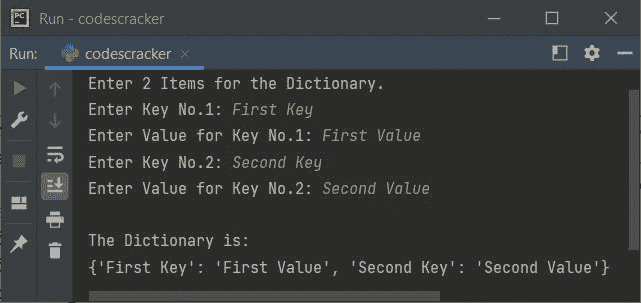
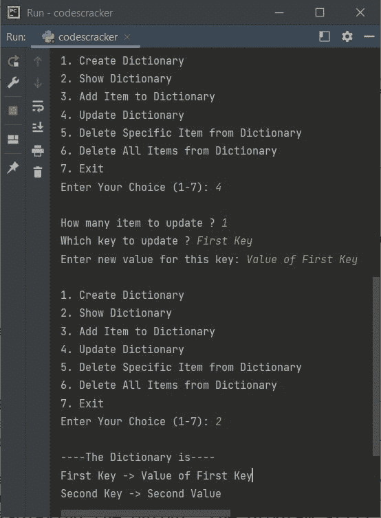

# Python 词典

> 原文：<https://codescracker.com/python/python-dictionary.htm>

Python 中的 Dictionary 是一种数据类型，是一种映射类型，当我们需要以 key:value 对的形式存储多个条目时就会用到。

在现实世界中，你可以考虑任何一本字典，其中的信息以 key:value 对的形式存储，其中 key 指的是单词，而 value 指的是它的定义。

字典有助于组织信息。例如，在字典里，所有的单词都是按字母顺序组织的，所以我们可以很容易地找到所需的单词，并很容易地得到关于该单词的定义或描述。

**注-**Python 中的字典是一个<u>有序</u>和<u>可变</u>的条目集合，其中 <u>不允许重复</u>。

## 用 Python 创建字典

在 Python 中，字典是以键和值对的形式创建的，其中键和值之间有一个冒号(:)，每一项之间有一个逗号(，)。每一项都包含一个键及其值。此外，所有项目必须用大括号括起来，即{}。以下是用 Python 创建字典的语法:

```
mydict = {key_1: val_1, key_2: val_2, ..., key_n: val_n}
```

这里 **key_1** 、 **key_2** 、 **key_n** 是键，而 **val_1** 、 **val_2** 、 **val_n** 是值。 下面是一个简单的字典示例:

```
mydict = {"Day": "Wednesday", "Month": "October"}
print(mydict)
```

上面的 Python 程序在 dictionary 上生成的输出显示在下面给出的快照中:


你可以在输出中看到整本字典。要访问和打印特定键的特定值，则需要使用 **mydict[key]** 。稍后，在本文中，您将了解关于访问键、值或字典条目的所有内容。

**重要的** -在创建字典时，请始终记住，字典的键必须是单个元素，而 值可以是单个元素，如整数、字符串等。或者多个元素，例如列表、元组等。

**注意-** 当创建每项成对的字典时，键和值之间不需要**冒号**(:)。 稍后，在本教程中，我们会看到这个例子。

### 创建具有多个关键字类型的字典

单个字典的所有键的数据类型可以相同，也可以不同。下面是一个示例，使用多种类型的密钥:

```
my_dictionary = {1: "Python", "city": "New York City"}
```

参见第一个键，即 **1** 为整数型，其中作为第二个键，即**城市**为字符串型。

### 为单个键创建具有多个值的字典

正如已经说过的**重要的**注意，字典中单个键的值可能是单个或多个 值。下面是一个例子，给一个名为**的键分配多个值，标记为**。

```
my_dictionary = {"Name": "Luis", "Marks": [89, 96, 73]}
```

在上面的语句中，**【89，96，73】**基本上是一个三元素(数字)的列表，这个列表是一个名为**的 标志**的键的值。

### 创建一个空字典

要创建一个空字典，不要在花括号内添加任何键值对。以下是用 Python 创建空字典的示例:

```
my_dictionary = {}
```

也可以使用 **dict()** 方法创建一个空字典，如下所示:

```
my_dictionary = dict()
```

### 使用 dict()方法创建字典

也可以使用 **dict()** 方法创建一个字典。这里有一个例子:

```
my_dictionary = dict({"Name": "Jonah", "Marks": [89, 93, 97]})
print(my_dictionary)
```

上述程序产生的输出将是:

```
{'Name': 'Jonah', 'Marks': [89, 93, 97]}
```

### 用成对的条目创建字典

在创建每个条目都成对的字典时，我们不需要使用冒号(:)来分隔键和值。也不需要花括号。下面是一个例子，展示了如何用成对的条目创建一个字典。

```
my_dictionary = dict([("Name", "Jonah"), ("Marks", [89, 93, 97])])
print(my_dictionary)
```

这个程序产生的输出将与前一个程序完全相同。

### 创建嵌套字典

字典也可以嵌套在另一个字典中。以下是 Python 中嵌套字典的一个示例:

```
my_dictionary = {"College": "Harvard University", "Program": "Computer Science",
                 "Student": {"Name": "Nathaniel", "Address": "1549 Scott Center Rd Sherman, New York(NY)",
                             "Marks": [97, 98, 85]}}
print(my_dictionary)

```

上面的 Python 程序在创建嵌套字典时产生的输出是:

```
{'College': 'Harvard University', 'Program': 'Computer Science', 'Student': {'Name': 'Nathaniel', 'Address': '1549 Scott Center Rd Sherman, New York(NY)', 'Marks': [97, 98, 85]}}
```

在上面的程序中，名为 **Student** 的键值本身就是一个字典，其中有三个条目。

## 在 Python 中访问字典键或值或项目

这一节很重要，它展示了如何只访问键、值或字典的所有条目。让我们从使用字典的键来访问字典的值开始。

### 通过关键字从字典中访问值

可以使用字典的键访问字典中的值。下面是语法:

```
my_dictionary[key];
```

其中 **key** 是将要访问其值的键的名称。例如:

```
mydict = {"Day": "Wednesday", "Month": "October"}
print(mydict["Day"])
print(mydict["Month"])
```

下面给出的快照显示了上述程序产生的示例输出:


问题是，如果字典中没有要访问其值的键，该怎么办？
让我们使用下面给出的程序，从字典中找出一个不可用的键:

```
mydict = {"Name": "Jonah", "City": "Tacoma"}
print(mydict["Marks"])
```

由于名为**的关键字标记**在名为 **mydict** 的字典中不存在，因此上述程序产生/引发了 一个错误，如下图所示:


由于引发的错误是 **KeyError** ，因此为了处理这个错误，我们需要使用 **try-except** 块作为 ，如下例所示:

```
mydict = {"Name": "Jonah", "City": "Tacoma"}
try:
    print(mydict["Marks"])
except KeyError:
    print("\nThe key named \"Marks\" is not available!")
```

现在输出将是:

```
The key named "Marks" is not available!
```

**get()** 方法也可用于使用键访问字典的值，如下例所示:

```
mydict = {"Day": "Wednesday", "Month": "October"}
print(mydict.get("Day"))
print(mydict.get("Month"))
```

输出将与前一个程序的输出相同。

**注意-** 使用 **get()** 方法访问字典中不可用的键，例如 **print(my dict . get(" Marks "))**产生 **None** 。

### 访问嵌套字典值

为了访问 Python 中的嵌套字典值，我们需要嵌套键。下面是访问嵌套字典中可用值的语法:

```
my_dictionary[key_one][key_two]
```

上面的代码返回名为 **key_two** 的 key 的值。 **key_two** 是嵌套 字典中可用的键之一，它是名为 **key_one** 的键的值。下面是一个访问嵌套字典中可用值的示例:

```
my_dictionary = {"College": "Harvard University", "Program": "Computer Science",
                 "Student": {"Name": "Nathaniel", "Address": "1549 Scott Center Rd Sherman, New York(NY)",
                             "Marks": [97, 98, 85]}}
print(my_dictionary["Student"]["Address"])
```

上面的程序显示了名为**学生**的关键字**地址**的值。以下是输出:

```
1549 Scott Center Rd Sherman, New York(NY)
```

### 打印字典的所有关键字

有时我们需要查看字典中所有可用键的名称。因此，下面是我创建的代码，它列出并打印了名为 **mydict** 的字典的所有键:

```
mydict = {"Name": "Jonah", "City": "Forks"}
for d in mydict:
    print(d)
```

下面是它的示例输出:

```
Name
City
```

### 打印字典的所有值

很多时候，我们需要看到字典的所有值，除了整个字典。因此，下面是我创建的程序，展示了如何用 Python 访问和打印字典的所有值:

```
mydict = {"Name": "Jonah", "City": "Forks"}
for i in mydict:
    print(mydict[i])
```

下面是它的示例输出:

```
Jonah
Forks
```

上面的程序也可以用下面的程序代替。这个程序使用 **values()** 方法做同样的任务，打印所有的 字典值:

```
mydict = {"Name": "Jonah", "City": "Forks"}
for i in mydict.values():
    print(i)
```

这个程序产生与前一个程序完全相同的输出。

### 打印字典的关键字和值

这是程序，我想每个人都需要得到，而学习 Python 中的字典。因为，大多数时候都需要手工获取和打印一个字典的所有键和值。因此，我创建了一个程序，展示了如何通过手动格式化输出来打印没有默认格式的字典的键和值:

```
mydict = {"Name": "Jonah", "City": "Tacoma"}

print("Key\t\t\t Value")
print("----------------------")
for i in mydict:
    print(i, "\t\t", mydict[i])
```

上述程序产生的输出将是:


### 打印字典的所有项目

这个程序使用 **items()** 方法打印一个字典的所有条目。让我们看看下面给出的程序:

```
mydict = {"Name": "Mark", "Program": "Computer Science", "Age": 22}
for i in mydict.items():
    print(i)
```

上述程序产生的输出将是:

```
('Name', 'Mark')
('Program', 'Computer Science')
('Age', 22)
```

每个项目的第一个元素表示关键值，而每个项目的第二个元素表示值。

此外，我们可以使用与上述程序相同的技术打印字典的键和值。以下是以手动格式打印字典的键和值的程序:

```
mydict = {"Name": "Mark", "Program": "Computer Science", "Age": 22}
for i, j in mydict.items():
    print(i, "->", j)
```

这个 Python 程序产生的输出将是:


## 在 Python 中向字典添加新项目

要向字典中添加新项目，语法如下:

```
my_dictionary[key] = value
```

或者使用 **update()** 方法向字典中添加一个新条目。下面是另一种语法，使用 **update()** 方法来做 与上面相同的任务:

```
my_dictionary.update({key: value})
```

**注意-** 对于字符串类型的键和/或值，使用**双引号(" "**)将键和/或值括起来。

**重要信息** -当使用上述两种方式中的任何一种向字典添加新条目时，将在 字典的末尾添加一个新条目。如果字典中已经有了键的名字，那么这个键的值就会被更新。是 因为，字典不允许重复。

以下是根据用户输入向字典添加/更新条目的示例:

```
print("Enter 2 Items for the Dictionary.")
my_dictionary = {}
for i in range(2):
    print("Enter Key No.", i+1, ": ", end="", sep="")
    key = input()
    print("Enter Value for Key No.", i+1, ": ", end="", sep="")
    value = input()
    my_dictionary.update({key: value})

print("\nThe Dictionary is:")
print(my_dictionary)
```

下面是用户输入的运行示例，**第一个键**和**第一个值**作为第一个 项的键和值，而**第二个键**和**第二个值**作为字典第二项的键和值:



**注-**[结束](/python/python-end.htm)和[结束](/python/python-sep.htm)是 print()的两个 参数，用于改变 print 语句的默认行为。

**注意-** 因为默认情况下， **input()** 方法将每个输入的值都视为字符串类型。也就是说，无论你输入什么 值，它都会被自动转换成字符串。

下面给出的例子显示了如果用于添加新条目的键已经存在于字典中，该值是如何更新的:

```
mydict = {"Name": "Jonah", "City": "Seattle"}
print(mydict)
mydict["City"] = "Bellingham"
print(mydict)
```

上述程序产生的输出将是:

```
{'Name': 'Jonah', 'City': 'Seattle'}
{'Name': 'Jonah', 'City': 'Bellingham'}
```

## 用 Python 查找字典的长度

要查找字典的长度，使用下面给出的程序中所示的 **len()** 方法:

```
my_dict = {1: "USA", 2: "UK", 3: "Australia"}
my_dict_len = len(my_dict)
print("The dictionary \"my_dict\" has", my_dict_len, "items.")
```

这将产生以下输出:

```
The dictionary "my_dict" has 3 items.
```

## 用 Python 从字典中删除一个条目

要从字典中删除一个条目，使用 **del** 关键字，如下例所示:

```
mydict = {"Day": "Wednesday", "Month": "October"}
print(mydict)

del mydict["Day"]
print(mydict)
```

上述 Python 程序产生的输出将完全是:


从上面的输出可以看出，字典的第二次打印，第一个条目，其关键字的名称是 **Day** 被 删除了。

**pop()** 方法也可用于使用项目的键名从字典中弹出/移除项目，如下例 所示:

```
mydict = {"Day": "Wednesday", "Month": "October"}
print(mydict)

mydict.pop("Day")
print(mydict)
```

输出将与之前的程序相同。

### 从词典中删除最后一项

要从字典中删除最后一项，请使用 **popitem()** ，如下例所示:

```
mydict = {"Day": "Wednesday", "Month": "October"}
print(mydict)

mydict.popitem()
print(mydict)

mydict.popitem()
print(mydict)
```

下面给出的快照显示了上述 Python 程序生成的示例输出:


**注意-** 每次我们使用 **popitem()** 的时候，最后一项都会从字典中删除。

现在的问题是，如果字典是空的，我们使用 **popitem()** 怎么办？
让我们使用下面给出的 程序来检查一下:

```
mydict = {"Name": "Jonah", "City": "Olympia"}
print(mydict)

mydict.popitem()
print(mydict)

mydict.popitem()
print(mydict)

mydict.popitem()
print(mydict)
```

这次的输出将是:


查看错误**key error:' pop item():dictionary is empty '**表示字典为空，因此没有可弹出的键 。因此，当字典中没有可用的 项时，我们需要进一步处理通过使用 **popitem()** 引发的 **KeyError** 错误，如下例所示:

```
mydict = {"Name": "Jonah", "City": "Yakima"}
print(mydict)

try:
    mydict.popitem()
    print(mydict)
except KeyError:
    print("\nThe Dictionary \"mydict\" is empty!")

try:
    mydict.popitem()
    print(mydict)
except KeyError:
    print("\nThe Dictionary \"mydict\" is empty!")

try:
    mydict.popitem()
    print(mydict)
except KeyError:
    print("\nThe Dictionary \"mydict\" is empty!")
```

因为为了使程序更加动态，我假设我不知道在哪个 **popitem()** ，字典是空的。因此， 我对每个 **popitem()** 使用了 **try-except** 块来捕捉引发的错误。下面是上面的 程序产生的输出，这次:


因为同一个语句写了三次，所以最好将所有这些用完全相同的代码写了多次的语句包装在一个函数中。以下是先前程序的修改版本:

```
def p(d):
    try:
        d.popitem()
        print(mydict)
    except KeyError:
        print("\nThe Dictionary \"mydict\" is empty!")

mydict = {"Name": "Jonah", "City": "Yakima"}
print(mydict)

p(mydict)
p(mydict)
p(mydict)
```

输出将与之前的程序完全相同。

### 一次删除字典中的所有条目

要一次删除字典中的所有条目，请使用 **clear()** 方法，如下例所示:

```
mydict = {"Name": "Jonah", "City": "Everett"}
print(mydict)

mydict.clear()
print(mydict)
```

上述程序产生的输出将完全是:

```
{'Name': 'Jonah', 'City': 'Everett'}
{}
```

查看输出。也就是说，在使用 **clear()** 方法之前，我们看到了字典的所有条目。但是在使用 **()**方法后，我们看不到任何条目，因为所有的条目都被清除了。

### 删除整个词典

**del** 关键字也可以用来删除整个字典，如下例所示。

```
mydict = {"Day": "Wednesday", "Month": "October"}
print(mydict)

del mydict
print(mydict)
```

现在，上面程序产生的输出将使用第一个 [print()](/python/python-print-statement.htm) ， 产生字典，然后使用第二个 **print()** 产生错误。因为，字典是使用 第二个 **print()** 语句前的 **del** 关键字删除的。让我们先看看输出，然后看看如何处理错误:


因为引发的错误名称是 **NameError** 。因此，我们需要处理这个异常。下面是演示程序，向 展示了如何处理这些类型的错误:

```
mydict = {"Day": "Wednesday", "Month": "October"}
print(mydict)

del mydict
try:
    print(mydict)
except NameError:
    print("\nThe dictionary \"mydict\" is empty!")
```

现在上面的程序产生的输出，这次将是:


因为我们已经知道第二个 **print()** 在打印字典 **mydict** 时引发了一个错误，因此 我已经应用了 **try-except** 块来处理第二个 **print()** 引发的错误。但是你可以放 every where 来检查我们要打印的字典是空的还是有一些条目。

## Python 中的词典理解

我们还可以使用 iterables 以简洁的方式创建字典，使用小代码或单个语句。

```
cubes = {n: n*n*n for n in range(1, 6)}
print(cubes)
```

在上面的程序中， **:** (冒号)前是键，**后:**是值。因为 range()方法 返回值的序列。因此 **range(1，6)** 返回 **1，2，3，4，5** 。所以上面的程序也可以写成 为:

```
cubes = {n: n*n*n for n in (1, 2, 3, 4, 5)}
print(cubes)
```

这个程序和前一个程序的输出是一样的，那就是:

```
{1: 1, 2: 8, 3: 27, 4: 64, 5: 125}
```

第一次 **n** 的值将为 1。因此， **n: n*n*n** 或 **1: 1*1*1** 或 **1: 1** 将被初始化 到**立方体**作为其第一项。类似地 **n: n*n*n** 或 **2: 2*2*2** 或 **2: 8** 将被初始化为**立方体** ，以此类推。

上面和前面的程序也可以写成:

```
cubes = {}
for i in range(1, 6):
    cubes[i] = i*i*i
print(cubes)
```

下面是另一个例子，根据用户输入打印前 5 个自然数的正方形或立方体:

```
print("1\. Squares")
print("2\. Cubes")
print("Enter Your Choice (1 or 2): ", end="")
try:
    ch_1 = int(input())
    if ch_1==1:
        print("\n1\. Squares of First 5 Even Natural Numbers")
        print("2\. Squares of First 5 Odd Natural Numbers")
        print("Enter Your Choice (1 or 2): ", end="")
        try:
            ch_2 = int(input())
            if ch_2==1:
                squares = {n: n*n for n in range(1, 11) if n%2==0}
                print("\n", squares, sep="")
            elif ch_2==2:
                squares = {n: n*n for n in range(1, 11) if n%2!=0}
                print("\n", squares, sep="")
        except ValueError:
            print("\nInvalid Input!")
    elif ch_1==2:
        print("\n1\. Cubes of First 5 Even Natural Numbers")
        print("2\. Cubes of First 5 Odd Natural Numbers")
        print("Enter Your Choice (1 or 2): ", end="")
        try:
            ch_2 = int(input())
            if ch_2==1:
                cubes = {n: n*n*n for n in range(1, 11) if n%2==0}
                print("\n", cubes, sep="")
            elif ch_2==2:
                cubes = {n: n*n*n for n in range(1, 11) if n%2!=0}
                print("\n", cubes, sep="")
        except ValueError:
            print("\nInvalid Input!")
except ValueError:
    print("\nInvalid Input!")
```

下面是用户输入 **1** 和 **2** 作为两种选择的示例运行:


创建这个程序是为了向你展示，在使用字典理解创建字典时，我们如何应用这个条件。

## Python 词典的大型程序

这是 Python 中关于字典的最后一个大型程序。专注于这个程序，学习 Python 中的一些额外的东西:

```
mydict = {}
while True:
    print("\n1\. Create Dictionary")
    print("2\. Show Dictionary")
    print("3\. Add Item to Dictionary")
    print("4\. Update Dictionary")
    print("5\. Delete Specific Item from Dictionary")
    print("6\. Delete All Items from Dictionary")
    print("7\. Exit")
    print("Enter Your Choice (1-7): ", end="")
    try:
        ch = int(input())
        if ch == 1:
            print("\nHow many items to store in dictionary ? ", end="")
            try:
                tot = int(input())
                print("Enter", tot, "Items for the dictionary.")
                for i in range(tot):
                    print("\nEnter key and value for item no.", i+1, ": ", end="", sep="")
                    key = input()
                    value = input()
                    mydict[key] = value
            except ValueError:
                print("\nInvalid Input!")
        elif ch == 2:
            print("\n----The Dictionary is----")
            for k, v in mydict.items():
                print(k, "->", v)
        elif ch == 3:
            print("\nHow many items to add ? ", end="")
            try:
                tot = int(input())
                print("Enter", tot, "Items for the dictionary.")
                for i in range(tot):
                    print("\nEnter key and value for item no.", i+1, ": ", end="", sep="")
                    key = input()
                    if key in mydict:
                        print("The key \"", key, "\" is already available!", sep="")
                    else:
                        value = input()
                        mydict[key] = value
            except ValueError:
                print("\nInvalid Input!")
        elif ch == 4:
            print("\nHow many item to update ? ", end="")
            try:
                tot = int(input())
                if tot > len(mydict):
                    print("\nThere is only", len(mydict), "items in the dictionary!")
                else:
                    for i in range(tot):
                        print("Which key to update ? ", end="")
                        key = input()
                        if key in mydict:
                            print("Enter new value for this key: ", end="")
                            value = input()
                            mydict[key] = value
                        else:
                            print("\nThe entered key is not found!")
            except ValueError:
                print("\nInvalid Input!")
        elif ch == 5:
            print("\nHow many item to delete ? ", end="")
            try:
                tot = int(input())
                if tot > len(mydict):
                    print("\nThere is only", len(mydict), "items in the dictionary!")
                else:
                    for i in range(tot):
                        print("Which key to delete ? ", end="")
                        key = input()
                        if key in mydict:
                            del mydict[key]
                        else:
                            print("\nThe entered key is not found!")
            except ValueError:
                print("\nInvalid Input!")
        elif ch == 6:
            print("\nAre you sure to delete all items ? (y/n): ", end="")
            c = input()
            if c=='y':
                mydict.clear()
                print("The dictionary is now empty!")
        elif ch == 7:
            break
        else:
            print("\nInvalid Choice!")
    except ValueError:
        print("\nInvalid Choice!")
```

下面是它的示例运行，用户输入 **1** 作为选择， **2** 作为要插入或添加的项目数，然后**第一个键** 和**第一个值**作为第一个项目，而**第二个键**和**第二个值**作为要添加的第二个项目:


由于整个程序被包裹在一个 **while** 循环中，其条件被提供为 **True** ，该条件总是评估 为真，直到一个 **break** 关键字出现，当你输入 **7** 作为退出程序的选择时，就会发生这种情况。因此 显示输出后，程序仍继续执行。所以我们再选一个。这一次，我将选择**4**T18 进行更新，然后将 **1** 作为要更新的项目编号，**第一个关键字**作为关键字，第一个关键字的**值作为其新的 值:**



当用户输入任何无效输入时，该程序以处理所有错误的方式创建。你可以自己去看看。当你交叉检查程序时，它会提高你的技能。

[Python 在线测试](/exam/showtest.php?subid=10)

* * *

* * *