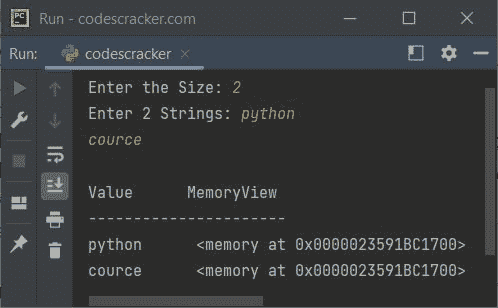

# Python 中的 memoryview

> 原文：<https://codescracker.com/python/python-memoryview.htm>

Python 是一种以速度和性能著称的语言。也就是说，在处理大型迭代或文件时，我们需要优化代码来提高速度和性能。在那里*内存视图*对象进入 画面。

*memoryview* 使用缓冲协议来访问二进制对象的内存，而不实际复制。一个 *内存视图*对象属于[二进制序列](/computer-fundamental/binary-sequence.htm) 类型，如[字节](/python/python-bytes.htm)和[字节数组](/python/python-bytearray.htm)。

## Python 中的 memoryview 是什么？

一个*内存视图*是一个广义的**数组结构。它提供了在数据结构 之间共享内存，而无需先复制。在处理大型数据集 时，优化程序的效率和性能起着重要的作用。**

## 为什么用 Python 写 memoryview？

Python 中的 *memoryview* 的主要目的是，它允许访问对象的内部数据。这里的 对象必须支持缓冲协议。Python 中支持缓冲协议的对象有**字节**和 T4】字节数组。

**注意-***memory view*对象在切片数据而不复制底层数据时很有用。

## 我们如何在 Python 中创建 memoryview 对象？

要在 Python 中创建一个 *memoryview* 对象，使用如下语法所示的 [memoryview()](/python/python-memoryview.htm) 构造函数:

```
memoryview(obj)
```

这里 **obj** 是一个对象。该对象必须支持缓冲协议。**字节**和**字节数组**是 两个内置对象，支持缓冲协议。

## Python 内存视图示例

下面是一个非常简单的程序，展示了在 Python 中使用 *memoryview* 对象的好处。

```
import time

n = 500000
data = b'x' * n
b = data
start = time.time()
while b:
    b = b[1:]
tm = time.time() - start
print("Time taken for", n, "iterations (without memoryview):", tm, "sec")

n = 500000
data = b'x' * n
b = memoryview(data)
start = time.time()
while b:
    b = b[1:]
tm = time.time() - start
print("Time taken for", n, "iterations (with memoryview):", tm, "sec")
```

输出:


也就是在不使用 *memoryview* 对象的情况下，迭代 500000 次需要 4.9095458984375 秒。 而用 *memoryview* 对象再迭代 50 万次只需要 0.07810783386230469 秒。

让我们用 Python 创建另一个程序，它使用与上述程序类似的方法，来检查迭代一个[循环](/python/python-loops.htm) ( [`while`循环](/python/python-while-loop.htm) ) 若干次所用的次数，而不使用 *memoryview* 对象。在这个程序之后，我创建了另一个 程序，带有 *memoryview* 对象。

```
import time

for n in (10000, 20000, 30000, 40000, 90000):
    bData = b'codescracker'*n
    start = time.time()
    while bData:
        bData = bData[1:]
    print("Time taken when n is", n, ":", time.time() - start)
```

下面给出的快照显示了这个 Python 程序产生的示例输出:


在上面的程序中，首先值 **10000** 被初始化为 **n** 。在循环的 [块内，二进制对象**b‘codescracker’* 10000**或 **10000** 乘以 **codescracker** 作为二进制对象被初始化为](/python/python-for-loop.htm) **[变量](/python/python-variables.htm)。现在当前时间被初始化为**开始**变量。**

 **以及在循环开始时**的执行。该循环继续执行，直到 **bData** 变量的最后一个字符。 **bData[1:]** 是指除了第一个字符以外的所有字符。也就是说， **while** 循环将被迭代 **n** 或 **10000** 次，用于**循环的**的第一次迭代。同样， **20000** 的次数，此时 **n** 的值将为 20000，或者为**循环的**的第二次迭代。**

在执行完**的所有迭代后，while** 循环，执行所有迭代所花费的时间将使用以下公式计算 :

```
time.time() - start
```

并使用 [print()](/python/python-print-statement.htm) 语句进行打印。看最后一次，那是 50 秒。为此，我必须等待 50 秒来完成最后一次迭代。将“codescracker”乘以 90000 得到 12*90000 个字符。 当我们使用常规方法时，逐一迭代总共 1080000 个字符中的每一个字符将花费相当多的时间。但是让我们对*内存视图*对象做同样的事情。

下面是使用 *memoryview* 对象迭代 **while** 循环以计算并打印迭代所用的 时间的相同程序:

```
import time

for n in (10000, 20000, 30000, 40000, 90000):
    bData = b'codescracker'*n
    bData = memoryview(bData)
    start = time.time()
    while bData:
        bData = bData[1:]
    print("Time taken when n is", n, ":", time.time() - start)
```


当 **bData** (必须被迭代)被转换成 *memoryview* 对象时，看看迭代是如何变得快速的。下面是上述两个程序的组合版本，只做了一些小的修改:

```
import time

print("Type\t\t\tIterations\t\tTime Taken")
print("-------------------------------------------")

for n in (100000, 200000, 300000, 400000, 500000):
    data = b'x'*n
    start = time.time()
    b = data
    while b:
        b = b[1:]
    end = time.time()
    tm = end - start
    print(f'bytes \t\t\t{n}\t\t\t {tm:0.2f}')

print()

for n in (100000, 200000, 300000, 400000, 500000):
    data = b'x'*n
    start = time.time()
    b = memoryview(data)
    while b:
        b = b[1:]
    end = time.time()
    tm = end - start
    print(f'memoryview  \t{n}\t\t\t {tm:0.2f}')
```

下面是它的示例输出:


我不知道你如何在你的应用程序中利用 *memoryview* 对象。但问题是，这个对象使用 缓冲协议来访问二进制对象的内存，而不实际复制。

我认为使用上面给出的注释和例子可以清楚地描述 *memoryview* 对象的概念。 现在让我们创建一个打印 *memoryview* 类型变量的值和类型的例子。

```
x = memoryview(b'codescracker')
print(x)
print(type(x))
```

上面的 Python 程序生成的输出演示了 **memoryview** 对象，看起来类似于:

```
<memory at 0x000001BD90E81700>
<class 'memoryview'>
```

这里是另一个关于 **memoryview** 的例子，允许用户输入数据:

```
print("Enter the Size: ", end="")
n = int(input())
print("Enter", n, "Strings: ", end="")
mystr = []
for i in range(n):
    val = input()
    mystr.append(val)

print("\nValue      MemoryView")
print("----------------------")
for i in range(n):
    x = bytes(mystr[i], "utf-16")
    print(mystr[i], "    ", memoryview(x))
```

下面给出的快照显示了上述程序的运行示例，用户输入的 **4** 为大小，**代码**、 、**破解**、**点**、 **com** 为四个[字符串](/python/python-strings.htm):


下面是另一个带有其他用户输入的运行示例:



[Python 在线测试](/exam/showtest.php?subid=10)

* * *

* * ***