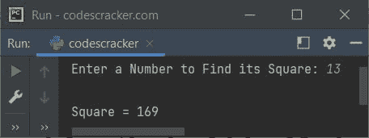
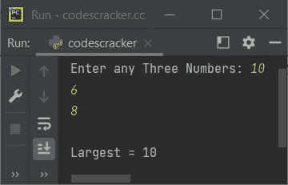

# Python 函数

> 原文：<https://codescracker.com/python/python-functions.htm>

当我们需要多次执行某个代码块时，就会用到 Python 中的函数。写在函数内部的语句块只有在函数被调用时才会被执行。例如:

```
def myFunction():
    print("Hey,")
    print("It is easy to code in Python")

myFunction()
```

输出是:

```
Hey,
It is easy to code in Python
```

函数，基本上是一个执行特定任务的代码块。

## Python 中的 def 关键字

当我们需要在 Python 中创建或定义一个函数时，就会用到 **def** 关键字。Python 中 **def** 关键字的语法是:

```
def function_name(arg1, arg2, arg3, ..., argN):
   // definition of function
```

这里的 **function_name** 是指函数的名称，而 **arg1** 、 **arg2** 等等是 参数列表。

## 在 Python 中创建函数

要在 Python 中创建一个函数，使用 **def** 关键字，后跟函数名，然后用逗号分隔参数 ，所有参数都用圆括号括起来，然后用冒号。现在从下一行开始，保留缩进， 编写代码，定义函数的任务。例如:

```
def greet():
    print("Have a good day!")
```

#### 用 Python 创建函数的步骤

*   Python 中的函数块，以 **def** 关键字开始，后面是函数名，然后是 括号(圆形的左括号和右括号)
*   参数应该放在这些括号内
*   函数的代码块以冒号(:)开头
*   用于退出函数的 [return](/python/python-return-keyword.htm) 语句
*   **返回没有值的**语句，与**返回无**相同

## 用 Python 调用函数

要在 Python 中调用一个函数，只需将该函数写成一条语句。如果有的话，提供论据。例如:

```
greet()
```

因为函数 **greet()** 没有任何参数，所以我只写了这个函数。 **greet()**基本上等于代码块，写在这个函数里面。因此， 程序如下:

```
def greet():
    print("Have a good day!")

greet()
```

印刷品:

```
Have a good day!
```

在输出控制台上。每当我们在 Python 中调用一个函数时，该函数中编写的所有语句都会被执行。

### 函数中的参数是什么？

当我们需要在函数调用和定义之间传递信息时，在函数中使用参数。或者简单地说，如果我说，参数是传递给函数的信息。

例如，如果一个函数 say **add()** 带两个参数 say **x** 和 **y** ，返回 **x** 和 **y** 的 加法。因此，这里正在发生信息的传递。让我们考虑 下面的程序:

```
def add(x, y):
    return x+y

print(add(10, 40))
```

输出是:

```
50
```

这里，值 **10** 和 **40** 被传递给 **x** 和 **y** 。然后 **x+y** 得到 返回。因此， **add(10，40)** 求值为 **50** 。

**注-** 定义函数时，括号内的[变量](/python/python-variables.htm)为函数的参数。 当函数被调用时，传递给函数的值是指函数的参数。

## Python 中不带参数的函数

Python 中不带参数的函数，大部分时间是用来打印一些消息给用户。例如，在要求用户创建密码的应用程序中，可以使用一个函数来显示方向消息:

```
def toFollow():
    print("1\. The password length should be 12 characters long")
    print("2\. The password should be the combination of alphabets and numbers.")
    print("3\. Try to create a random password, that doesn't match anything related to you")

toFollow()
```

现在，每当你想显示方向信息时，在创建密码时，只需编写 **toFollow()** ， 即可执行 **toFollow()** 函数中的所有三行语句。

## Python 中带有一个(单个)参数的函数

以下程序演示了 Python 中的函数，只有一个参数:

```
def square(x):
    return x*x

print("Enter a Number to Find its Square: ", end="")
num = int(input())

print("\nSquare =", square(num))
```

下面给出的快照显示了示例运行，用户输入 **13** :



**注意-**[end =](/python/python-end.htm)参数使用 [print()](/python/python-print-statement.htm) 跳过自动换行符 的插入。

在上面的程序中，编写代码时， **print()** 函数内的`square(num)`， 函数 **square()** 被调用， **num** 的值被初始化为 **x** ，函数 的参数。并使用 **return** 关键字或语句，返回值 **x*x** 。因此 **正方形(13)** 被评估为 **169** 。

在上面的程序中，下面的语句:

```
return x*x
```

也可以写成:

```
res = x*x
return res
```

同样，上面的程序可以这样写:

```
def square(x):
    res = x*x
    print("\nSquare =", res)

print("Enter a Number to Find its Square: ", end="")
num = int(input())

square(num)
```

## Python 中带有多个参数的函数

以下程序使用多个参数演示了 Python 中的函数:

```
def large(x, y, z):
    if x > y:
        if y > z:
            return x
        else:
            if z > x:
                return z
            else:
                return x
    else:
        if y > z:
            return y
        else:
            return z

print("Enter any Three Numbers: ", end="")
a = int(input())
b = int(input())
c = int(input())

print("\nLargest =", large(a, b, c))
```

该示例使用用户输入的三个数字 **10** 、 **6** 和 **8** 运行:



**注-** 调用函数时，参数个数必须与定义函数时使用的参数个数 相匹配。

## Python 函数-任意参数(*args)

在 Python 中，带有任意参数函数也是允许的。当我们不知道将传递给函数的参数的数量时，可以用任意参数创建函数。

在 Python 中创建带有任意参数的函数的方法是:

```
def functionName(*argumentName):
   // definition of function
```

**注-****argumentName**前的 ***** 使 argument name，任意论证。

当任意参数被用于一个函数时，那么该函数将接收一个[元组](/python/python-tuples.htm) 参数。因此，可以使用 **argumentName[0]** 访问第一个参数，使用 **argumentName[1]** 访问第二个参数 ，以此类推。例如:

```
def codescracker(*args):
    print("Addition =", args[0] + args[1] + args[2] + args[3])

codescracker(4, 32, 13, 430)
```

输出是:

```
Addition = 479
```

就像 Python 中的变量一样。也就是说，在变量的情况下，不需要在使用之前声明变量，而只需要随时随地初始化变量的值。同样，在上面的程序中，在定义一个名为 **codescracker()** 的函数时，我没有声明所有的参数。使用了唯一的 ***args** 或任何您使用的名称，并且使用类似元组的索引，在定义函数时可以使用任意数量的参数 。

## Python 函数-关键字参数(kwargs)

还可以将 *key=value* 对形式的参数发送给 Python 中的函数。例如:

```
def codescracker(schoolName, nickName, socialName):
    print("Nickname =", nickName)

codescracker(schoolName="Felix", nickName="Finn", socialName="Ben")
```

输出是:

```
Nickname = Finn
```

当然，论点的顺序并不重要。例如，上面的程序也可以这样创建:

```
def codescracker(schoolName, socialName, nickName):
    print("Nickname =", nickName)

codescracker(nickName="Finn", schoolName="Felix", socialName="Ben")
```

输出将与前一个相同。

### Python 中的任意关键字参数(**kwargs)

因为在任意参数的情况下，参数名称前只有一个星号(*)。因此，在任意关键字参数的情况下，参数名称前会有两个星号(**)。例如:

```
def codescracker(**kwargs):
    print("Nickname =", kwargs["nickName"])

codescracker(schoolName="Felix", nickName="Finn", socialName="Ben")
```

输出仍然相同，即**昵称= Finn**

## 在 Python 函数中使用默认参数值

Python 还允许在函数中设置参数的默认值。因此，如果没有参数传递给函数，那么将使用默认值。例如:

```
def myfun(val = 3):
    print("The value is:", val)

myfun(1)
myfun(2)
myfun()
myfun(4)
```

输出是:

```
The value is: 1
The value is: 2
The value is: 3
The value is: 4
```

## 在 Python 中将 Iterable 作为参数传递给函数

我们也可以传递一个 iterable，比如 list，tuple 等等。作为 Python 中函数的参数。例如:

```
def myFunction(x):
    print(x)

myList = [1, 2, 3, 4, 5]
myTuple = (6, 7, 8, 9)
mySet = {10, 11, 12, 13, 14, 15}

myFunction(myList)
myFunction(myTuple)
myFunction(mySet)
```

输出是:

```
[1, 2, 3, 4, 5]
(6, 7, 8, 9)
{10, 11, 12, 13, 14, 15}
```

因此，我们可以使用 iterable 将单个变量的多个值传递给一个函数。例如:

```
def cube(x):
    for val in x:
        print("Cube of", val, "=", val*val*val)

myList = [1, 2, 3, 4, 5]
cube(myList)
```

输出是:

```
Cube of 1 = 1
Cube of 2 = 8
Cube of 3 = 27
Cube of 4 = 64
Cube of 5 = 125
```

### Python 中与函数相关的推荐关键词

*   [巨蟒屈服](/python/python-yield-keyword.htm)
*   [Python 回归](/python/python-return-keyword.htm)
*   [Python lambda](/python/python-lambda-keyword.htm)

[Python 在线测试](/exam/showtest.php?subid=10)

* * *

* * *