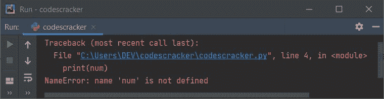
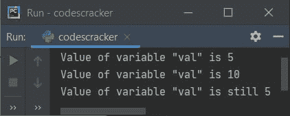
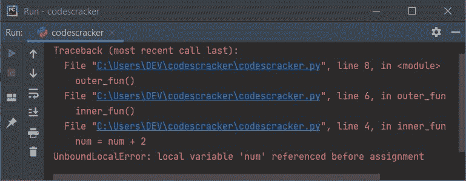
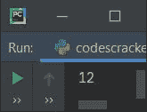
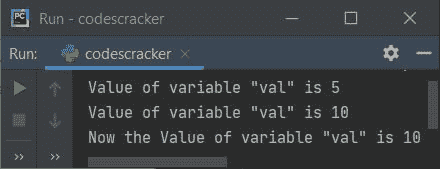
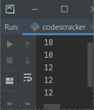
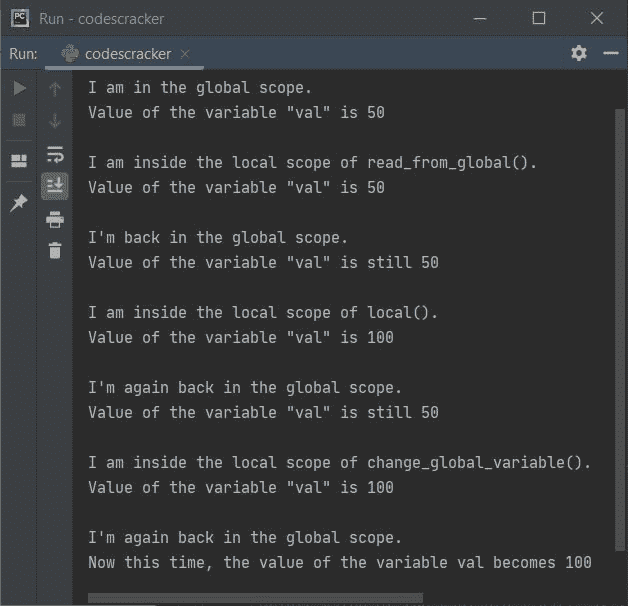
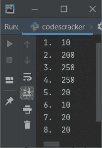

# Python 变量范围

> 原文：<https://codescracker.com/python/python-variable-scope.htm>

本文涵盖了 [Python](/python/index.htm) 中与[变量](/python/python-variables.htm)范围相关的所有内容。也就是说，在仔细阅读和理解了这篇教程之后，我确信，你会得到 去了解关于变量作用域的一切。这篇文章涉及:

*   Python 局部变量及示例
*   Python **外地** [关键词](/python/python-keywords.htm)举例
*   Python 全局变量及示例

## Python 局部变量

在[函数](/python/python-functions.htm) 或[类](/python/python-classes-objects.htm)中声明的所有变量都是局部变量。或者你可以说，一个函数或类 中的变量只有出现在赋值语句(=，+=，-=等)的左边时才被认为是局部变量。).例如， 如果你在 range(5) 或其他绑定中找到了类似于 a 的 **a = 5** 或**的任何变量，那么变量 **a** 被称为 是局部变量。**

局部变量属于局部范围。也就是说，在下面给出的程序中:

```
def codescracker():
    num = 2
    print(num)

codescracker()
```

**num** 变量的作用域仅限于定义它的函数。也就是说，在函数(codescracker)之外， 变量 **num** 未知/未定义。上面的程序产生 **2** 作为输出。

现在你可能会想到一个问题，如果我们在函数之外使用一个局部变量呢？因此，我创建了一个程序 ,如下所示，它在函数外使用局部变量:

```
def codescracker():
    num = 2

print(num)
```

上面的程序产生一个错误( **NameError** )，如下图所示:



现在我们可能会有另一个问题，如果我们想访问一个在程序中本地创建的变量呢？
那么这个问题的答案就是**全局**关键词。稍后，在本教程中，您将了解全局变量。现在让我们 看看下面给出的例子，Python 中的局部变量:

```
def codescracker():
    val = 10
    print("Value of variable \"val\" is", val)

val = 5
print("Value of variable \"val\" is", val)
codescracker()
print("Value of variable \"val\" is still", val)
```

下面给出的快照显示了上述程序产生的示例输出:



从上面的例子可以看出，值为 5 的变量 **val** 是全局变量，在 函数 **codescracker()** 中声明的同一个变量被认为是局部变量。因此，值 10 被初始化为它，是局部的，并且仅保持到该函数的执行。也就是说，当你退出那个函数时，值 10 丢失，5 将是变量 **val** 的原始值 。

## Python 非本地关键字

因为 Python 不允许我们在内部范围内给外部范围的变量重新赋值。因此为了克服这个问题，Python 提供了一个名为**非本地**的关键字。当我们需要对一个已经在外部函数中声明的变量执行赋值操作 时，就会用到这个关键字。例如，下面的 Python 程序:

```
def outer_fun():
    num = 10
    def inner_fun():
        num = num + 2
        print(num)
    inner_fun()

outer_fun()
```

生成一个**unboundlocalrerror**，如下图所示:



这是因为，如果在函数内部有一个变量赋值，那么这个变量就被认为是局部变量。因此，我们必须使用**非本地**关键字来创建变量，如下面给出的程序所示:

```
def outer_fun():
    num = 10
    def inner_fun():
        nonlocal num
        num = num + 2
        print(num)
    inner_fun()

outer_fun()
```

现在，这一次，产生的输出看起来像:



即 **12** 是上述程序产生的输出，没有产生任何误差。但是，如果您不需要对变量 **num** (一个先前创建的变量)执行任何赋值 ，那么您可以继续操作，而无需进一步声明该变量，如下面给出的 程序所示:

```
def outer_fun():
    num = 10
    def inner_fun():
        print(num)
    inner_fun()

outer_fun()
```

这个程序产生的输出是 **10** ，而不是 12，因为我没有像前面的程序那样将它的值增加 2。

**注意-** 如果你找到了任何一个**非本地的**变量，那么这个变量属于一个封闭函数。这既不是本地的，也不是全球的 。

## Python 全局变量

在 Python 中可以用两种方法创建全局变量。第一种方法是在所有函数和类之外定义变量，也就是在主程序内部。第二种方法是在程序的任何地方使用**全局** 关键字定义变量。以下是 Python 全局变量的一个示例:

```
def codescracker():
    global val
    val = 10
    print("Value of variable \"val\" is", val)

val = 5
print("Value of variable \"val\" is", val)
codescracker()
print("Now the Value of variable \"val\" is", val)
```

下面给出的快照取自上述 Python 程序产生的输出:



下面是另一个创建两个全局变量的例子，一个使用普通方式(在主程序内部)，第二个使用**全局**关键字 ，如上所述:

```
num = 10

def codes():
    print(num)

def cracker():
    global val
    val = 12
    print(val)

def codescracker():
    print(val)

print(num)
codes()
cracker()
print(val)
codescracker()
```

上述程序产生的输出是:



上述程序的工作方式是:

*   首先创建一个变量 **num** 并用 10 初始化
*   因为这个变量是在任何函数或类之外创建的，所以这个变量的作用域是全局的
*   因为变量的作用域是全局的，所以从任何函数或类中，我们都可以访问这个变量
*   我定义了两个名为 **codes()** 和 **cracker()** 的方法。但程序流程转到 **print(num)** 语句(即在两个函数之外)，在执行第一条语句后，即 **num = 10**
*   使用 **print(num)** 语句， **num** 的值(等于 10)被打印在输出上
*   现在执行语句 **codes()**
*   也就是说，方法 **codes()** 被调用，在这个方法中，语句 **print(num)** 被执行
*   由于 **num** 是全局定义的，因此 **num** 的值再次从名为**代码**的方法 中输出
*   现在方法 **cracker()** 被调用。在这个方法中，一个名为 **val** 的变量使用 **global** 关键字定义
*   由于变量是使用**全局**关键字定义的，因此这个变量可以从整个 程序的任何地方访问
*   现在 12 被赋值并使用 **print(val)** 语句打印
*   倒数第二，执行 **print(val)** 语句，在输出中打印 12。
*   需要注意的是，倒数第二条语句访问了在 **cracker()** 方法中定义的变量 **val** 。发生这种情况是因为我使用了**全局**关键字来定义变量
*   由于变量 **val** 是用**全局**关键字定义的，因此它也可以从另一个 函数中访问，如上面的程序所示。也就是说， **codescracker()** 也可以访问变量 **val**

## Python 局部变量与全局变量示例程序

这是你需要理解的例子。在理解了这个程序之后，我确信，你会对 Python 中的局部变量和全局变量有一个完整的理解。

```
val = 50

def read_from_global():
    print("\nI am inside the local scope of read_from_global().")
    print("Value of the variable \"val\" is",val)

def local():
    val = 100
    print("\nI am inside the local scope of local().")
    print("Value of the variable \"val\" is",val)

def change_global_variable():
    global val
    val = 100
    print("\nI am inside the local scope of change_global_variable().")
    print("Value of the variable \"val\" is",val)

print("\nI am in the global scope.")
print("Value of the variable \"val\" is",val)

read_from_global()
print("\nI'm back in the global scope.")
print("Value of the variable \"val\" is still",val)

local()
print("\nI'm again back in the global scope.")
print("Value of the variable \"val\" is still",val)

change_global_variable()
print("\nI'm again back in the global scope.")
print("Now this time, the value of the variable val becomes",val)
```

下面是它的示例输出:



## Python 变量范围示例

这个示例程序可能会消除您对局部和全局变量以及**非局部**关键字的所有疑虑(如果有的话):

```
num = 10

def codes():
    num = 200
    print("2\. ",num)
    def inner():
        nonlocal num
        num = num + 50
        print("3\. ",num)
    inner()
    print("4\. ",num)

def cracker():
    global val
    val = 20
    print("5\. ",val)
    print("6\. ",num)

def codescracker():
    print("7\. ",val)

print("1\. ",num)
codes()
cracker()
codescracker()
print("8\. ",val)
```

为每个 **print** 语句提供编号，显示执行 **print** 语句的序列号。下面给出的 快照取自上述程序产生的输出:



仔细看看上面的程序。可能需要几分钟。但我确信，它将为你提供关于 Python 中变量作用域的一切。

[Python 在线测试](/exam/showtest.php?subid=10)

* * *

* * *