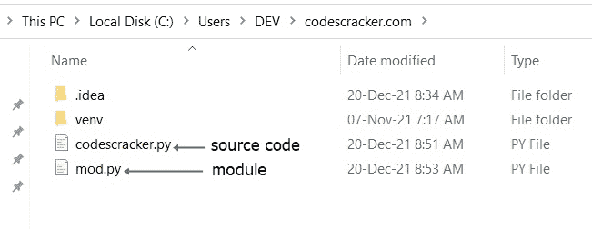
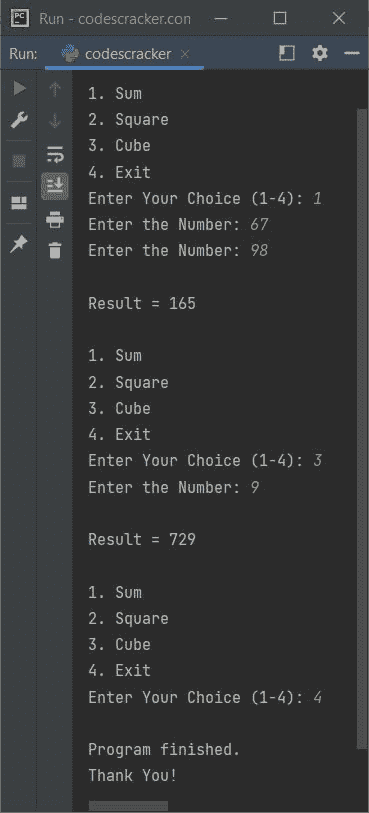

# Python 模块

> 原文：<https://codescracker.com/python/python-modules.htm>

Python 中的模块基本上是一个包含一些函数和/或对象的文件。例如:

```
def greet():
    print("Hey,")
    print("a warm welcome from my side.")
```

将该代码保存在扩展名为**的文件中。py** 说 **mod.py** 。将这个文件放在当前的 目录中，这个目录是 Python 程序(源代码)可用的目录。这里是 当前目录的快照，在我的例子中:



**注-***codescracker . py*文件的源代码如下。

现在创建一个程序，它导入上面新创建的名为 **mod.py** 的模块，以便在程序中使用该模块中定义的函数 。例如:

```
import mod

mod.greet()
```

这将产生以下输出:

```
Hey,
a warm welcome from my side.
```

**注意-**[导入](/python/python-import-statement.htm)语句/关键字用于 加载 Python 中的模块。

**重要** -模块文件必须用**保存。py** 分机

## 为什么我们需要用 Python 创建一个模块？

如果你正在用 Python 创建一个应用程序，它有大量的函数、变量和/或其他对象，那么最好将一些或所有这些函数、变量和/或其他对象放在一个名为*模块*的单独文件中。

在不打开源代码文件的情况下，重新定义或编辑包含实际程序的某个部分的模块文件变得很容易。此外，源代码文件将变得更小，变得更容易处理。

**注意-** 模块有些时候有助于组织代码。在 将相关代码组合成模块后，大程序也变短了。

## 如何在 Python 中使用一个模块？

要使用模块，在 Python 中，首先使用 **import** 关键字加载模块。下面是语法:

```
import module_name
```

如果你想只加载一个模块的特定功能，那么使用 **import** 连同 [from](/python/python-from-keyword.htm) 关键字，这样:

```
from module_name import function_name
```

在程序中加载模块后，使用该模块中定义的函数，如下所示:

```
module_name.function_name
```

**注意-** 使用模块中定义的函数时，需要将函数与 模块绑定。因为有时在大型应用程序中，在不同的 模块中可能会定义多个同名的函数。而如果那些模块都加载在同一个程序里面，那么直接调用函数， 会抛出错误。

## Python 模块示例——在程序中创建和使用模块

正如已经说过的，模块是一个文件，以**结尾。py** 扩展，包含一些代码块。例如， 将下面的代码块保存在一个文件中，比如说 **mymodule.py** :

```
def sum(a, b):
    return a+b

def sqr(x):
    return x*x

def cub(x):
    return x*x*x

def msg():
    print("Enter the Number: ", end="")
```

要使用这个模块，创建另一个程序。例如:

```
import mymodule

choice = 1
while 1 <= choice <= 4:
    print("\n1\. Sum")
    print("2\. Square")
    print("3\. Cube")
    print("4\. Exit")
    print("Enter Your Choice (1-4): ", end="")
    choice = int(input())

    if choice == 1:
        mymodule.msg()
        numOne = int(input())
        mymodule.msg()
        numTwo = int(input())
        res = mymodule.sum(numOne, numTwo)
        print("\nResult =", res)

    elif choice == 2:
        mymodule.msg()
        num = int(input())
        res = mymodule.sqr(num)
        print("\nResult =", res)

    elif choice == 3:
        mymodule.msg()
        num = int(input())
        res = mymodule.cub(num)
        print("\nResult =", res)

    elif choice == 4:
        choice = 5

    else:
        choice = 1
        print("\nInvalid Choice!")
```

带有一些用户输入的示例运行显示在下面给出的快照中:



### 使用 Python 中的内置模块

一些内置模块也是由 Python 的创建者定义的。例如:

```
import operator

print(operator.add(10, 30))
```

输出是:

```
40
```

这里的[操作符模块](/python/python-operator-module.htm)是一个内置模块，由 Python 的创建者预定义 。

## 在 Python 中创建和使用模块中的变量/对象

包括函数，我们还可以在一个模块中定义[列表](/python/python-lists.htm)、[字典](/python/python-dictionary.htm)、 等一些对象。例如，以下代码位于一个名为 **mod.py** 的模块中:

```
mylist = [12, 32, 43, 53]
mydict = {"Name": "Louis", "Course": "EECS"}
```

现在我们可以使用上面的列表和在 **mod.py** 模块中定义的字典。例如:

```
import mod

print(mod.mylist[0])
print(mod.mylist[1])

print(mod.mydict["Name"])
print(mod.mydict["Course"])
```

输出是:

```
12
32
Louis
EECS
```

## 用 Python 重命名程序中的模块

当我们需要为程序中的一个模块定义一个重复的名字 时，就会用到关键词。例如:

```
import mod as m

print(m.mylist[0])
print(m.mydict["Name"])
```

输出是:

```
12
Louis
```

在上面的程序中，下面的语句:

```
import mod as m
```

加载名为 **mod** 的模块，并为其定义一个重复的名称 **m** 。现在，我们需要编写 **m** 来代替 **mod** 来访问模块 **mod** 中定义的任何对象/函数。

[蟒蛇在线测试](/exam/showtest.php?subid=10)

* * *

* * *