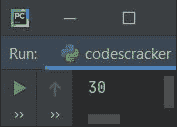

# Python 运算符模块

> 原文：<https://codescracker.com/python/python-operator-module.htm>

为了使用方法执行操作，而不是在 Python 程序中使用[操作符](/python/python-operators.htm)，我们有了 **操作符**模块，它提供了许多执行操作的方法。本文讨论了在 Python 的**操作符**模块中可用的这些方法:

*   添加()
*   sub()
*   mul()
*   truediv()
*   floordiv()
*   mod()
*   功率()
*   eq()
*   S7-1200 可编程控制器
*   燃气轮机()
*   lt()
*   葛()
*   乐()
*   还有 _()
*   还是 _()
*   异或运算()
*   反转()
*   lshift()
*   rshift()
*   是 _()
*   is_not()
*   包含()
*   concat()
*   getitem()
*   setitem()
*   delitem()

下面逐一给出所有方法的简要描述和示例等细节。让我们看看所有这些来了解关于**操作符**模块方法的一切。要使用上述任何一种方法，我们必须导入**操作符**模块。所有的 方法必须和**操作符**一起使用，如下面给出的语法所示:

```
import operator

operator.method_name()
```

## add()方法

**运算符**模块的 **add()** 方法与 **+** 运算符作用相同。也就是说，这个方法是用于加法的。 但不同的是，要使用 **add()** 方法，我们可以这样进行:

```
res = operator.add(a, b)
```

上述语句表明 **a** 和 **b** 的加法结果被初始化为 **res** 变量。 <u>不要忘记导入**操作符**模块，在使用它的方法</u>之前说 **add()** 。要导入**运算符**模块，使用以下语句:

```
import operator
```

语句中，`res = operator.add(a, b)`相当于:

```
res = a + b
```

下面是一个实现**运算符**模块的 **add()** 方法的示例程序:

```
import operator

a, b = 10, 20
res = operator.add(a, b)
print(res)
```

下面是上面程序产生的输出的快照:



## sub()方法

就像 **add()** 方法一样， **sub()** 方法用于减法。下面是一个使用 **sub()** 方法 的**运算符**模块的示例程序:

```
import operator

a, b = 6, 4
res = operator.sub(a, b)
print(res)
```

输出将是 **2** 。

## mul()方法

**mul()** 方法的工作原理与 ***** 相同，用于乘法运算。下面是一个程序使用 **mul()** 方法的例子:

```
import operator

a, b = 6, 4
res = operator.mul(a, b)
print(res)
```

这个程序产生的输出是 **24** 。

## truediv()方法

**truediv()** 方法的工作原理与 **/** 相同，用于除法。下面给出的例子使用了 **truediv()** 方法:

```
import operator

a, b = 6, 4
res = operator.truediv(a, b)
print(res)
```

这个程序产生的输出将是 **1.5** 。即真实/精确的除法结果。

## floordiv()方法

**运算符**模块的 **floordiv()** 方法与 **//** 的作用相同，同样用于除法。但是使用 **floordiv()** 将两个数相除后得到的结果 不会是精确的除法结果。而是小于或等于结果的最接近的整数 值。下面是一个 **floordiv()** 的示例程序:

```
import operator

a, b = 6, 4
res = operator.floordiv(a, b)
print(res)
```

这一次，上述程序产生的输出是 **1** 。

## mod()方法

**mod()** 方法的工作原理与 **%** 相同，用于求模。下面给出了使用**运算符** 模块的 **mod()** 方法的示例程序:

```
import operator

a, b = 6, 4
res = operator.mod(a, b)
print(res)
```

上述程序产生的输出将是 **2** ，它显示了 6 除以 4 的余数。

## pow()方法

**运算符**模块的 **pow()** 方法与 ****** 的工作原理相同，用于求幂运算。即 **a ** b** 得到 作为**a<sup>b</sup>T11】对待。下面是一个程序使用 **pow()** 方法的例子:**

```
import operator

a, b = 2, 5
res = operator.pow(a, b)
print(res)
```

32 是这个程序产生的输出。由于 **operator.pow(a，b)** 的计算结果为**a<sup>b</sup>T5】，并且这个 的计算结果为 **2 <sup>5</sup>** ，因此得出 32。**

## eq()方法

**运算符**模块的 **eq()** 方法与 **==** 的工作原理相同，用于检查是否相等。即任意两个 变量、值或操作数是否相等。下面是一个使用 **eq()** 方法的例子:

```
import operator

a, b = 6, 5
res = operator.eq(a, b)
print(res)
```

上述程序产生的输出为**假**，因为 **a** 的值不等于 **b** 的值。下面是 等式检查的一个著名应用:

```
import operator

print("Enter first Input: ", end="")
a = input()
print("Enter second Input: ", end="")
b = input()
if operator.eq(a, b):
    print("\nBoth are equal")
else:
    print("\nBoth are not equal")
```

以下是用户输入 **codescracker** 作为第一和第二输入的示例运行:


这里是另一个示例运行，用户输入 **8** 同时作为第一和第二输入:


也就是说，表达式 **operator.eq(8，8)** 评估为 **True** ，因此程序流程进入 **if** 块并评估打印语句，即打印**两者相等**。

## ne()方法

**ne()** 方法的工作原理和**一样！=** ，用于检查任意两个变量或直接值是否不相等 。也就是说，使用这个方法，如果两个变量不相等，则返回 True，否则返回 False。 下面是一个示例程序，采用**【ne()】**(不相等)方法:

```
import operator

a, b = 6, 5
res = operator.ne(a, b)
print(res)
```

该程序产生**真值**作为输出。由于 **6** 不等于 **5** 。

## gt()方法

**运算符**模块的 **gt()** 方法与 **>** 作用相同，用于检查传递的第一个参数是否大于传递的第二个参数 。如果第一个将大于第二个，则返回**真**，否则返回 **假**。下面是一个程序使用 **gt()** 方法的例子:

```
import operator

a, b = 6, 5
res = operator.gt(a, b)
print(res)
```

输出将是**真**，因为 **a** 的值大于 **b** 的值。下面是另一个例子，展示了 **gt()** 方法的 著名用法:

```
import operator

print("Enter first Number: ", end="")
num_one = int(input())
print("Enter second Number: ", end="")
num_two = int(input())
if operator.gt(num_one, num_two):
    print(num_one, "is greater than", num_two)
else:
    print(num_one, "is less than", num_two)
```

以下是用户输入的第一个数字 **20** 和第二个数字 **10** 的运行示例:


## lt()方法

**lt()** 方法的工作原理与 **<** 相同，用于检查第一个参数的值是否小于第二个 参数(传递给方法)的值。下面是一个使用 **lt()** 方法的**运算符**模块的例子:

```
import operator

a, b = 6, 5
res = operator.lt(a, b)
print(res)
```

由于 a (6)不小于 b (5 ),产生**假**作为输出。

## ge()方法

**运算符**模块的 **ge()** 方法与 **> =** 运算符作用相同，用于检查第一个参数 是否大于等于传递给该方法的第二个参数。它返回 True 或 False。下面是一个 使用 **ge()** (大于/等于)方法的例子:

```
import operator

a, b = 6, 5
res = operator.ge(a, b)
print(res)
```

产生**真值**作为输出，因为 **a** (6)大于 **b** (5)。

## le()方法

**le()** 与 **< =** 运算符作用相同，用于检查传递给方法的第一个参数是否小于或等于传递给方法的第二个参数 。它返回 True 或 False。下面给出了使用 **le()** 方法的示例程序 :

```
import operator

a, b = 6, 5
res = operator.le(a, b)
print(res)
```

产生**假**作为输出。

## 和 _()方法

**运算符**模块的**和 _()** 方法与**按位&** 运算符的作用相同。你可以参考 [位运算符并结合例子](/computer-fundamental/bitwise-operators.htm)来得到关于位 运算符的所有必要的东西。下面是一个使用**和 _()** 方法的例子:

```
import operator

a, b = 60, 13
res = operator.and_(a, b)
print(res)
```

上述程序产生的输出将是 **12** 。要了解按位 AND 运算符的计算是如何执行的，请参考程序上方提供的 的独立文章。但是现在，这里有另一个示例程序，它可能会提醒您关于 操作符:

```
import operator

a, b = 1, 0
print(a, "&", b, "=", operator.and_(a, b))
a, b = 0, 1
print(a, "&", b, "=", operator.and_(a, b))
a, b = 0, 0
print(a, "&", b, "=", operator.and_(a, b))
a, b = 1, 1
print(a, "&", b, "=", operator.and_(a, b))
```

下面给出的快照显示了这个 Python 程序产生的输出:


## or_()方法

**或 _()** 方法的工作原理与 **|** 运算符相同。下面是一个使用这种方法的例子:

```
import operator

a, b = 60, 13
res = operator.or_(a, b)
print(res)
```

产生 **61** 作为输出。也就是说，在取两个值的二进制等效值之间的位或时，比如说 **60** 和 **13** ， ，我们将得到另一个二进制值，它当然等于 61。

## xor()方法

**xor()** 方法的工作原理与 **&帽子相同；**操作员。下面是一个使用这种方法的示例程序:

```
import operator

a, b = 60, 13
res = operator.xor(a, b)
print(res)
```

产生 **49** 作为输出。

## invert()方法

**invert()** 方法的工作原理与**相同。该方法用于反转二进制值或 值的二进制等效值。与上面的方法不同，这个方法只处理单个参数。下面是一个使用 **invert()** 方法的例子:**

 **```
import operator

a = 5
print(operator.invert(a))
```

产生 **-6** 作为输出。

## lshift()方法

**lshift()** 与 **< <** 运算符的作用相同。下面是一个使用 **lshift()** 方法的**运算符**模块的例子:

```
import operator

a, b = 14, 1
print(operator.lshift(a, b))
```

产生 **28** 作为输出，因为将 14 的二进制等价物左移 1 位后，我们将得到一个二进制值，即等于 28(十进制)。

## rshift()方法

**rshift()** 与 **> >** 运算符的作用相同。下面是一个使用 **rshift** 方法的例子:

```
import operator

a, b = 14, 1
print(operator.rshift(a, b))
```

产生 **7** 作为输出，因为将 **14** 的二进制等效值(0000 1110)左移 1 位后，我们将得到 一个二进制值(0000 0111)，即等于十进制的 7。

## is_()方法

**运算符**模块的 **is_()** 方法与 **is** 身份运算符的作用相同。下面举例说明使用 **is_()** 的方法:

```
import operator

a, b, = 10, 10
print(operator.is_(a, b))

a, b = "codes", "cracker"
print(operator.is_(a, b))

a, b = "codescracker", "codescracker"
print(operator.is_(a, b))
```

下面给出的快照显示了上述程序产生的示例输出:


## is_not()方法

**is_not()** 与 **is not** 运算符的作用相同。下面是一个使用这种方法的例子:

```
import operator

a, b, = 10, 10
print(operator.is_not(a, b))

a, b = "codes", "cracker"
print(operator.is_not(a, b))

a, b = "codescracker", "codescracker"
print(operator.is_not(a, b))
```

该程序产生的输出如下所示:


## contains()方法

**运算符**模块的 **contains()** 方法与运算符中的**作用相同，检查一个对象是否是 任意列表、字符串或元组的成员。下面是一个使用**包含()**方法的例子:**

```
import operator

nums = [1, 2, 3, 4, 5]
val = 3

res = operator.contains(nums, val)
print(res)

print(operator.contains(nums, 6))
```

下面是上面 Python 程序产生的输出的快照:


下面给出的程序展示了 Python 编程中 **contains()** 方法的主要和最常用的用法，即 [搜索元素](/python/program/python-search-element-in-list.htm):

```
import operator

nums = [1, 2, 3, 4, 5]

print("Enter an element to search: ")
val = int(input())

if operator.contains(nums, val):
    print("\nIt is available in the list")
else:
    print("\nThe element is not found in the list!")
```

下面是用户输入的示例运行， **10** 作为输入:


## concat()方法

在连接两个字符串时，**运算符**模块的 **concat()** 方法与 **+** 的工作方式相同。这个方法有两个 参数，两个参数都必须是字符串类型。这里有一个例子:

```
import operator

a = "codes"
b = "cracker"
res = operator.concat(a, b)
print(res)
```

上述程序产生的输出将是 **codescracker**

## getitem()方法

**getitem()** 方法用于获取一个元素。下面的代码或语句:

```
val = operator.getitem(nums, index_number)
```

工作方式类似于或被视为:

```
val = nums[index_number]
```

下面是一个使用 **getitem()** 方法的**运算符**模块的示例程序:

```
import operator

nums = [10, 20, 30, 40, 50]
print("Get element with Index Number: ", end="")
index_number = int(input())

val = operator.getitem(nums, index_number)
print("\nThe value at index", index_number, "is", val)
```

下面是它的示例运行，使用用户输入， **3** 作为索引号来获取该索引号处的元素:


同样的方法，即 **getitem()** 也可以用来获取多个条目。为此，以类似于 **getitem(nums，slice(i，j))** 的方式使用方法，其中从索引 **i** 到 **j** 的所有项目都从 **nums** 切片。在 中，切片以包括第一索引(I)而排除第二索引(j)的方式执行。也就是说， **getitem(nums，slice(1，3))** 只在第一个和第二个索引处对 元素进行切片，而在第三个索引处不进行切片。这里有一个例子:

```
import operator

nums = [10, 20, 30, 40, 50]
print(operator.getitem(nums,slice(1, 3)))
```

上述程序产生的输出将是**【20，30】**。

## setitem()方法

**setitem()** 方法(称为索引赋值)主要用于替换列表中的元素。例如，下面的语句:

```
operator.setitem(nums, index_number, new_value)
```

类似于或被视为:

```
nums[index_number] = new_value
```

下面是一个使用 **setitem()** 方法的**运算符**模块的例子:

```
import operator

nums = [10, 20, 30, 40, 50]
operator.setitem(nums, 2, 3)
print(nums)
```

下面是它的示例输出:


还可以使用 **setitem()** 方法一次分配多个值。这可以通过切片分配来使用。为此， 我们需要使用 **setitem()** 方法作为 **setitem(seq，slice(i，j)，values)** ，它类似于或被视为:

```
seq[i:j] = values
```

下面是一个示例程序:

```
import operator

nums = [10, 20]
operator.setitem(nums, slice(2, 5), [30, 40, 50])
print(nums)
```

产生 **[10，20，30，40，50]** 作为输出，因为使用 **setitem()** 方法插入了新的 3 个元素。

## delitem()方法

**运算符**模块的 **delitem()** 方法，也称为**索引删除**，用于 [删除一个元素](/python/program/python-delete-element-from-list.htm)。下面的 代码使用了 **delitem()** 方法:

```
operator.delitem(nums, index_number)
```

工作方式类似于或被视为:

```
del nums[index_number]
```

下面是一个程序使用 **delitem()** 方法的例子:

```
import operator

nums = [10, 20, 30, 40, 50]
operator.delitem(nums, 2)
print(nums)
```

执行上述程序后，我们将得到以下输出:


就像 **setitem()** ， **delitem()** 方法也可以使用切片删除一次删除多个元素。 这可以使用类似于 **delitem(seq，slice(i，j))** 的相同方法来完成，其工作方式类似于:

```
del seq[i:j]
```

下面是一个使用 **delitem()** 方法删除多个项目的示例程序:

```
import operator

nums = [10, 20, 30, 40, 50]
operator.delitem(nums, slice(2, 5))
print(nums)
```

产生以下输出:


[Python 在线测试](/exam/showtest.php?subid=10)

* * *

* * ***