# Python 操作系统模块

> 原文：<https://codescracker.com/python/python-os-module.htm>

**os** 模块提供[函数](/python/python-functions.htm)，用于使用 [Python](/python/index.htm) 程序与 [操作系统](/operating-system/index.htm)进行交互，如创建 文件、删除文件、重命名文件等。本文讨论 Python 中的 **os** 模块的这些功能:

*   os.getcwd()
*   os.chdir()
*   os.mkdir()
*   os.makedirs()
*   os.listdir()
*   os.remove()
*   OS . rmr()
*   os.rename()
*   os.path.exists()
*   os.path.getsize()

让我们一个接一个地解释这些函数及其示例程序。

## 操作系统模块的 getcwd()函数

**os** 模块的 **getcwd()** 函数，用于查找当前工作的 [目录](/operating-system/directories.htm)。名称 **getcwd** 代表 **获取当前工作目录**。下面是一个示例程序，使用 **getcwd()** :

```
import os

print("The Current Directory is:", os.getcwd())
```

上述程序产生的输出显示在下面给出的快照中:

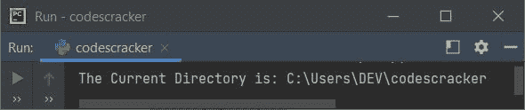

**注意-** 当前目录是保存 Python 程序源代码的文件夹的路径。

这是保存上述程序的文件夹的快照:

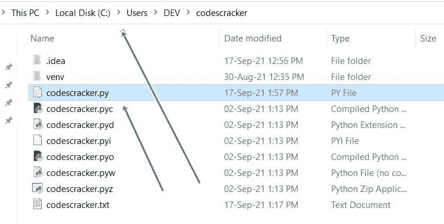

查看路径和源代码文件，用箭头指示。

## 操作系统模块的 chdir()函数

**os** 模块的 **chdir()** 函数，用于改变程序当前的工作目录。功能 **chdir** 代表**改变目录**。下面是 **os.chdir()** 函数的示例程序:

```
import os

print("The Current Directory is:", os.getcwd())

os.chdir("../")
print("The Current Directory is:", os.getcwd())
```

下面是它的示例输出:

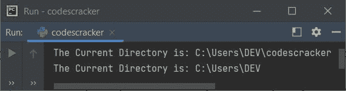

现在让我们创建两个同名的文件，比如 **codescracker.txt** 。一个在 **codescracker** 文件夹内，一个在 文件夹外。内部文件夹应该包含文本**你好**。这是文件夹以及打开的新 创建文件的快照:

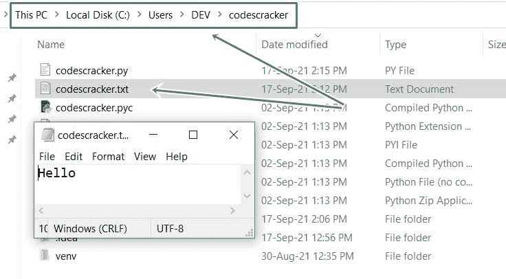

并将文本**世界**放到外部文件中。以下是快照:

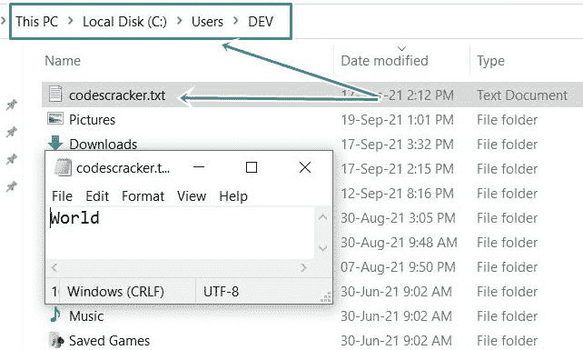

现在让我们创建程序，使用 **os** 模块的 **chdir()** :

```
import os

print("The Current Directory is:", os.getcwd())
print("The file \"codescracker.txt\" inside this directory contains:")
f = open("codescracker.txt", "r")
print(f.read())
f.close()

os.chdir("../")
print("\nThe Current Directory is:", os.getcwd())
print("The file \"codescracker.txt\" inside this directory contains:")
f = open("codescracker.txt", "r")
print(f.read())
f.close()
```

上述程序产生的输出显示在下面给出的快照中:

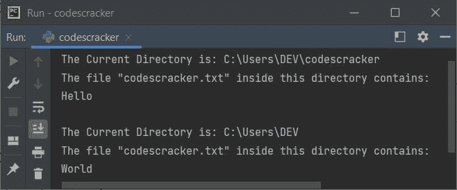

查看程序如何访问两个不同目录中的文件 **codescracker.txt** 。你也可以使用一个 Python 程序访问 任意数量的文件。但是在访问当前目录中不可用的文件之前，首先 将目录更改为所需的目录，然后继续。在访问任何目录中的任何文件之前，也要这样做。

## 操作系统模块的 mkdir()函数

**os** 模块的 **mkdir()** 函数，用于创建新的目录。名字 **mkdir** 代表 **制作目录**。因此，我将在当前目录 (C:\Users\DEV\codescracker)中创建一个名为 **cc** 的文件夹。也就是说，使用下面给出的程序，一个新的目录**C:\ Users \ DEV \ codescracker \ cc**被创建。但是在创建和执行程序之前，让我们先看看当前目录的快照:

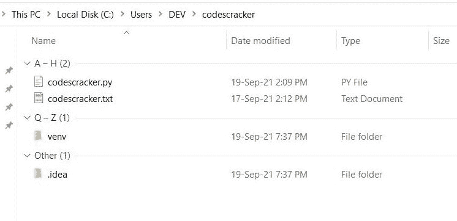

**注-** 编号(A-H (2)，Q-Z (1)，其他(1))显示在上图快照中，自动应用，在 后点击**日期修改**标签对文件进行排序，按日期修改。这不关你的事，但为了避免误解，我必须把这件事告诉你。

现在让我们创建程序。程序如下:

```
import os

folder = "cc"
cwd = os.getcwd()
path = cwd + '\\' + folder
os.mkdir(path)
print("The directory '%s' is created." %path)
```

下面是上述程序产生的输出的快照:


这是执行上述程序后，文件夹的快照:

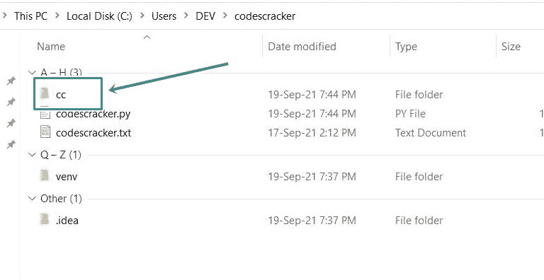

看，执行程序后，文件夹 **cc** 成功创建。在上面的程序中，语句:

```
print("The directory '%s' is created." %path)
```

也可以写成:

```
print("The directory '", path, "' is created.", sep="")
```

或者

```
print("The directory '" + path + "' is created.")
```

现在问题可能出现了，在大多数程序员的脑海中，看到上面的代码后是，如果目录已经可用了呢？
这个问题的答案是下面给出的程序，是在修改上述程序后创建的:

```
import os

print("Enter the Name of Folder to Create: ", end="")
folder = input()
cwd = os.getcwd()
path = cwd + '\\' + folder
try:
    os.mkdir(path)
    print("\nThe directory '%s' is created." %path)
except FileExistsError:
    print("\nThe directory '%s' is already available." %path)
```

下面是它的示例运行，将用户输入 **cc** 作为要创建的文件夹:

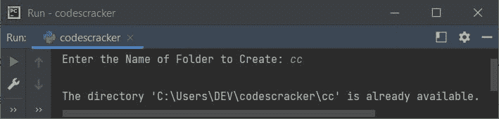

**注意-** 你可以在任何目录下创建文件夹。要完成这个任务，首先使用 **os.chdir()** ， 改变目录，然后做与上面程序类似的事情。

如果您想查看由**filexistserror**异常引起的实际错误，那么请替换上述程序中除块 之外的**:**

```
except FileExistsError:
    print("\nThe directory '%s' is already available." %path)
```

使用以下模块:

```
except FileExistsError as fee:
    print(fee)
```

**注意** -我已经使用**作为**关键字来创建**filexistserror**的别名**费**。

在用户输入相同的情况下，上述程序产生的输出如下所示:

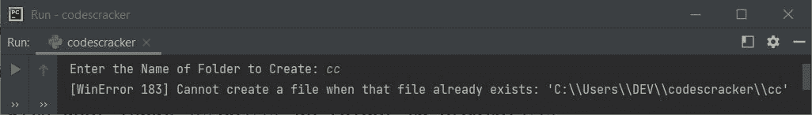

也就是说，第二行中的错误是:

```
[WinError 183] Cannot create a file when that file already exists: 'C:\Users\DEV\codescracker\cc'
```

**注-** 要详细了解 [print()](/python/python-print-statement.htm) 的 [end=](/python/python-end.htm) 和 [sep=](/python/python-sep.htm) 参数，请参考其 单独教程。

## os 模块的 makedirs()函数

**os** 模块的函数 **makedirs()** ，用于使用一条 语句创建目录或多个目录。

要创建一个特定的文件夹，在另一个特定的文件夹内，或任何指定的目录，使用 **os.makedirs()** 在程序的一次执行中完成这个任务。让我们看看下面给出的程序，以便更好地理解它:

```
import os

print("Enter the Name of Folder to Create: ", end="")
folder = input()
mydir = "C:\\Users\\DEV\\codescracker\\myfolder\\year\\2021"
path = mydir + '\\' + folder
try:
    os.makedirs(path)
    print("\nThe directory is created.")
except FileExistsError:
    print("The given directory is already available.")
```

下面是用户输入的示例运行:

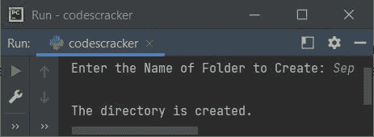

执行上述程序后，用户输入与示例运行中相同。目录**C:\ Users \ DEV \ codescracker \ my folder \ year \ 2021 \ Sep**被创建。下面是使用上述 Python 程序新创建的目录 的快照:


如您所见，创建了四个目录，即 **myfolder** 、 **year** 、 **2021** 和 **Sep** 。但是这四个目录并不是在一个单独的目录中单独创建的。而是**九月**在 **2021** 里面， T12】2021 在**年**里面，**年**在**我的文件夹**里面，**我的文件夹**在当前目录里。

## 操作系统模块的 listdir()函数

**os** 模块的函数 **listdir()** ，用于默认列出当前目录下的所有目录。 要列出或打印另一个目录下的所有文件和文件夹，先用 **os.chdir()** 切换到当前工作的 目录，到那个目录，你要列出其中的所有文件和文件夹。你可以尝试一下。但是我要用默认程序创建一个程序:

```
import os

print("All files and directories available in current directory:")
print(os.listdir())
```

下面是它的示例输出:

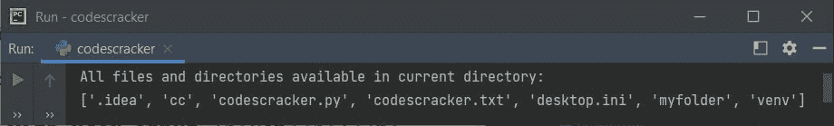

如果您想列出任何指定目录中的文件和目录，请使用下面的程序。这是先前程序的修改版本:

```
import os

mydir = "C:\\Users\\DEV"
files_folders = os.listdir(mydir)

print("Files and Directories in \"", mydir, "\":", sep="")
print(files_folders)
```

上述程序产生的输出显示了目录 **C:\Users\DEV** 中所有可用的文件和文件夹

**注意-** 它不仅限于列出来自 **C** 驱动器的文件和目录。您也可以列出所有的 文件和文件夹或目录从任何驱动器。

## 操作系统模块的 remove()函数

**os** 模块的 **remove()** 函数，用于使用 Python 程序删除任何文件。

```
import os

print("Enter the Name of File: ", end="")
file = input()
os.remove(file)
print("\nThe file \"", file, "\" deleted.", sep="")
```

下面是它的示例运行，用户输入 **codescracker.txt** 作为要从当前目录中删除的文件名。 因为我没有提供任何目录或路径，所以默认情况下，文件从当前目录被删除。这里是 从上述程序的示例运行中获取的快照:

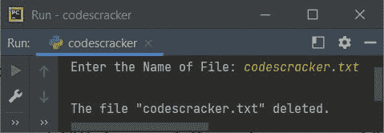

现在的问题是，如果给定的文件名在目录中不存在怎么办？或者如果给定的文件名不是一个文件，而是一个文件夹呢？
这两个问题的解决方案是处理 找不到文件或者输入的文件不可用后引发的异常，而不是同名文件夹 可用。例外情况是 **PermissionError** ，当没有文件但有同名文件夹时，以及 **FileNotFoundError** ，当没有找到文件时。让我们首先创建一个只处理 **FileNotFoundError** 错误的程序:

```
import os

print("Enter the Name of File: ", end="")
file = input()
try:
    os.remove(file)
    print("\nThe file \"", file, "\" deleted.", sep="")
except FileNotFoundError:
    print("\nThe file \"", file, "\", not found.", sep="")
```

下面是它的示例运行，用户输入与前一个程序的示例运行相同:

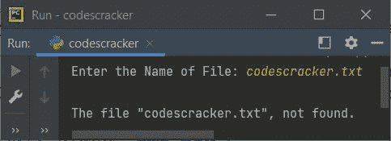

因为文件 **codescracker.txt** 是使用之前程序的样本运行删除的。因此，在这个示例运行中， 我们看到了上面的输出。您还可以生成由 **FileNotFoundError** 异常引发的默认错误消息。 让我们创建另一个程序，它处理多个异常并打印默认错误信息。

```
import os

print("Enter the Name of File: ", end="")
file = input()
try:
    os.remove(file)
    print("\nThe file \"", file, "\" deleted.", sep="")
except FileNotFoundError as fnfe:
    print(fnfe)
except PermissionError as pe:
    print(pe)
except OSError as ose:
    print(ose)
```

下面是它的示例运行，用户输入的文件名与前一个程序的文件名相同:

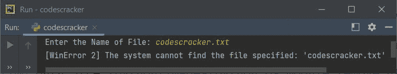

**注意-** 要从另一个目录删除文件，使用 **os.chdir()** 改变当前工作目录，然后处理 类似的程序来完成任务。

## 操作系统模块的 rmdir()函数

**os** 模块的 **rmdir()** 函数，用于删除目录。

```
import os

print("Enter the Name of Directory: ", end="")
directory = input()
os.rmdir(directory)
print("\nThe directory \"", directory, "\" deleted.", sep="")
```

下面是用户输入的运行示例， **cc** 作为要从当前目录中删除的目录的名称。

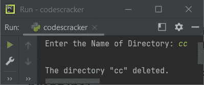

现在，当前目录中的 **cc** 目录或文件夹被删除。在修改了上面的 之后，让我们创建另一个程序，当用户输入一个不存在或找不到的目录时，它处理错误:

```
import os

print("Enter the Name of Directory: ", end="")
directory = input()
try:
    os.rmdir(directory)
    print("\nThe directory \"", directory, "\" deleted.", sep="")
except FileNotFoundError as fnfe:
    print(fnfe)
except OSError as ose:
    print(ose)
```

下面是它的示例运行，用户输入与前面的程序相同:

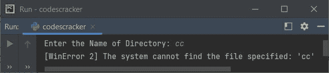

由于消息是**【WinError 2】系统找不到指定的文件:‘cc’**，说明程序引发了 **FileNotFoundError** 错误，基本上就是说目录不可用。

## os 模块的 rename()函数

**os** 模块的 **rename()** 函数，用于使用程序重命名文件或文件夹。

```
import os

old_name = "myfolder"
new_name = "yourfolder"
os.rename(old_name, new_name)
print("The folder named \"", old_name, "\", renamed with \"", new_name, "\"", sep="")
```

下面是它的运行示例:

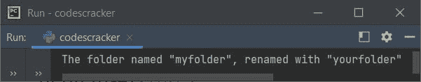

如果你看到当前目录，那么在执行上述 程序后，文件夹 **myfolder** 被重命名为 **yourfolder** 。以下是该目录的快照:


你也可以用同样的程序改变文件名。让我们修改上面的程序，并创建另一个程序，它在运行时从用户那里接收文件/文件夹的名称以进行重命名。当文件/文件夹不存在时，程序也会处理错误:

```
import os

print("Enter the Name of Old File/Folder: ", end="")
old = input()
print("Enter the Name of New File/Folder: ", end="")
new = input()

try:
    os.rename(old, new)
    print("\nRenamed successfully!")
except FileNotFoundError as fnfe:
    print(fnfe)
except IsADirectoryError as iade:
    print(iade)
except NotADirectoryError as nade:
    print(nade)
except PermissionError as pe:
    print(pe)
except IOError as ioe:
    print(ioe)
```

下面是它在用户输入 **myfile.txt** 下的运行示例:

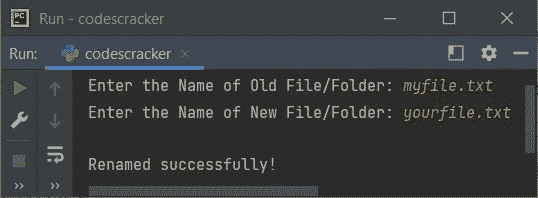

这是使用相同用户输入运行的另一个示例。由于文件 **myfile.txt** 使用上面的示例运行进行重命名， 然后提供与旧文件相同的文件用新文件重命名，程序产生或引发 **FileNotFoundError** 异常:

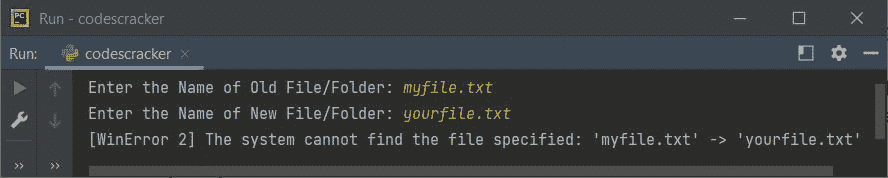

**注意-** 要从任何其他目录更改文件/文件夹的名称，首先使用 **os.chdir()** 更改当前工作目录 ，然后继续。

## os 模块的 path.exists()函数

Python 中的 **os.path.exists()** 函数，用于检查给定路径是否存在/可用。

```
import os

print("Enter the Full Path: ", end="")
path = input()
if os.path.exists(path):
    print("\nAvailable.")
else:
    print("\nNot available.")
```

下面是用户输入的示例运行**C:\ Users \ DEV \ codescracker**:

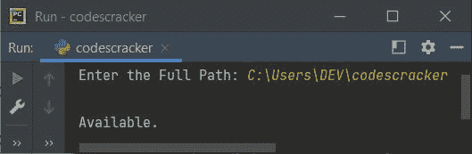

由于 **os.path.exists()** 返回**真**或**假**。即路径存在时**真**，路径不存在时**假** 。因此，我直接将代码作为条件的 [if 语句](/python/python-if-else-elif-statements.htm)。

路径可以是目录或文件。

## os 模块的 path.getsize()函数

Python 中的 **os.path.getsize()** 方法用于查找目录的大小。大小将以字节为单位。

```
import os

print("Enter the Full Path: ", end="")
path = input()
try:
    size = os.path.getsize(path)
    print("\nSize =", size, "bytes")
except OSError as ose:
    print(ose)

```

以下是用户输入的运行示例:

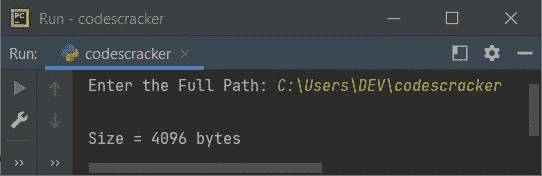

[Python 在线测试](/exam/showtest.php?subid=10)

* * *

* * *