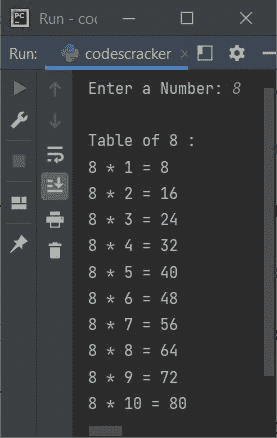

# Python 异常处理(try、except、finally、raise)

> 原文：<https://codescracker.com/python/python-exceptions.htm>

在 Python 中，异常处理是处理由 Python 程序引发的异常的过程。下面是 Python 中用来处理异常的[关键字](/python/python-keywords.htm):

*   尝试
*   除...之外
*   最后
*   上升

有时异常处理变得很重要，以继续程序的执行，避免程序在出现异常时停止。

## Python 中的 try 关键字

**try** 关键字用于创建 *try* 块，该块测试代码的错误。

## Python 中的 except 关键字

**except** 关键字用于创建 *except* 块，处理引发的异常/错误。

## Python 中的 finally 关键字

**finally** 关键字用于创建 *finally* 块，该块执行在该块中写入的所有语句 ，而不管是否出现异常。

## Python 中的 raise 关键字

**raise** 关键字用于引发异常。

## Python 异常处理示例

定义了 Python 中处理异常的所有四个关键字。现在是在示例程序的帮助下，一个一个地进行阐述的时候了。

## Python try-except 块

**尝试...except** 是 Python 中处理异常时使用最多的两个关键字。因为，当我们 需要检查代码错误时，我们需要一个 **try** 块，而如果出现异常，我们需要捕捉那个异常 ，当然是使用 **except** 块。例如:

```
try:
    print("The value of variable 'val' is", val)
except:
    print("The variable 'val' is not defined")
```

由于变量 **val** 在使用前没有定义，因此输出将是:

```
The variable 'val' is not defined
```

在 Python 中创建程序时，如果您不确定任何特定的语句，例如，如果您想从用户那里接收一个整数输入，但是我们知道 [input ()](/python/python-input-function.htm) 方法将每个输入的值都视为字符串类型。因此，我们需要将该值转换为 **int** 类型。但是 如果用户输入类似 **$** ， **D** ， **#** ， **Python** 的值，那就不能转换成 the *int* 了。那么在这种情况下，我们需要把语句放在一个 **try** 块中，这样，我们就可以捕捉到 的异常。例如:

```
print("Enter a number: ", end="")
num = input()

try:
    num = int(num)
    cub = num*num*num
    print("\nCube =", cub)
except:
    print("\nInvalid Input!")
```

下面给出的快照显示了上述程序的示例运行，用户输入 **12** :


这是另一个使用用户输入 **codescracker** 运行的示例。这一次，输入实际上是一个字符串， ，它不能被转换成一个 **int** 类型的值。因此，输出将是:


现在的问题是，如果创建程序时没有使用 **try-except** 会怎样？
让我们用下面给出的实用程序找出 答案:

```
print("Enter a number: ", end="")
num = input()

num = int(num)
cub = num*num*num
print("\nCube =", cub)
```

现在输出与用户输入的任何数字不同，比如说 **#** 将会是:


正如您从上面的输出中看到的，程序因以下语句而停止:

```
num = int(num)
```

引发的错误或异常的名称为**值错误**。因此，我们可以通过使用 这个 try-except 块来捕获这个异常:

```
print("Enter a number: ", end="")

try:
    num = int(input())
    print("\nCube =", num*num*num)
except ValueError:
    print("\nInvalid Input!")
```

我还做了一些修改来缩短代码。上面的代码仍然会产生相同的输出。

要手动只生成错误消息(默认消息)，请按照以下方式创建程序:

```
print("Enter a number: ", end="")

try:
    num = int(input())
    print("\nCube =", num*num*num)
except ValueError as ve:
    print("\nInvalid Input!")
    print("Exception:", ve)
```

现在，带有用户输入 **#** 的输出将是:


## Python 中具有相同代码的多个异常

我们可以使用除了之外的多个**块来捕捉由放置在 **try** 块中的代码引发的多个异常。例如:**

```
try:
    print("The square of", num, "is", num*num)
except NameError:
    print("The variable 'num' is not defined")
except:
    print("Something went wrong!")
```

因为变量 **num** 没有定义。因此，当我们在 Python 中使用未定义的变量/对象时， 会引发一个名为 **NameError** 的异常。因此，输出将是:

```
The variable 'num' is not defined
```

现在让我们用下面给出的程序修改上面的程序:

```
num = "10"
try:
    num = int(num)
    print("The square of", num, "is", num*num)
except NameError:
    print("The variable 'num' is not defined")
except ValueError:
    print("Invalid value stored in variable 'num'")
except:
    print("Something went wrong!")
```

因为变量 **num** 是在使用前定义的。因此，输出将是:

```
The square of 10 is 100
```

让我们再次修改上面的程序。也就是说，初始化除了数字之外的任何东西，比如说 **Python** 到 T2】num。例如:

```
num = "Python"
try:
    num = int(num)
    print("The square of", num, "is", num*num)
except NameError as ne:
    print("The variable 'num' is not defined")
    print("Exception:", ne)
except ValueError as ve:
    print("Invalid value stored in variable 'num'")
    print("Exception:", ve)
except:
    print("Something went wrong!")
```

现在输出将是:

```
Invalid value stored in variable 'num'
Exception: invalid literal for int() with base 10: 'Python'
```

这些只是一些演示，展示了 Python 中多个异常的处理。

#### 处理多个异常的语法

```
try:
   # do something
except exceptionName:
   # handle particular exception
except (exceptionOne, exceptionTwo, exceptionThree):
   # handle multiple exceptions at once
except:
   # handle all other (remaining) exceptions
```

## Python 尝试使用 finally

**finally** 关键字用于创建在**尝试之后执行的代码块...除了**挡。 这个**最后的**代码块将被执行，即使 **try** 引发了异常。例如:

```
print("Enter a Number to Print its Table: ", end="")
try:
    num = int(input())
    print("\nTable of", num, ":")
    for i in range(1, 11):
        print(i*num)
except ValueError:
    print("\nInvalid Input.")
finally:
    print("\nProgram finished.")
```

使用用户输入 **6** 运行的示例为:


下面给出的快照显示了用户输入 **$** 的另一个示例运行


**注意-****最后**块总是执行，不管**尝试的结果如何...除了**。

## Python 尝试使用 else

在**尝试之后的 **else** 块...除了**，当没有错误 出现时，可用于执行语句。例如:

```
print("Enter a Number: ", end="")
try:
    num = int(input())
except ValueError:
    print("\nInvalid Input.")
else:
    print("\nTable of", num, ":")
    for i in range(1, 11):
        print(num, "*", i, "=", num*i)
```

用户输入 **8** 的样本运行显示在下面给出的快照中:



而带有无效用户输入的示例运行显示在另一个快照中，如下所示:


## Python raise 关键字示例

以下程序显示了 Python 中的 **raise** 关键字的示例:

```
print("Enter a Positive Number: ", end="")

try:
    num = int(input())
    if num<0:
        raise Exception("Negative numbers aren't allowed.")
except ValueError:
    print("\nInvalid Input!")
```

用户输入 **-34** (负数)的示例运行显示在下面给出的快照中:


下面是另一个例子，演示了 Python 中的 **raise** 语句/关键字:

```
print("Enter a Number: ", end="")
num = input()

if not type(num) is int:
    raise TypeError("Invalid Input!")
```

用户输入**编码**的样本运行如以下快照所示:


[Python 在线测试](/exam/showtest.php?subid=10)

* * *

* * *