# Python 文件处理

> 原文：<https://codescracker.com/python/python-file-io.htm>

本文旨在涵盖文件处理的所有主题，以及示例程序及其相应的运行或输出示例。因此，这里的文件处理教程，旨在让你感觉，<u>从头到脚</u>。

文件处理是 Python 的热门话题之一。因为，有时我们需要使用 Python 程序处理文件，在文件中插入、更新或删除信息。

文件处理中使用最多的<u>函数是**open()**T3。因为每次 对文件执行任何操作，我们都需要先打开文件，而这个函数就是用来打开文件的。</u>

**注-** 根据打开模式，文件被打开，用于读取、写入、附加等目的。

### Python 中文件处理的需求是什么？

在使用 Python 创建 web 应用程序时，文件处理是一个重要的部分。在那里，大多数时候，你需要以文件的形式存储数据。数据可以是一些文本信息、图像、视频等。

## 文件处理中使用的方法列表

这里列出了 Python 中用来处理文件的所有重要方法及其简要描述。在所有这些方法中， **open()** 、 **read()** 、 **write()** 和 **close()** 是文件 处理最常用的方法。

这四种方法之外的其他方法属于文件处理的高级主题。我已经在本教程中介绍了文件处理的基础版和高级版。因此，让我首先描述那些在 Python 中处理文件时起关键作用的重要方法:

*   [open()](/python/python-open-function.htm) -用于打开文件。
*   [readable()](/python/python-readable-function.htm) -用于检查文件是否可读。
*   [readline()](/python/python-readline-function.htm) -用于从文件中读取一行(第一行)。每次我们使用这个函数，下一行将会返回 。
*   [readlines()](/python/python-readlines-function.htm) -用于以行的形式读取文件的全部内容，其中每一行都作为 list 的元素返回。
*   [read()](/python/python-read-function.htm) -用于一次性读取文件的全部内容。
*   [writable()](/python/python-writable-function.htm) -用于检查文件是否可写。
*   [write()](/python/python-write-function.htm) -用于将字符串写入文件。
*   [writelines()](/python/python-writelines-function.htm) -用于一次将多个字符串写入文件，其中每个字符串必须作为列表的元素。
*   [close()](/python/python-close-function.htm) -用于使用 file 对象或处理程序从程序中关闭文件的链接。
*   [seek()](/python/python-seek-function.htm) -用于在文件流中移动文件处理程序的对象。
*   [tell()](/python/python-tell-function.htm) -用于查找文件处理程序在文件流中的当前位置。

### 重要文件打开模式列表

下面给出了在 Python 编程中处理文件时最常用的模式。要了解所有模式，需要参考 **open()** 函数。在那里，我描述了每一个细节以及所有的模式和例子。

*   **r** -此模式用于只读。
*   **w** -此模式仅用于写入。如果文件存在，以前的内容将被删除。如果文件不存在， 那么一个新的文件将被创建。
*   **a** -与 **w** 相同，但之前的内容不会被删除。用于将内容追加到文件中。

## Python 中文件处理的基础知识

让我先介绍一下 Python 中文件处理的基础知识。然后将涵盖文件处理的所有高级主题。在基础部分，我们将处理这些操作:

*   打开文件
*   创建文件
*   写入文件
*   读取文件
*   关闭文件

让我们从第一个开始，那就是打开文件。

### Python 文件打开操作

在 Python 中，要打开一个文件，我们需要使用 open()函数。下面是一个例子，打开一个名为 **myfile.txt** 的文件。

```
c = open("myfile.txt")
```

因为我没有提供模式，并且因为<u>的默认模式是**r**T3。因此，上述文件以 **r** 或 只读模式打开。</u>

### Python 文件创建操作

用 Python 创建一个文件，我们需要在 **w** 、 **w+** 、 **wb** 、 **wb+** 、 **a** 、 **a+** 、 **ab** 、 **ab+** 模式下打开文件。如前所述，所有模式以及这些模式都在 open()函数中进行了描述。对于现在的 ，我们只需要 **r** 、 **w** 和 **a** 模式。

```
file_handler = open("myfile.txt", "w")
print("The file \"myfile.txt\" is created.")
```

如果你执行这个 Python 程序，那么使用第一条语句，一个名为 **myfile.txt** 的文件将被创建在 当前目录中。保存 Python 源代码的目录。上面的程序使用 产生的输出，它的第二个语句将是:

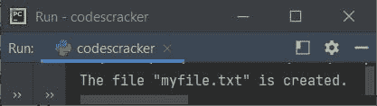

因为在我的例子中，我保存了我的 Python 源代码，或者说上面的程序保存在目录中，比如说**C:\ Users \ DEV \ codescracker**， 因此在这个目录中，文件被创建。以下是使用上述 程序运行示例创建的目录和新文件的快照:

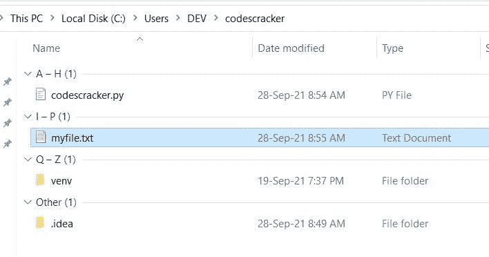

因为我没有写任何东西到这个文件，所以文件的大小是 0。也就是说，目前该文件中没有可用的内容。

### Python 文件写操作

因为该文件是使用上述程序创建的。因此，是时候[将内容写入文件](/python/program/python-program-write-to-file.htm)了。所以让我们用下面给出的程序写 :

```
file_handler = open("myfile.txt", "w")
file_handler.write("Hey, I'm the content.")
print("The content is written in the file.")
```

正如你所看到的，在使用 **write()** 写内容之前，我们需要以写模式打开文件，比如说 **w** 。 现在如果你执行上面的程序，那么内容**嘿，我就是内容。**将被写入文件中。还有一个 消息说**内容被写入文件中。**将打印在输出控制台上。下面是上述程序产生的示例输出的快照 :

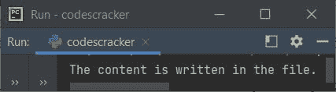

现在如果你打开这个文件，这个文件包含了一些内容，是用上面的程序写的。以下是打开文件的快照:

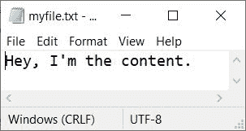

### Python 文件读取操作

创建文件时，还会使用以前的程序将一些内容写入文件。因此是时候让[从文件](/python/program/python-program-read-file.htm)中读取内容了。所以下面给出的程序使用 **r** 以读取模式打开同一个文件，读取其中可用的 内容:

```
file_handler = open("myfile.txt", "r")
print(file_handler.read())
```

上述程序产生的输出将是文件 **myfile.txt** 中可用的文本。下面是显示 样本输出的快照:

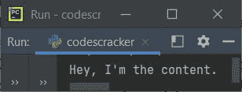

另一种读取文件的方法是:

```
file_handler = open("myfile.txt", "r")
for line in file_handler:
   print(line, end="")
file_handler.close()
```

**注意-****print()**中的 **end=** 参数用于跳过自动插入换行符。

### Python 文件关闭操作

在执行读、写、更新等操作后。到/从文件，我们需要关闭文件的链接从程序使用其处理程序。因此 Python 提供了一个名为 **close()** 的函数来完成这项任务。下面是 计划演示它:

```
file_handler = open("myfile.txt", "r")
file_handler.close()
print("The file is closed.")
```

如果您执行上面的程序，输出将是:

```
The file is closed.
```

让我们创建另一个程序来显示，当我们关闭文件后读取它时会发生什么。

```
file_handler = open("myfile.txt", "r")
file_handler.close()
print(file_handler.read())
```

现在，这一次，上述程序产生的输出将是:

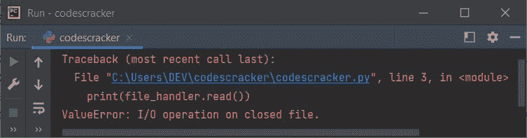

即 **print()** 函数内的代码 **file_handler.read()** 引发一个名为 **ValueError** 的异常，表示对关闭的文件进行 **I/O 操作。**否则我们无法对关闭的文件执行输入/输出操作。

让我们创建另一个程序，手动处理错误。

```
file_handler = open("myfile.txt", "r")
file_handler.close()
try:
   content = file_handler.read()
   print(content)
except ValueError:
   print("The file is closed.")
```

现在，输出将是我在捕获异常并将手动错误消息放入 except 块后提供的手动消息。下面是生成的输出:

```
The file is closed.
```

如果你去掉这句话:

```
file_handler.close()
```

从上面的程序，那么输出将是:

```
Hey, I'm the content.
```

嘿，我很满足。文件 **myfile.txt** 中的内容是否可用

## Python 中文件处理的进展

因为文件处理的所有基础知识都已经涵盖了。现在让我们继续，讨论一些与 Python 中的文件处理相关的有趣的高级主题。

### 仅当文件不存在时才创建该文件

这是 Python 中高级文件处理最重要的部分。因为我认为，大多数时候我们使用 **w** 模式来创建文件，而不知道目录中是否已经存在同名文件。因为如果 相同的文件已经存在，那么使用 **w** 模式将会覆盖该文件，或者该文件的内容将会被删除。

因为文件内容会被删除，所以我们可能会丢失一些重要的数据。因此，我们需要检查我们将要创建的文件是否已经存在。如果没有，那么只有我们创建文件。

```
print("Enter the Name of File: ", end="")
file_name = input()
try:
   file_handler = open(file_name, "x")
   print("\nThe file named \"", file_name, "\" is created.", sep="")
except FileExistsError:
   print("\nThe file named \"", file_name, "\" is already available.", sep="")
```

**注意-****x**模式用于代替 **w** 来创建一个文件，如果该文件不存在的话。否则， 返回一个错误，即**filexistserror**。

下面是它的示例运行，用户输入 **myfile.txt** 作为要创建的文件名:

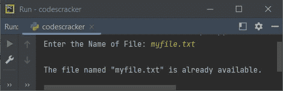

您可以查看文件 **myfile.txt** 的内容。使用上述程序，一切都不会受到影响。下面是另一个 示例，使用用户输入的 **yourfile.txt** 作为要创建的文件名:

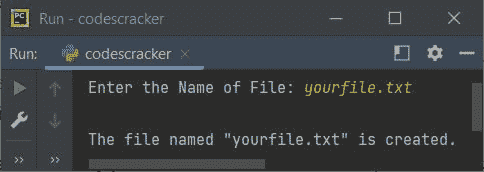

如果你看到你的当前目录，那么名为 **yourfile.txt** 的文件将是可用的，它是使用上面的 程序的示例运行创建的:

### 检查文件是否可写

在将内容写入文件之前，最好检查文件是否可写。因此，可以使用函数 **writable()** 来完成这项工作，如下面给出的程序所示:

```
print("Enter the Name of File: ", end="")
file_name = input()
file_handler = open(file_name, "w")
if file_handler.writable():
   print("\nThe file, \"", file_name, "\" is writable.", sep="")
   print("\n1\. Write at Once")
   print("2\. Write Line by Line")
   print("Enter Your Choice (1 or 2): ", end="")
   choice = int(input())
   if choice==1:
      print("\nEnter text to write: ", end="")
      content = input()
      file_handler.write(content)
   elif choice==2:
      print("\nHow many lines to write: ", end="")
      no_of_lines = int(input())
      print("Enter", no_of_lines, "lines of string to write: ", end="")
      mylines = list()
      for i in range(no_of_lines):
         line = input()
         line = line + "\n"
         mylines.append(line)
      file_handler.writelines(mylines)
      print("\nLines are written in the file.")
   else:
      print("\nInvalid Choice!")
else:
   print("\nThe file, \"", file_name, "\" is not writable.", sep="")
file_handler.close()
```

以下是用户输入的运行示例:

*   **myfile.txt** 作为文件名
*   **2** 为选择逐行书写
*   **3** 为要写入的行数
*   这是第一行。、**这是第二行。**，**这是第三行。**为三行向 写。

下面给出的快照显示了使用上述用户输入运行的示例:

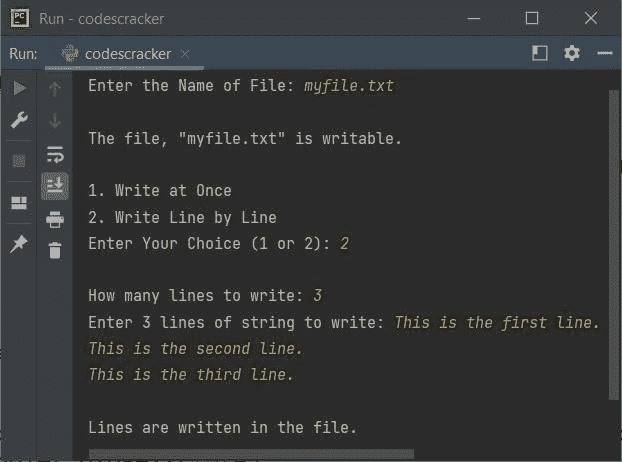

在上面的程序中，语句:

```
line = line + "\n"
```

用于在每行的末尾插入一个新行。要了解更多关于 **writable()** 函数的信息，请参考它的 单独教程。

**注意-** 文件可能不可写，因为打开方式不允许，或者权限不允许。

### 检查文件是否可读

这个程序和以前的类似。也就是说，在这个程序中，在实际执行读操作之前，我还检查了文件是否可读。我还应用了所有三种方法来读取文件内容:

```
print("Enter the Name of File: ", end="")
file_name = input()
file_handler = open(file_name, "r")
if file_handler.readable():
   print("\nThe file, \"", file_name, "\" can be read.", sep="")
   print("\n1\. Read Whole Content")
   print("2\. Read First Line")
   print("3\. Read Content by Lines")
   print("Enter Your Choice (1, 2, or 3): ", end="")
   choice = int(input())
   if choice==1:
      print("\n----Content of File----")
      content = file_handler.read()
      print(content)
   elif choice==2:
      print("\n----Content of File----")
      content = file_handler.readline()
      print(content)
   elif choice==3:
      print("\n----Content of File----")
      content = file_handler.readlines()
      print(content)
   else:
      print("\nInvalid Choice!")
else:
   print("\nThe file, \"", file_name, "\" can not be read.", sep="")
file_handler.close()
```

以下是用户输入的运行示例， **myfile.txt** 作为文件名， **2** 作为选项:

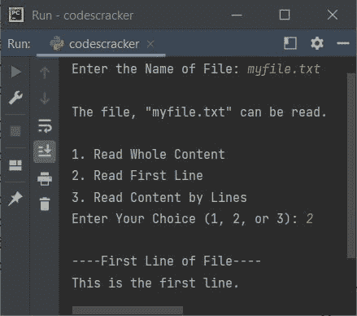

这是另一个示例，这次选择了 **3** :

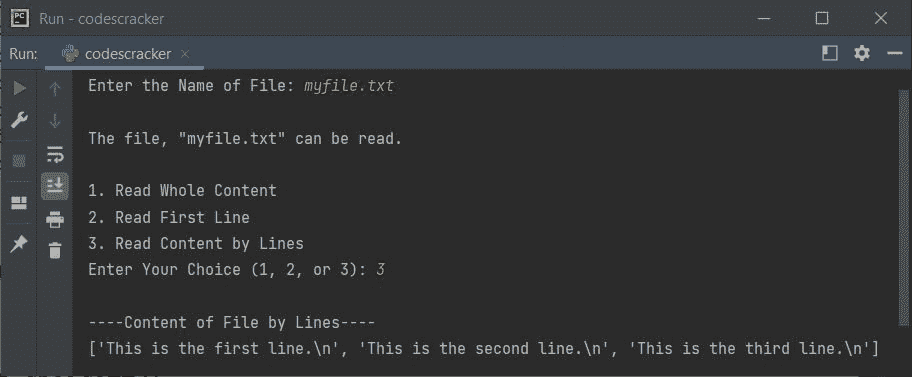

如果您选择第一个选项，那么输出将是:

```
This is the first line.
This is the second line.
This is the third line.
```

### Python 文件追加操作

在 Python 中文件处理的基础部分，我已经介绍了这个主题，写入文件。因此，让我创建一个程序，展示如何在不删除前一个文件的情况下将新内容添加到文件中。

```
print("Enter the Name of File: ", end="")
file_name = input()
file_handler = open(file_name, "a+")
print("\nEnter the content to append: ", end="")
content = input()
file_handler.write(content)
file_handler.seek(0)
print("\n----New content of file----")
print(file_handler.read())
file_handler.close()
```

这是它的示例运行，用户输入的文件名与前面程序中提供的文件名相同，内容追加为**这是第四行的字符串。**:

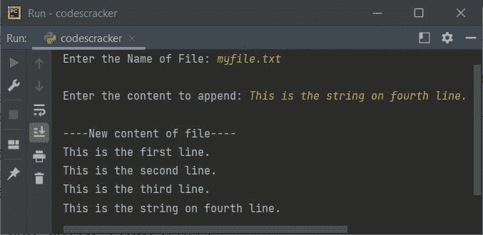

**注-****a+**模式用于在追加和读取模式下打开文件。使用 **seek()** 来移动文件对象或处理程序在文件流中的位置。因为我已经使用了 **seek(0)** ，因此文件处理程序 将转到文件流中文件的开头。

上述程序也可以替换为下面给出的程序:

```
print("Enter the Name of File: ", end="")
file_name = input()
file_handler = open(file_name, "a")
print("\nEnter the content to append: ", end="")
content = input()
file_handler.write(content)
file_handler.close()
file_handler = open(file_name, "r")
print("\n----New content of file----")
print(file_handler.read())
file_handler.close()
```

这个程序的工作方式与之前的程序完全相同。唯一的区别是，我没有在读取和附加模式下打开文件，而是先在附加模式下打开文件来附加内容。

当内容被追加后，我就使用它的处理程序关闭了文件。并在读取模式下重新打开文件，使用 **r** 读取文件内容，而不是使用 **seek()** 在开始时移动处理程序来读取内容。你可以按照 的任何方式来做这项工作。但是我建议初学者选择第二个，否则第一个会更好。

### Python 文件更新操作

追加到文件也是一种可以被认为是更新文件的方式。但是这个部分包含文件内容的实际更新。也就是说，这里我们将使用新文本替换一些文本。让我们看看怎么做。这里有一个程序演示了它:

```
print("Enter the Name of File: ", end="")
file_name = input()
file_handler = open(file_name, "r")
content = file_handler.read()
print("\nEnter the text to search: ", end="")
old_text = input()
if old_text in content:
   print("Enter new text to replace with: ", end="")
   new_text = input()
   content = content.replace(old_text, new_text)
   file_handler.close()
   file_handler = open(file_name, "w")
   file_handler.write(content)
   print("\nThe text is replaced!")
   print("\nWant to read (y/n): ", end="")
   ch = input()
   if ch=='y':
      file_handler.close()
      file_handler = open(file_name, "r")
      print("\n----New content of file----")
      print(file_handler.read())
else:
   print("\nThe text, \"", text, "\" is not found in the file.")
file_handler.close()
```

下面是它的示例运行，用户输入 **myfile.txt** ，**行**作为要搜索的文本，**字符串**作为要替换 的文本，最后 **y** 作为执行替换操作后显示文件新内容的选项:

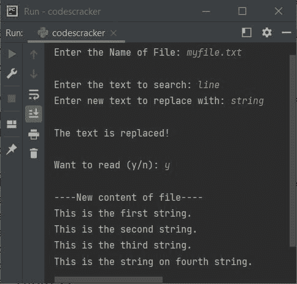

### Python 中的大型文件处理程序

因为 Python 中的文件处理的所有主题都包含在内。因此，让我把所有这些主题结合起来，创建一个关于文件处理的大型程序。这个程序包括所有的东西，以及所有错误的处理。一定要专注于程序及其示例运行。相信我，在理解了这个程序之后，你会觉得在 Python 的文件处理领域一定比以前更好:

```
print("1\. Read a File")
print("2\. Write to File")
print("3\. Append to File")
print("4\. Update a File")
print("Enter Your Choice (1-4): ", end="")
try:
   choice = int(input())
   if choice==1:
      print("\nEnter the Name of File: ", end="")
      file_name = input()
      try:
         file_handler = open(file_name, "r")
         if file_handler.readable():
            print("\n----Content of File----")
            print(file_handler.read())
         else:
            print("\nThe file is not readable.")
         file_handler.close()
      except FileNotFoundError:
         print("\nFile not found!")
   elif choice==2:
      print("\nEnter the Name of File: ", end="")
      file_name = input()
      file_handler = open(file_name, "w")
      if file_handler.writable():
         print("\n1\. Write text of single line.")
         print("2\. Write text of multiple lines.")
         try:
            option = int(input())
            if option==1:
               print("\nEnter text to write: ", end="")
               text = input()
               file_handler.write(text)
               print("\nThe text is written in the file.")
               print("Want to read (y/n) ? ", end="")
               ch = input()
               if ch=='y':
                  file_handler.close()
                  file_handler = open(file_name, "r")
                  print("\n----Content of File----")
                  print(file_handler.read())
                  file_handler.close()
            elif option==2:
               print("\nHow many number of lines to write: ", end="")
               try:
                  no_of_lines = int(input())
                  print("Enter", no_of_lines, "lines of text, one by one:")
                  mylines = list()
                  for i in range(no_of_lines):
                     line = input()
                     line = line + "\n"
                     mylines.append(line)
                  file_handler.writelines(mylines)
                  print("\nAll lines are written in the file.")
                  print("Want to read (y/n) ? ", end="")
                  ch = input()
                  if ch=='y':
                     file_handler.close()
                     file_handler = open(file_name, "r")
                     print("\n----Content of File----")
                     print(file_handler.read())
                     file_handler.close()
               except ValueError:
                  print("\nInvalid Input! (number of lines)")
            else:
               print("\nInvalid Option!")
         except ValueError:
            print("\nInvalid Input! (Option)")
      else:
         print("\nThe file is not writable.")
   elif choice==3:
      print("\nEnter the Name of File: ", end="")
      file_name = input()
      file_handler = open(file_name, "a")
      if file_handler.writable():
         print("\n1\. Append text of single line.")
         print("2\. Append text of multiple lines.")
         try:
            option = int(input())
            if option==1:
               print("\nEnter text to append: ", end="")
               text = input()
               file_handler.write("\n")
               file_handler.write(text)
               print("\nThe text is appended in the file.")
               print("Want to read (y/n) ? ", end="")
               ch = input()
               if ch=='y':
                  file_handler.close()
                  file_handler = open(file_name, "r")
                  print("\n----Content of File----")
                  print(file_handler.read())
                  file_handler.close()
            elif option==2:
               print("\nHow many number of lines to append: ", end="")
               try:
                  no_of_lines = int(input())
                  print("Enter", no_of_lines, "lines of text, one by one:")
                  mylines = list()
                  for i in range(no_of_lines):
                     line = input()
                     line = line + "\n"
                     mylines.append(line)
                  file_handler.write("\n")
                  file_handler.writelines(mylines)
                  print("\nAll lines are appended in the file.")
                  print("Want to read (y/n) ? ", end="")
                  ch = input()
                  if ch=='y':
                     file_handler.close()
                     file_handler = open(file_name, "r")
                     print("\n----Content of File----")
                     print(file_handler.read())
                     file_handler.close()
               except ValueError:
                  print("\nInvalid Input!")
            else:
               print("\nInvalid Option!")
         except ValueError:
            print("\nInvalid Input!")
      else:
         print("\nThe file is not writable.")
   elif choice==4:
      print("\n1\. Replace Text")
      print("2\. Delete Text")
      print("3\. Empty File")
      print("Enter your choice (1-3): ", end="")
      try:
         option = int(input())
         print("\nEnter the Name of File: ", end="")
         file_name = input()
         file_handler = open(file_name, "r")
         content = file_handler.read()
         if option==1:
            print("Enter text to search: ", end="")
            old_text = input()
            if old_text in content:
               print("Enter text to replace with: ", end="")
               new_text = input()
               content = content.replace(old_text, new_text)
               file_handler.close()
               file_handler = open(file_name, "w")
               file_handler.write(content)
               print("\nThe text is replaced!")
               file_handler.close()
               print("Want to read (y/n) ? ", end="")
               ch = input()
               if ch == 'y':
                  file_handler = open(file_name, "r")
                  print("\n----Content of File----")
                  print(file_handler.read())
                  file_handler.close()
            else:
               print("\nThe text is not found in the file!")
         elif option==2:
            print("Enter text to delete: ", end="")
            text_to_delete = input()
            if text_to_delete in content:
               content = content.replace(text_to_delete, "")
               file_handler.close()
               file_handler = open(file_name, "w")
               file_handler.write(content)
               print("\nThe text is deleted!")
               file_handler.close()
               print("Want to read (y/n) ? ", end="")
               ch = input()
               if ch == 'y':
                  file_handler = open(file_name, "r")
                  print("\n----Content of File----")
                  print(file_handler.read())
                  file_handler.close()
            else:
               print("\nThe text is not found in the file!")
         elif option==3:
            file_handler.close()
            file_handler = open(file_name, "w")
            file_handler.write("")
            print("\nThe file is emptied!")
            file_handler.close()
            print("Want to read (y/n) ? ", end="")
            ch = input()
            if ch == 'y':
               file_handler = open(file_name, "r")
               print("\n----Content of File----")
               print(file_handler.read())
               file_handler.close()
         else:
            print("\nInvalid Option!")
      except ValueError:
         print("\nInvalid Input!")
   else:
      print("\nInvalid Choice!")
except ValueError:
   print("\nInvalid Input!")
```

以下是它的示例运行，选择用户输入 **1** ，选择 **myfile.txt** 作为文件名:

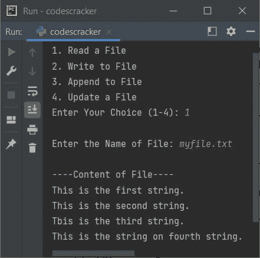

这是另一个运行示例。这一次，我选择了第三个选项，使用上面的程序来检查追加操作:

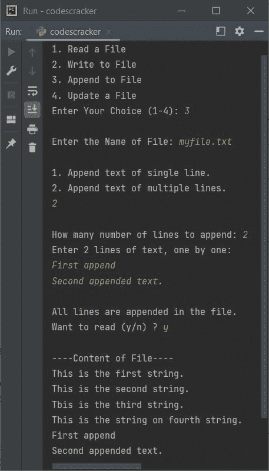

这是最后一次样品测试。这一次，我对第四个选择进行了交叉检查，从文件中删除了文本:

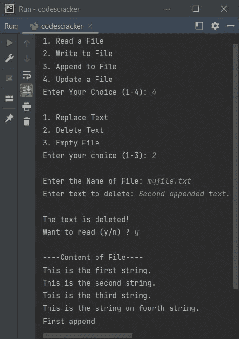

**注-** 使用 Python 程序删除、重命名、创建文件或文件夹，请参考 [os 模块](/python/python-os-module.htm)。

#### 关于文件处理的更多示例

*   [复制文件](/python/program/python-program-copy-files.htm)
*   [合并两个文件](/python/program/python-program-merge-two-files.htm)
*   [列出目录](/python/program/python-program-list-files-in-directory.htm)中的文件
*   [删除一个文件](/python/program/python-program-delete-files.htm)

[Python 在线测试](/exam/showtest.php?subid=10)

* * *

* * *