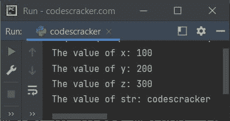

# python class method Decorator-@ class method

> 原文：<https://codescracker.com/python/python-classmethod-decorator.htm>

类方法 decorator 或 **@classmethod** 用于将类内部的方法定义为类方法。举 的例子:

```
class CodesCracker:
    @classmethod
    def classfun(cls, x):
        print("The first parameter (cls):", cls)
        print("The second parameter (x):", x)

CodesCracker.classfun("Hey!")
```

下面是上面的 Python 程序产生的输出，演示了 **@classmethod** 装饰器:

```
The first parameter (cls): <class '__main__.CodesCracker'>
The second parameter (x): Hey!
```

类方法引用类对象作为第一个参数。

类方法可以访问类是什么。class 方法也是一个函数，但是可以访问对象及其内部，比如字段和其他方法，而静态方法则不能。这两者之间的区别在[类方法和 Python](/python/python-class-method-vs-static-method.htm) 中的静态方法中提供。

可以使用以下方法直接调用类方法:

```
ClassName.ClassMethodName()
```

或者通过使用类的对象，以这种方式:

```
ob = ClassName()
ob.ClassMethodName()
```

其中 **ob** 是指类**类名**的对象变量。

在上面的示例程序中，使用了以下语句:

```
CodesCracker.classfun("Hey!")
```

类 **CodesCracker** 作为名为 **classfun()** 的类方法的第一个参数被隐式传递，而**则“嘿！”**将作为名为 **classfun()** 的类方法的第二个参数被传递。也就是说， **cls** 参数(第一个参数)在使用 **@classmethod** decorator 定义类方法时， 指的是类本身。

## Python @classmethod 装饰语法

Python 中的 **@classmethod** decorator 的语法是:

```
@classmethod
def myfun(cls, arg1, arg2, arg3, ..., argN):
    # definition code goes here
```

就像 **self** 一样，类内部正常方法的第一个参数指的是对象实例。对于 类方法也是如此，类方法的第一个参数，也就是类内的 **cls** ，指的是类本身。 以及其余所有参数如 **arg1** 、 **arg2** 等都是指普通函数 所具有的自变量。

## Python @classmethod 装饰示例

这里有一个 Python 中的 **@classmethod** decorator 的例子:

```
class CodesCracker:
    @classmethod
    def myfun(cls, x, y, z, str):
        print("The value of x:", x)
        print("The value of y:", y)
        print("The value of z:", z)
        print("The value of str:", str)

CodesCracker.myfun(100, 200, 300, "codescracker")
```

下面给出的快照显示了上述 Python 程序产生的示例输出，演示了 **@classmethod** 装饰器:



[Python 在线测试](/exam/showtest.php?subid=10)

* * *

* * *