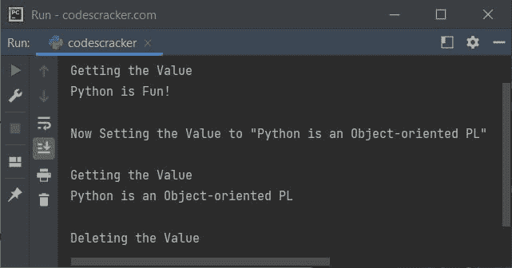
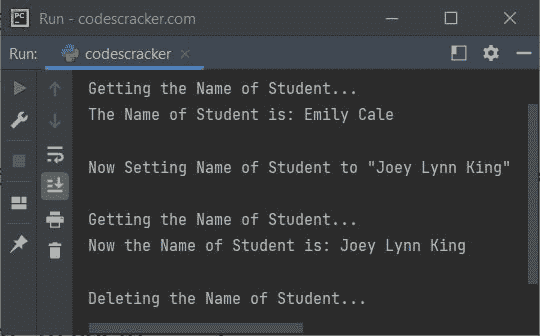

# Python @property 装饰器

> 原文：<https://codescracker.com/python/python-property-decorator.htm>

**@属性**用于定义新属性或修改现有属性。例如:

```
class CodesCracker:
    def __init__(self, val):
        self.v = val

    @property
    def val(self):
        print("\nGetting the Value")
        return self.v

    @val.setter
    def val(self, val):
        print("\nNow Setting the Value to \"", val, "\"", sep="")
        self.v = val

    @val.deleter
    def val(self):
        print("\nDeleting the Value")
        del self.v

a = CodesCracker("Python is Fun!")
print(a.val)

a.val = "Python is an Object-oriented PL"
print(a.val)

del a.val
```

上面程序的示例输出展示了 Python 中的 **@property** decorator，如下面给出的 快照所示:



使用 **@property** decorator 定义新属性或修改现有属性的方法， 是:

```
class C(object):
    @property
    def x(self):
        return self._x

    @x.setter
    def x(self, value):
        self._x = value

    @x.deleter
    def x(self):
        del self._x
```

例如:

```
class CodesCracker:
    def __init__(self, stud):
        self.s = stud

    @property
    def stud(self):
        print("\nGetting the Name of Student...")
        return self.s

    @stud.setter
    def stud(self, nstud):
        print("\nNow Setting Name of Student to \"", nstud, "\"", sep="")
        self.s = nstud

    @stud.deleter
    def stud(self):
        print("\nDeleting the Name of Student...")
        del self.s

x = CodesCracker("Emily Cale")
print("The Name of Student is:", x.stud)
x.stud = "Joey Lynn King"
print("Now the Name of Student is:", x.stud)
del x.stud
```

下面给出的快照当然显示了这个程序的示例输出:



[Python 在线测试](/exam/showtest.php?subid=10)

* * *

* * *