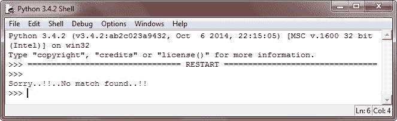
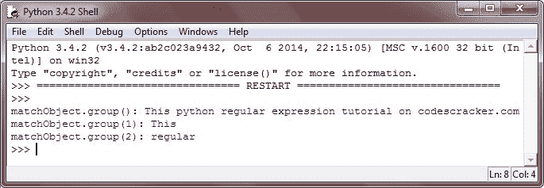
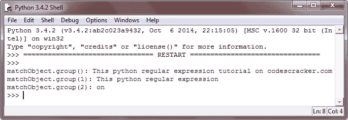

# Python 正则表达式

> 原文：<https://codescracker.com/python/python-regular-expressions.htm>

python 中的正则表达式只是一个特殊的字符序列，它使用专门的语法帮助您在一个模式中匹配另一组字符串。

正则表达式是一种特殊的字符序列，它使用模式中的特殊语法来帮助您匹配或查找其他(或一组)字符串。正则表达式在 UNIX 中被广泛使用。

python 中的 match()函数试图将 RE 模式与带有可选标志的字符串进行匹配。以下是在 python 中使用 match()函数的一般形式:

```
re.match(pattern, string, flags=0)
```

这里，**模式**是要匹配的正则表达式，**字符串**是字符串，它将被搜索以匹配字符串开头 的模式，然后**标志**是修饰符。

match()函数只在成功时返回匹配的对象，否则不返回任何对象。您可以使用匹配对象 的 **groups()** 函数来获取匹配的表达式。

## Python 正则表达式示例

下面是一个示例程序，说明了 python 中正则表达式的概念和用途:

```
# Python Regular Expression - Example Program

import re

str = "This python regular expression tutorial on codescracker.com"

matchObject = re.match( r'(.*) are (.*?) .*', str, re.M|re.I)

if matchObject:
   print("matchObject.group():", matchObject.group())
   print("matchObject.group(1):", matchObject.group(1))
   print("matchObject.group(2):", matchObject.group(2))

else:
   print("Sorry..!!..No match found..!!")
```

以下是上述 python 程序的示例输出:



让我们用这个来修改上面的 python 程序:

```
# Python Regular Expression - Example Program

import re

str = "This python regular expression tutorial on codescracker.com"

matchObject = re.match( r'(.*) python (.*?) .*', str, re.M|re.I)

if matchObject:
   print("matchObject.group():", matchObject.group())
   print("matchObject.group(1):", matchObject.group(1))
   print("matchObject.group(2):", matchObject.group(2))

else:
   print("Sorry..!!..No match found..!!")
```

以下是上述 python 程序生成的示例输出:



让我们再次修改上面的 python 程序:

```
# Python Regular Expression - Example Program

import re

str = "This python regular expression tutorial on codescracker.com"

matchObject = re.match( r'(.*) tutorial (.*?) .*', str, re.M|re.I)

if matchObject:
   print("matchObject.group():", matchObject.group())
   print("matchObject.group(1):", matchObject.group(1))
   print("matchObject.group(2):", matchObject.group(2))

else:
   print("Sorry..!!..No match found..!!")
```

下面是上述 python 程序产生的输出:



[Python 在线测试](/exam/showtest.php?subid=10)

* * *

* * *