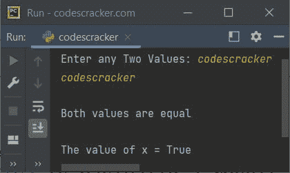

# Python True 关键字

> 原文：<https://codescracker.com/python/python-true-keyword.htm>

Python 中的 **True** 关键字基本上就是一个布尔值。有两个布尔值，即*真* 和[假](/python/python-false-keyword.htm)。**真**基本上是由于:

*   比较操作
*   、或其值以真/假形式评估的任何其他逻辑表达式

例如:

```
a = 10
b = 20
c = 10

print(a==c)
print(a<b)
```

输出是:

```
True
True
```

## Python True 关键字示例

*真*是布尔运算的结果。也就是说，如果布尔运算的表达式评估 为真，那么条件评估为真。这里有一个例子可以说明这一点:

```
print("Enter any Two Values: ", end="")
a = input()
b = input()

x = a==b
if x:
    print("\nBoth values are equal")
else:
    print("\nBoth values are not equal")

print("\nThe value of x =", x)
```

下面给出的快照显示了上述程序的示例运行，用户输入 **codescracker** 作为 的第一个和第二个值:



[Python 在线测试](/exam/showtest.php?subid=10)

* * *

* * *