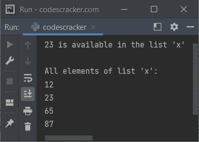
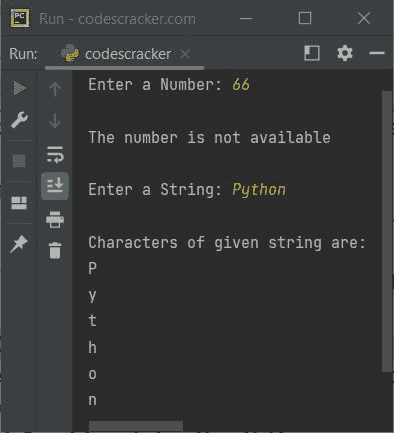

# Python `in`关键字

> 原文：<https://codescracker.com/python/python-in-keyword.htm>

Python 中的关键字中的**在我们需要时使用:**

1.  检查某个特定值在序列中是否可用，如[列表](/python/python-lists.htm)、 、[元组](/python/python-tuples.htm)等。或者不是
2.  或者遍历循环中的[序列](/python/python-for-loop.htm)

例如:

```
x = [12, 23, 65, 87]
if 23 in x:
    print("23 is available in the list 'x'")
else:
    print("23 is not available in the list 'x'")

print("\nAll elements of list 'x':")
for e in x:
    print(e)
```

下面给出的快照显示了上述程序产生的示例输出，演示了 Python 中的关键字 中的**:**



**注意-** Python 是一种区分大小写的语言，因此将中的**都用小写字母。**

## 关键字示例中的 Python

下面是 Python 中关键字中**的一个例子:**

```
x = (134, 54, 65, 67, 0, 23)
print("Enter a Number: ", end="")
num = int(input())
if num in x:
    print("\nThe number is available")
else:
    print("\nThe number is not available")

print("\nEnter a String: ", end="")
str = input()
print("\nCharacters of given string are:")
for c in str:
    print(c)
```

使用用户输入的 **66** 作为数字， **Python** 作为[字符串](/python/python-strings.htm) 的示例运行如下面给出的快照所示:



[Python 在线测试](/exam/showtest.php?subid=10)

* * *

* * *