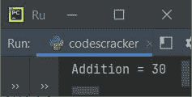
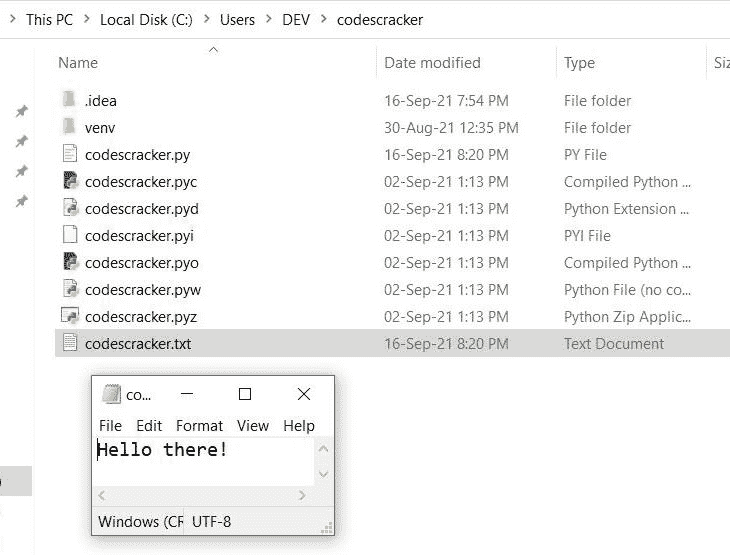
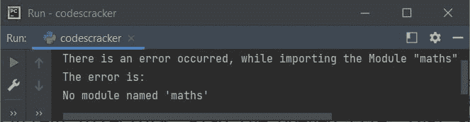
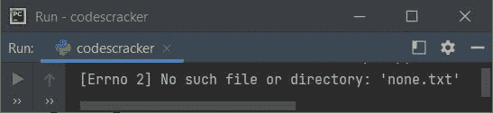

# Python 作为关键字

> 原文：<https://codescracker.com/python/python-as-keyword.htm>

Python 中的 **as** 关键字用于提供别名。基本上**作为**关键字被使用，大多数时候定义 为任何预定义名称的子名称或用户自定义名称。例如:

```
import operator as op
```

现在模块**操作符**被使用它的重名访问，比如**操作符**。也就是说，每当在程序中，你 键入 **op** ，意味着它代表给**操作符**模块。例如:

```
import operator as op

a = 10
b = 20
res = op.add(a, b)
print("Addition =", res)
```

如你所见， **op** 变量引用了**运算符**，因此使用 [运算符模块](/python/python-operator-module.htm)的函数 **add()** ，两个数的相加通过 **op.add()** 来实现。那正好等于 **operator.add()** 。下面是上述程序产生的输出:



## 可以使用 as 关键字的上下文

这里列出了四种情况，通常情况下，关键字**作为**可以用来给出别名。

1.  **作为**关键字给模块起别名
2.  **作为**关键字，为子模块提供别名
3.  **作为**关键字为资源赋予别名
4.  **作为**关键字，为异常提供别名

让我们用示例程序简要解释一下这些上下文。

### 为模块提供别名的关键字

**作为**关键字，大多数情况下，用于给模块起别名或子名称。下面给出的程序演示了 这种情况。

```
import <module_name> as <alias_name>
```

例如，下面给出的程序，给**随机**模块赋予别名 say **r** 。

```
import random as r

print(r.randint(10, 100))
```

[产生一个介于 10 和 100 之间的随机数](/python/program/python-program-generate-random-numbers.htm)。正如你 从上面的程序中可以看到的，变量 **r** 后的语句:

```
import random as r
```

被认为是**随机**。因此，无论我们在哪里写 **r** ，意味着我们在上面的 语句后写 **random** 。

### 作为子模块别名的关键字

**作为**关键字也可以用来给子模块起别名。下面是语法展示，如何使用**作为**关键字 给 Python 中子模块的别名:

```
from <module_name> import <sub_module_name> as <alias_name>
```

例如:

```
from math import sqrt as s

print(s(25))
```

在上面的程序中， [print()函数](/python/python-print-statement.htm)里面的 **s** ，基本上就是 **math** 模块的 **sqrt** 函数。以下是执行上述代码后的输出:

```
5.0
```

### 作为关键字为资源提供别名

**作为**关键字与**和**关键字一起，可以用来为 Python 程序中的资源提供别名。 让我们先看语法，然后再看例子:

```
with <resource> as <alias_name>
```

例如，下面的程序创建了一个名为 **codescracker.txt** 的文件，并编写了 **Hello there！**到这个 文件。如果文件 **codescracker.txt** 已经在当前目录中，那么程序不会创建 文件，只会用 **Hello there 覆盖内容！**。程序如下:

```
with open('codescracker.txt', mode='w') as fh:
    print('Hello there!', file=fh)
```

执行上述程序后，一个名为 **codescracker.txt** 的文件被创建(如果之前没有的话)并带有 给定的内容，即【T2 你好！如下图所示。快照显示两者，即当前目录中可用的文件 ，打开的文件显示使用上述程序写入/覆盖的内容:



**注意-** 如果你对 **print()** 语句如何将内容写入文件，而不是写入到输出 屏幕感到困惑。然后参考它单独的教程。

上面的程序，也可以这样创建:

```
with open("codescracker.txt", "w") as fh:
    fh.write("Hello there!")
```

这和前一个程序的实际任务完全一样。

### 为异常提供别名的关键字

这是最后一个上下文，在这里可以使用关键字**作为**。要生成由任何异常 名称引发的默认异常，使用**作为**关键字来给出异常的别名，并打印默认异常错误，如下面给出的程序 所示。但是让我们先看看语法:

```
except <exception_name> as <alias_name>
```

例如:

```
try:
    import maths as m
    print("The \"maths\" module is imported with \"m\" as its Duplicate Name.")
except ImportError as ie:
    print("There is an error occurred, while importing the Module \"maths\"")
    print("The error is:")
    print(ie)
```

因为 Python 中没有任何名为 **maths** 的模块。因此，以上程序产生的输出如下:



**注意-****数学**模块在 Python 中可用，在 maths 中不可用。

让我们创建另一个程序，使用**作为**关键字为异常名提供别名，比如说 **FileNotFoundError** ， 在本例中:

```
try:
    with open("none.txt", "r") as fh:
        print(fh.read())
except FileNotFoundError as fnfe:
    print(fnfe)
```

因为文件 **none.txt** 在当前目录中不可用。此外，使用 **r** 打开文件，即 读取模式。因此，如果发现文件在当前目录中不可用，不会创建新文件，而是 产生或引发错误。因此，以上程序产生的输出如下:



[Python 在线测试](/exam/showtest.php?subid=10)

* * *

* * *