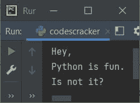
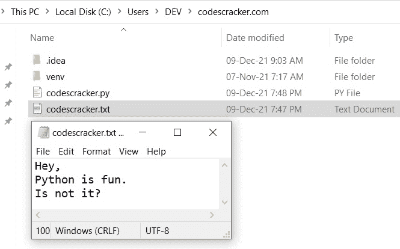
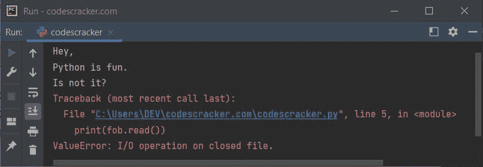
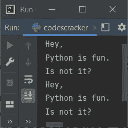
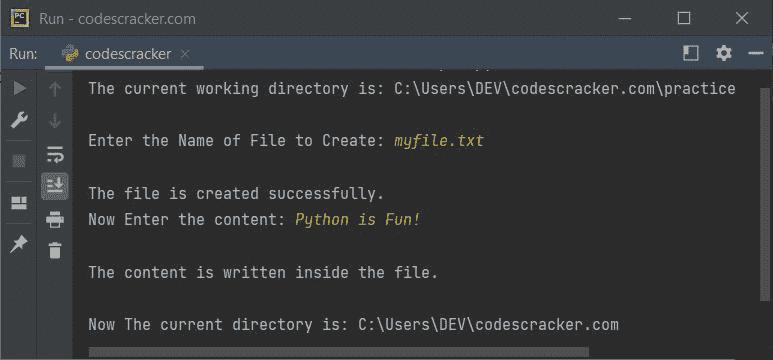

# 带关键字/语句的 Python

> 原文：<https://codescracker.com/python/python-with-keyword.htm>

Python 中带有关键字或语句的**用于获取某个资源，该资源得到 释放，同时留下带有上下文的*。例如:***

```
with open("codescracker.txt") as fob:
    content = fob.read()
    print(content)
```

下面给出的快照显示了上述 Python 程序产生的示例输出，展示了带有 关键字或语句的**:**



您会看到这个输出，因为在当前目录(保存上述 Python 程序或源代码的目录)中，有一个名为 **codescracker.txt** 的文件，其内容与 示例输出中显示的内容相同。以下是在示例运行中使用的当前目录的快照，打开了相同的文件:



如果使用 [open()](/python/python-open-function.htm) ， 打开文件时没有提供打开模式，那么默认情况下，文件以 **r** 模式打开，用于读取文件。

在用上下文离开*后，文件自动关闭。因此，如果您试图在带有上下文*的*之后再次执行 **fob.read()** ，那么您将会在输出上看到一个错误，因为一旦我们从带有上下文的**中退出 ，文件就会自动关闭。例如，下面的程序:***

```
with open("codescracker.txt") as fob:
    content = fob.read()
    print(content)

print(fob.read())
```

生产:



但是可以创建相同的程序，而不使用带有语句或关键字的**，以这种方式:**

```
fob = open("codescracker.txt")
print(fob.read())

fob.seek(0)

print(fob.read())
```

**注意-**[seek()](/python/python-seek-function.htm)函数用于将文件 指针移动到文件的开头。

上述程序产生的输出是:



这是因为，在之前的程序中， *with* 语句获得了打开文件和 读取其内容的资源。因此，在从具有上下文的*中存在之后，资源被释放，因此 使用其名为 **fob** 的对象访问文件时，会产生一个错误，表示文件已关闭。但是在这个 程序中，文件是打开的，直到我们使用 [close()](/python/python-close-function.htm) 函数来 关闭文件。*

上下文管理器基本上是一个对象，它定义了在执行带有语句的*时要建立的运行时上下文。*

例如，open 语句本身就是一个上下文管理器。它打开一个文件，只要是在用语句的*上下文中执行，就保持文件打开，当然，在那里使用它。当你 离开上下文时，关闭它，不管你是因为异常还是仅仅在控制的常规流程中离开。*

这里是 Python 中的另一个示例程序，演示了带有语句的*:*

```
with open("codescracker.txt") as ifob, open("myfile.txt", "w") as ofob:
    for line in ifob:
        ofob.write(line)
    print("The content of 'codescracker.txt' is copied to 'myfile.txt'")
```

输出是:

```
The content of 'codescracker.txt' is copied to 'myfile.txt'
```

执行该程序后，在当前目录下创建一个名为 **myfile.txt** 的文件，并将 *codescracker.txt* 文件的 内容复制到其中。如果这个文件已经存在，那么它以前的 内容将被新内容替换。

Python 提供了 **contextlib** 模块，使用 **@contextmanager** 装饰器帮助构建你自己的上下文管理器。例如，下面的程序临时改变当前的工作目录， 使用那个目录工作，当工作完成后，再回到实际的当前目录，对于 程序。

```
from contextlib import contextmanager
import os

@contextmanager
def working_dir(workPath):
    cur_dir = os.getcwd()
    os.chdir(workPath)
    try:
        yield
    finally:
        os.chdir(cur_dir)

with working_dir("C:/Users/DEV/codescracker.com/practice"):
    print("The current working directory is:", os.getcwd())
    # your code to work with this directory

print("\nNow The current directory is:", os.getcwd())
```

输出是:

```
The current working directory is: C:\Users\DEV\codescracker.com\practice

Now The current directory is: C:\Users\DEV\codescracker.com
```

其中**C:\ Users \ DEV \ codescracker . com**是上述程序的实际当前目录，因为我们的 Python 程序的源代码就保存在这个目录中。

由于该目录是临时更改的，因此您可以使用您的代码来处理该目录。一旦我们从带有结构的**中退出，我们就回到原来的当前目录。让我们 创造一个完整的实际例子来演示这个概念:**

```
from contextlib import contextmanager
import os

@contextmanager
def working_dir(workPath):
    cur_dir = os.getcwd()
    os.chdir(workPath)
    try:
        yield
    finally:
        os.chdir(cur_dir)

with working_dir("C:/Users/DEV/codescracker.com/practice"):
    print("The current working directory is:", os.getcwd())
    print("\nEnter the Name of File to Create: ", end="")
    fileName = input()
    fo = open(fileName, "w")
    print("\nThe file is created successfully.")
    print("Now Enter the content: ", end="")
    content = input()
    fo.write(content)
    print("\nThe content is written inside the file.")

print("\nNow The current directory is:", os.getcwd())
```

下面是它的运行示例，使用用户输入的 **myfile.txt** 作为文件名， **Python 很有趣！**作为内容:



我不知道带有关键字的**在你的应用中有什么帮助，但是实际上带有**的**就是上面描述的 。**

**注-**[yield](/python/python-yield-keyword.htm)关键字与 [return](/python/python-return-keyword.htm) 相似，只是 *yield* 返回一个生成器。

执行上述程序后，输入与上述示例运行中提供的相同。一个用 **Python 命名为 **myfile.txt** 的文件好玩！**因为内容将在那个目录下创建，作为 **working_dir()** 函数的参数，在*之后加上*关键字，而不是在当前目录下创建，在当前目录下保存了 Python 源代码 。

[Python 在线测试](/exam/showtest.php?subid=10)

* * *

* * *