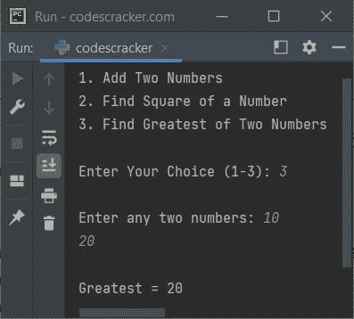

# Python return 关键字/语句

> 原文：<https://codescracker.com/python/python-return-keyword.htm>

Python 中的 **return** 关键字在我们需要退出一个有返回值或者没有返回值的[函数](/python/python-functions.htm) 时使用。例如:

```
def codes():
    print("First 'print()' inside 'codes()' function")
    return
    print("Second 'print()' inside 'codes()' function")

def cracker():
    return 10

def codescracker(a, b):
    return a+b

codes()
x = cracker()
print(x)
x = codescracker(10, 50)
print(x)
```

输出是:

```
First 'print()' inside 'codes()' function
10
60
```

在上面的程序中，下面的语句:

```
print("Second 'print()' inside 'codes()' function")
```

因为就在这条语句之前，使用了一条 **return** 语句或关键字。因此 程序流程从此功能中存在。

**注意-** 在**返回**语句后，剩余的语句将不被执行，如果可用的话， 在同一个函数内。

## Python return 关键字或语句示例

下面给出的程序是一个 **return** 语句的例子:

```
def add(x, y):
    return x+y

def square(x):
    return x*x

def great(x, y):
    if x>y:
        return x
    else:
        return y

print("1\. Add Two Numbers")
print("2\. Find Square of a Number")
print("3\. Find Greatest of Two Numbers")

print("\nEnter Your Choice (1-3): ", end="")
choice = int(input())

if choice == 1 or choice == 3:
    print("\nEnter any two numbers: ", end="")
    a = int(input())
    b = int(input())

if choice == 1:
    print("\nResult =", add(a, b))

elif choice == 2:
    print("\nEnter a Number: ", end="")
    num = int(input())
    print("\nResult =", square(num))

elif choice == 3:
    print("\nGreatest =", great(a, b))

else:
    print("\nInvalid Choice!")
```

下面给出的快照显示了示例运行，用户输入 **3** 作为选择， **10** 和 **20** 作为 两个数字:



[Python 在线测试](/exam/showtest.php?subid=10)

* * *

* * *