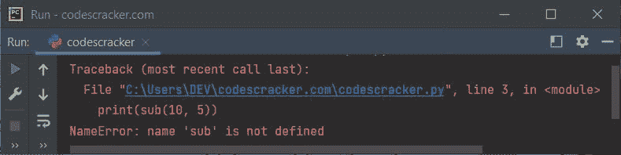
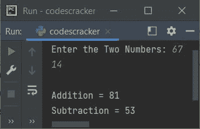

# Python `from`关键字

> 原文：<https://codescracker.com/python/python-from-keyword.htm>

Python 中的 **from** 关键字是在我们需要[从一个模块中导入](/python/python-import-statement.htm) 一个指定段的时候使用的。例如:

```
from operator import add

print(add(10, 20))
```

输出是:

```
30
```

在上面的程序中，我没有导入包含大量方法的整个[操作符模块](/python/python-operator-module.htm)、 ，而是只导入了**的 add()** 操作符模块。

因为我只从**操作符**模块中导入了 **add()** 。因此，如果我们访问同一个模块的 其他方法，如 **sub()** ，那么我们将得到一个错误，表明 **sub** 没有被 定义。例如:

```
from operator import add

print(sub(10, 5))
```

下面给出的快照显示了上述程序产生的输出:



因此，请确保导入模块的特定部分。也就是说，如果您确定不使用同一个模块的任何其他方法，那么只导入模块的特定方法。

但是如果你从上面的程序中替换下面的语句:

```
from operator import add
```

下面给出了声明:

```
import operator
```

那么输出将是:

```
5
```

**重要的**——输出当然会是 5，但是你需要使用 **sub()** 连同**操作符**， 如下:

```
print(operator.sub(10, 5))
```

## Python `from`关键字示例

让我们创建另一个程序来演示 Python 中来自关键字的**。但是在创建程序之前，使用来自**关键字**的 ，我们先创建一个程序，没有来自**的**。**

#### 没有 from 关键字

```
import operator

print("Enter the Two Numbers: ", end="")
a = int(input())
b = int(input())

print("\nAddition =", operator.add(a, b))
print("Subtraction =", operator.sub(a, b))
```

#### 带有 from 关键字

```
from operator import add, sub

print("Enter the Two Numbers: ", end="")
a = int(input())
b = int(input())

print("\nAddition =", add(a, b))
print("Subtraction =", sub(a, b))
```

#### 两个程序的输出



在这个程序中，由于我已经导入了**运算符**模块的两个特定方法，因此这两个 方法直接用它的名字来调用。也就是说，不使用 *operator.methodName* 格式。

[Python 在线测试](/exam/showtest.php?subid=10)

* * *

* * *