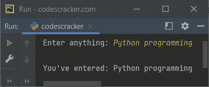
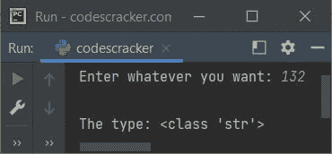
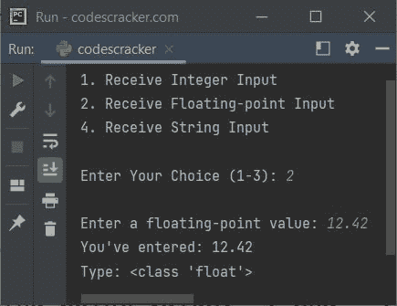

# Python `输入()`函数

> 原文：<https://codescracker.com/python/python-input-function.htm>

Python 中的 **input()** 函数在我们需要在程序运行时接收来自用户的数据时使用。 例如:

```
print("Enter anything: ", end="")
val = input()
print("\nYou've entered:", val)
```

下面给出的快照显示了用户输入 **Python 编程**的上述程序的示例运行



上面的程序也可以这样创建:

```
val = input("Enter anything: ")
print("\nYou've entered:", val)
```

您仍然会得到与上一个程序相同的输出。

**注-****input()**函数是 Python 中使用最多的函数之一。每当我们在 Python 应用程序中需要用户输入时， **input()** 函数就会出现。

## Python `input()`函数语法

Python 中 **input()** 函数的语法是:

```
input(prompt)
```

**提示**参数是可选的。该参数的默认值为**无**。如果你是 专业人士，那么你可以使用这个参数直接使用 **input()** ， 在输出上打印消息，而不是使用 [print ()](/python/python-print-statement.htm) ，一个程序的额外语句。

**input()函数-** 用于从标准输入中读取一个[字符串](/python/python-strings.htm)。尾部换行符被去除

**提示参数-** 在读取输入之前，提示字符串将打印在标准输出上，没有尾随换行符 。

## Python `input()`函数示例

下面是 Python 中 **input()** 函数的一个例子。因为 **input()** 函数将每个 输入的值都视为字符串类型，因此:

```
val = input("Enter whatever you want: ")
print("\nThe type:", type(val))
```

使用用户输入 **132** (一个整数值)产生以下输出:



**注-** 了解接收整数、浮点、字符串等。输入，参考 [Python 代码获取用户](/python/program/python-program-get-input-from-user.htm)的输入。

下面是本文的最后一个程序，使用 **input()** 函数在程序运行时 接收用户输入。

```
print("1\. Receive Integer Input")
print("2\. Receive Floating-point Input")
print("4\. Receive String Input")
print("\nEnter Your Choice (1-3): ", end="")
choice = int(input())

if choice == 1:
    print("\nEnter an integer value: ", end="")
    val = int(input())
    print("You've entered:", val)
    print("Type:", type(val))

elif choice == 2:
    print("\nEnter a floating-point value: ", end="")
    val = float(input())
    print("You've entered:", val)
    print("Type:", type(val))

elif choice == 3:
    print("\nEnter a string input: ", end="")
    val = input()
    print("You've entered:", val)
    print("Type:", type(val))

else:
    print("\nInvalid choice!")
```

以用户输入 **2** 作为选择， **12.42** 作为浮点值的示例运行如下面给出的快照所示:



[Python 在线测试](/exam/showtest.php?subid=10)

* * *

* * *