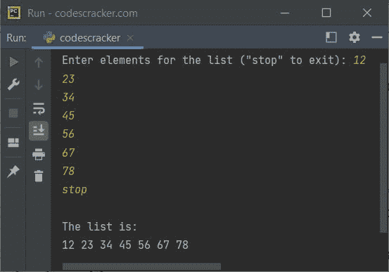
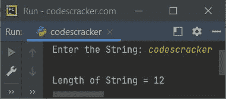

# Python `len()`关函数

> 原文：<https://codescracker.com/python/python-len-function.htm>

Python 中的 **len()** 函数用于查找一个序列的长度，如 [list](/python/python-lists.htm) 、 [tuple](/python/python-tuples.htm) 、 [string](/python/python-strings.htm) 、bytes、 [range](/python/python-range-function.htm) 或一个 集合，如 [dictionary](/python/python-dictionary.htm) 、 [set](/python/python-set.htm) 、frozenset。

基本上，函数 **len()** 返回一个对象中可用的项数。例如:

```
mylist = [32, 3, 65, 76]
print("Length of list =", len(mylist))

mytuple = (42, 53, 6)
print("Length of tuple =", len(mytuple))

mystring = "codescracker"
print("Length of string =", len(mystring))

mybyte = b'codescracker'
print("Length of byte =", len(mybyte))

myrange = range(15)
print("Length of range =", len(myrange))

mydictionary = {"Name": "Maradona", "Country": "Argentina"}
print("Length of dictionary =", len(mydictionary))

myset = {32, 43, 54, 56, 76, 8}
print("Length of set =", len(myset))

myfrozenset = frozenset(mytuple)
print("Length of frozenset =", len(myfrozenset))
```

上面的 Python 程序产生的输出，演示了 **len()** 函数，确切地说是:

```
Length of list = 4
Length of tuple = 3
Length of string = 12
Length of byte = 12
Length of range = 15
Length of dictionary = 2
Length of set = 6
Length of frozenset = 3
```

## Python `len()`关函数语法

在 Python 中使用 **len()** 函数的语法是:

```
len(objectName)
```

## Python `len()`关函数示例

当我们在 Python 中使用 list 或 string 时， **len()** 函数使用了大部分时间。这里有一个例子:

```
print("Enter elements for the list (\"stop\" to exit): ", end="")
mylist = []
while True:
    val = input()
    if val != "stop":
        mylist.append(val)
    else:
        break

print("\nThe list is:")
for i in range(len(mylist)):
    print(mylist[i], end=" ")
print()
```

上述程序产生的输出带有一些输入和**“stop”**最后，停止接收输入，在下面给出的快照中显示为 :



看 **len()** 函数有多重要。在上面的程序中，列表继续存储 用户输入的元素，直到用户输入**“停止”**。但是在屏幕上打印列表的元素时， **len()** 函数查找列表的长度，使用循环打印列表的所有元素。

这只是一个简单的程序。 **len()** 函数有多种用法。下面是另一个例子，在 Python 中使用字符串时使用 **len()** 函数:

```
print("Enter the String: ", end="")
str = input()
print("\nLength of String =", len(str))
```

使用用户输入的示例运行 **codescracker** 作为字符串，如下图所示:



**len()** 函数可以在很多程序中使用。但是永远记住，它只是用来寻找 一个物体的长度。

[Python 在线测试](/exam/showtest.php?subid=10)

* * *

* * *