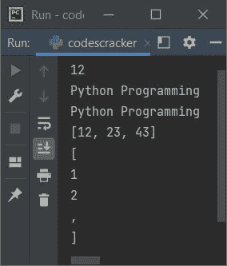

# Python `str()`函数

> 原文：<https://codescracker.com/python/python-str-function.htm>

当我们需要将一个值转换成一个[字符串](/python/python-strings.htm) 对象时，就会用到 Python 中的 **str()** 函数。例如:

```
a = 1234
x = str(a)
print(type(x))

a = 2.43
x = str(a)
print(type(x))

a = [12, 32, 43]
x = str(a)
print(type(x))
```

输出是:

```
<class 'str'>
<class 'str'>
<class 'str'>
```

## Python `str()`函数语法

Python 中 **str()** 函数的语法是:

```
str(object, encoding, errors)
```

其中**对象**是指将要转换成**字符串**对象的对象。**编码** 参数用于应用特定的编码方法，同时将对象转换为字符串。并且**错误** 参数用于指定在解码失败的情况下做什么。

**注-****编码**和**误差**参数可选。

**注-****编码**默认值为 **UTF-8** 。而**错误**的默认值是 **严格**。

**重要** -如果**编码**参数用于指定编码方式，那么**对象** 必须是一个[字节](/python/python-bytes.htm)对象。

**错误**参数的值可以是以下任何一个:

*   **严格**-**误差的默认值**。失败时，它会引发一个名为 **UnicodeDecodeError** ， 的异常
*   **忽略**-**错误**的这个值用于忽略无法编码的 Unicode
*   **替换** -该值用于将无法编码的 Unicode 替换为问号(？)
*   **xmlcharrefreplace** -该值用于插入 XML 字符引用，而不是 不可编码的 Unicode
*   **反斜杠** -该值用于插入转义序列 **\uNNNN** ，而不是 不可编码的 Unicode
*   **namereplace** -该值也用于插入一个转义序列 **\N{...}** ，而不是 无法编码的 Unicode

## Python `str()`函数示例

下面是 Python 中 **str()** 函数的一个例子:

```
a = 12
x = str(a)
print(x)

a = b'Python Programming'
x = str(a, 'ascii')
print(x)

a = b'Python Programming'
x = str(a, 'U7', 'replace')
print(x)

a = [12, 23, 43]
x = str(a)
print(x)
print(x[0])
print(x[1])
print(x[2])
print(x[3])
print(x[-1])
```

下面给出的快照显示了上述程序产生的示例输出，演示了 Python 中的 **str()** 函数 :



[Python 在线测试](/exam/showtest.php?subid=10)

* * *

* * *