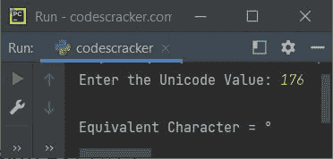
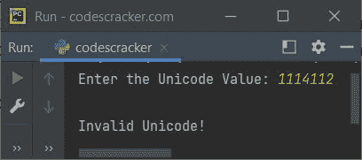
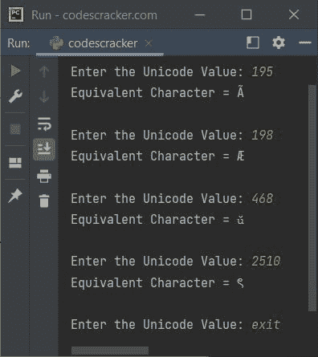

# Python `chr()`函数

> 原文：<https://codescracker.com/python/python-chr-function.htm>

Python 中的 **char()** 函数返回指定的 [Unicode](/computer-fundamental/unicode-characters.htm) 对应的字符。例如:

```
x = 65
print(chr(x))

x = 100
print(chr(x))

x = 51
print(chr(x))

x = 40
print(chr(x))
```

该程序产生的输出是:

```
A
d
3
(
```

## Python `chr()`函数语法

Python 中 **chr()** 函数的语法是:

```
chr(x)
```

其中 x 是指 Unicode 的整数值。 **x** 的取值范围从 0 到 1114111。如果指定的 值( **x** 的值)超出范围，则 **chr()** 抛出异常。异常 名称是**值错误**。

## Python `chr()`函数示例

下面是 Python 中 **chr()** 函数的一个例子。该程序在程序运行时从用户处接收 Unicode 值，并打印对应于给定 Unicode 的等价字符:

```
print("Enter the Unicode Value: ", end="")
u = int(input())
ch = chr(u)
print("\nEquivalent Character =", ch)
```

下面给出的快照显示了上述程序的运行示例，用户输入 **176** 作为值，使用 **chr()** 函数查找并打印 对应的字符:



Unicode **176** 对应一个**度( <sup>o</sup> )** 。下面是另一个由 **chr()** 函数引发的处理 **ValueError** 异常的例子:

```
print("Enter the Unicode Value: ", end="")
u = int(input())
try:
    ch = chr(u)
    print("\nEquivalent Character =", ch)
except ValueError:
    print("\nInvalid Unicode!")
```

下面是用户输入 **1114112** 的运行示例:



这是上述程序的修改版本。该程序继续执行从用户处获取 Unicode 值并打印等效字符，直到用户键入**退出**并点击`ENTER`键:

```
while True:
    print("\nEnter the Unicode Value: ", end="")
    u = input()
    if u == "exit":
        break
    else:
        try:
            u = int(u)
            try:
                ch = chr(u)
                print("Equivalent Character =", ch)
            except ValueError:
                print("Invalid Unicode!")
        except ValueError:
            print("Only integer value is allowed!")
```

下面给出的快照显示了该程序的示例运行，其中包含一些用户输入:



[Python 在线测试](/exam/showtest.php?subid=10)

* * *

* * *