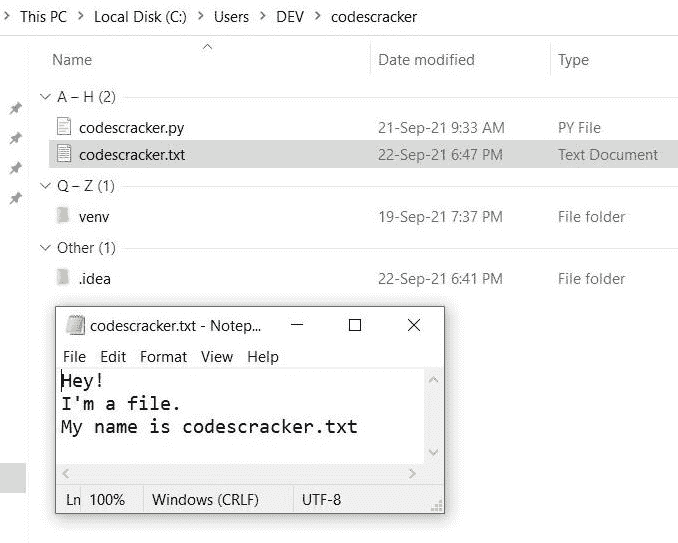
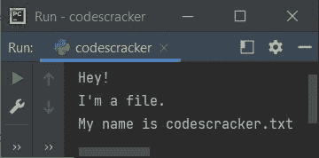
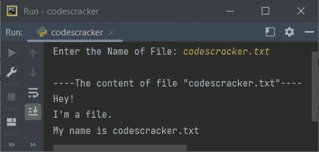
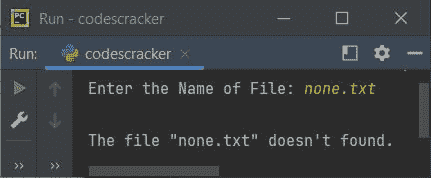
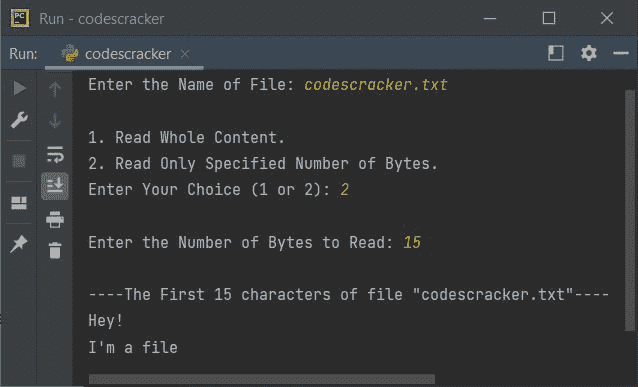

# Python read()

> 原文：<https://codescracker.com/python/python-read-function.htm>

Python 中的 **read()** [函数，用于](/python/python-functions.htm) [读取文件](/python/program/python-program-read-file.htm)的内容。该函数用于一次从文件中读取整个 内容或前几个字节的内容。

## Python read()语法

在 Python 中使用 **read()** 函数的语法是:

```
fo.read(size)
```

其中 **fo** 表示文件对象或处理程序。如果您想从文件中读取第一个指定数量的字节(字符)的 ，则必须在**字节**中给出**大小**。一个字节等于一个字符。

**注-****read()**的**大小**参数可选。也就是说，如果您不向 **read()** 函数提供任何参数，那么文件的全部内容都会被返回。

## Python read()示例

在继续这个程序之前，让我创建一个包含一些内容的文件，比如 **codescracker.txt** 。将这个文件保存在 当前目录下。这是当前目录的快照，包括打开的新创建的文件。



现在让我们用 Python 创建一个程序，它使用 **read()** 函数来读取这个新创建的文件的内容:

```
fo = open("codescracker.txt", "r")
content = fo.read()
print(content)
```

上述程序产生的输出将是文件 **codescracker.txt** 中可用的内容，如下面给出的 快照所示，该快照是我执行该程序时拍摄的:



在上面的程序中，下面两条语句:

```
content = fo.read()
print(content)
```

也可以替换为下面给出的单个语句:

```
print(fo.read())
```

现在让我们修改上面的程序，它在运行时从用户那里接收文件名。该程序还处理给定文件不存在时引发的错误:

```
print("Enter the Name of File: ", end="")
filename = input()
try:
    fo = open(filename, "r")
    print("\n----The content of file \"", filename, "\"----", sep="")
    print(fo.read())
except FileNotFoundError:
    print("\nThe file \"", filename, "\" doesn't found.", sep="")
```

下面是它在用户输入 **codescracker.txt** 下的运行示例:



下面是另一个使用用户输入 **none.txt** 运行的示例，这是一个不存在的文件:



**注-**[end =](/python/python-end.htm)和 [sep=](/python/python-sep.htm) ，这两个参数 都用来改变 [print()](/python/python-print-statement.htm) 的默认行为。要详细了解，请参考 的单独教程。

## Python read()带有大小参数

现在让我们创建另一个程序，它只从前面创建的同一文件中读取特定字节的内容。例如，下面给出的程序只从文件中读取前 10 个字节:

```
fo = open("codescracker.txt", "r")
print(fo.read(10))
```

下面是它的示例输出:


看，文件返回了前 10 个字符。这 10 个字符是:

1.  H
2.  e
3.  y
4.  ！
5.  (换行符)
6.  我
7.  '
8.  m
9.  (一个空格)
10.  a

现在让我再次修改上面的程序，用 Python 编写完整的 **read()** ，包括处理无效的 输入:

```
print("Enter the Name of File: ", end="")
filename = input()
try:
    fo = open(filename, "r")
    print("\n1\. Read Whole Content.")
    print("2\. Read Only Specified Number of Bytes.")
    print("Enter Your Choice (1 or 2): ", end="")
    try:
        choice = int(input())
        if choice==1:
            print("\n----The content of file \"", filename, "\"----", sep="")
            print(fo.read())
        elif choice==2:
            print("\nEnter the Number of Bytes to Read: ", end="")
            try:
                nob = int(input())
                print("\n----The First ", nob, " characters of file \"", filename, "\"----", sep="")
                print(fo.read(nob))
            except ValueError:
                print("\nInvalid Input!")
    except ValueError:
        print("\nInvalid Input!")
except FileNotFoundError:
    print("\nThe file \"", filename, "\" doesn't found.", sep="")
```

上述程序的示例运行，文件名输入为相同的文件，选择作为 **2** 读取指定的字节数， 然后 **15** 作为要读取的字节数，如下面给出的快照所示:



[Python 在线测试](/exam/showtest.php?subid=10)

* * *

* * *