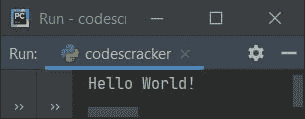
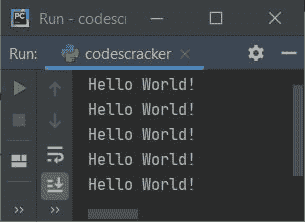
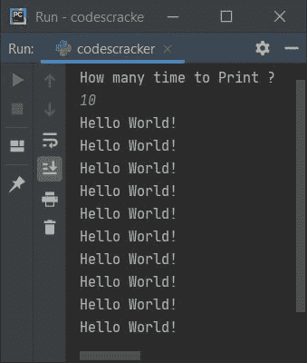
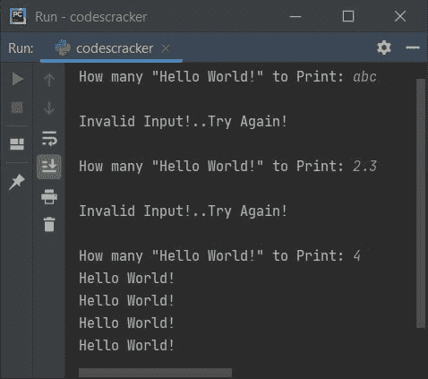

# Python 程序：打印 Hello World

> 原文：<https://codescracker.com/python/program/python-program-print-hello-world.htm>

在本文中，我用 Python 创建了一些程序来打印 **Hello World** 。以下是用 Python 编写的 Hello World 程序列表:

*   最简单的 Hello World 程序
*   使用**为**循环打印 Hello World 5 次
*   打印 Hello World **n** 次。 **n** 的值必须由用户输入
*   使用函数打印 Hello World
*   使用类和对象

## Python 中最简单的 Hello World 程序

要用 Python 打印 **"Hello World"** ，使用 **print()** 语句，将" Hello World "放入其中，就像下面给出的程序中的 一样。问题是，**写一个 Python 程序打印 Hello World！**。以下是它的答案:

```
print("Hello World!")
```

该 Python 程序产生的输出如下面给出的快照所示:



**注意-****print()**方法输出括号内的内容。这个东西可能是直接的 字符串，或者任何对象或变量等。

下面给出的程序也打印 **Hello World** ，但不是直接打印。也就是说，这个程序使用一个名为 **text** 的变量 来存储字符串，并使用 **print()** 来打印该字符串。让我们来看看:

```
text = "Hello World!"

print(text)
```

这个程序产生与前一个程序完全相同的输出。

## 使用`for`循环打印 Hello World 5 次

这个程序用**代替**循环打印五次 **Hello World** 。

```
for i in range(5):
    print("Hello World!")
```

下面是它的示例输出:



**注-** 任何写在 **#** (散列)符号后的都是注释。所以编译器会忽略它。

**注意-****range()**方法返回一系列值。默认情况下，从 0 开始，每次 递增 1，并在作为其参数提供的值之前继续。

因此，在上述程序中， **i** 的值从 0 开始，一直延续到 4，但是当其值变为 等于 5 时，意味着条件评估为假，程序结束。这样， 循环中的语句执行了五次，因此， **Hello World** 被打印了五次。

## 打印 Hello World n 次

在这个程序中，字符串 **Hello World** 被打印，直到给定值。例如，如果用户输入 20，那么 程序将打印 **Hello World** 二十次。

```
print("How many time to Print ? ")
tot = int(input())

for i in range(tot):
    print("Hello World!")
```

下面是用户输入 **10** 打印 **Hello World 的示例运行。**十次:



**注意-** 如果你发现很难理解 Python 中用户输入的接收，那么 离开这个东西，参考[从用户那里得到输入](/python/program/python-program-get-input-from-user.htm)， 这个 Python 程序系列的下一个或第二个程序，得到关于这个主题的所有东西。在学习了关于接收用户输入的 之后，回到这里来更舒服地继续这个系列。

#### 先前程序的修改版本

这是前一个程序的修改版本。 **end=** 用于跳过在 **print()** 中放置的 之后插入新行。 **try-except** 用于处理无效输入。

```
while True:
    print("How many \"Hello World!\" to Print: ", end="")
    try:
        tot = int(input())
        for i in range(tot):
            print("Hello World!")
        break
    except ValueError:
        print("\nInvalid Input!..Try Again!\n")
```

下面是一些无效和有效输入的运行示例:



因为所有东西都放在一个 **`while`循环**中，并且我已经给出了 **while** 循环的条件，因为 布尔值等于**真值**。这意味着，条件总是评估为真，因此要退出程序， 我必须使用一些关键字，如 **break** 来终止循环的执行

**尝试**的说法，即:

```
tot = int(input())
```

声明，代码只希望用户输入一个整数值，但是如果用户输入一个不是有效输入的数字(非整数值，例如，浮点、字符、字符串等)。)，然后代码抛出一个错误(ValueError)，程序流程转到除了主体之外的**，并打印一条类似 **无效输入的消息！..再试一次！**，程序流程再次进入**状态，同时**循环**

由于条件总是评估为真，因此直到用户输入有效的输入，循环继续。也就是说，当用户输入一个正确的值，比如说 **8** ，那么 **Hello World** 被打印八次，然后 使用 **break** 关键字，循环的执行被终止。

## 使用函数打印 Hello World

这个程序使用一个用户定义的函数来完成与前一个程序相同的工作。让我们先来看看这个程序:

```
def myfun():
    print("Hello World!")

myfun()
```

产生与本文第一个程序输出完全相同的输出。使用以下语句:

```
myfun()
```

我已经调用了这个函数，所以编译器会检查这个函数。由于该函数已经在本程序中使用 **def** 关键字定义，因此在函数内部声明，即:

```
print("Hello World!")
```

得到执行，打印 **Hello World！**。

## 使用类打印 Hello World

这是最后一个程序，使用名为 **CodesCracker** 的类创建。类是 Python 面向对象的特性。

```
class CodesCracker:
    def myfun(self):
        print("Hello World!")

obj = CodesCracker()
obj.myfun()
```

要访问一个类的成员函数，比如说 **myfun()** ，我们必须使用该类的一个对象。因此，名为 **obj** 的对象是由 **CodesCracker** 类创建的 。使用这个对象，我已经使用**点(.)**运算符。

**注意-****自身**作为第一个参数在 Python 中的类的每个成员函数中都是必需的。它传递对象的地址。

#### 其他语言的相同程序

*   [Java 打印 Hello World](/java/program/java-program-print-hello-world.htm)
*   [C 打印你好世界](/c/program/c-program-print-hello-world.htm)
*   [C++ 打印 Hello World](/cpp/program/cpp-program-print-hello-world.htm)

[Python 在线测试](/exam/showtest.php?subid=10)

* * *

* * *