# 从用户处获取输入的 Python 程序

> 原文：<https://codescracker.com/python/program/python-program-get-input-from-user.htm>

在开始 Python 程序系列之前，这篇文章非常重要。因为几乎每个程序都需要理解如何用 Python 接收用户输入。

因此，我在这里用 Python 创建了一些程序，展示了如何以多种方式从用户那里接收输入。以下是 Python 中接收用户输入的程序列表:

*   接收用户输入的最简单方式
*   从用户处获取整数输入
*   浮点输入
*   字符输入
*   字符串输入
*   接收连续输入

## 接收用户输入的最简单方式

要在 Python 中获得用户的输入，必须使用 **input()** 函数。您可以使用 功能接收任何类型的输入。问题是，**编写一个 Python 程序来接收用户输入**。以下是它的答案:

```
print("Enter anything: ")
val = input()

print("\nYou've entered:", val)
```

该程序最初会产生以下输出:

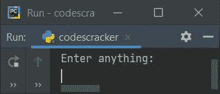

现在输入任何东西，比如说 **codescracker** ，按`ENTER`键将输入的值初始化为 **val** 变量，然后打印 **val** 变量的值作为输出，如下图所示:

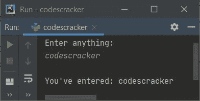

**重要-** <u>通过 **input()** 接收到的任何东西，都被当作一个字符串类型的值，默认为</u>。

这是另一个使用用户输入运行的示例， **235** :

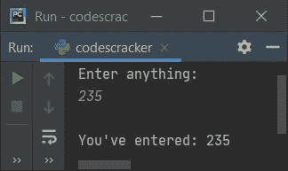

**注意-** 从上面的示例输出中可以看出， **235** 是一个数字，但是被当作一个字符串，就像在双引号中一样，那就是**【235】**。

可以肯定的是，使用下面的程序使用 **type()** 方法检查变量 **val** 的类型。

```
print("Enter anything: ", end="")
val = input()

print("\nType of Variable \'val\' =", type(val))
```

这个程序产生一个输出，等于，**变量类型‘val’=<类‘str’>**，而 不管用户输入什么值。以下是其示例运行，用户输入与之前的示例 运行相同:

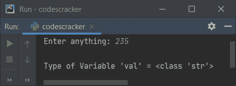

如您所见，用户输入了一个整数值，但被视为字符串类型的值。因此只接收特定类型的值，如整数、字符串等。然后参考下面给出的相应程序。

## 从用户处获取整数输入

这个程序在运行时只接收来自用户的整型值。

```
print("Enter an Integer Value: ", end="")
val = int(input())

print("\nYou've entered:", val)
```

以下是用户输入的运行示例， **54** 为整数值:

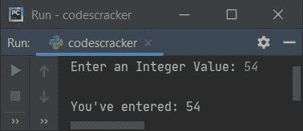

#### 如果用户输入了无效的输入怎么办？

如果用户输入一个非整数值，则上述程序会产生一个错误，如下图所示:

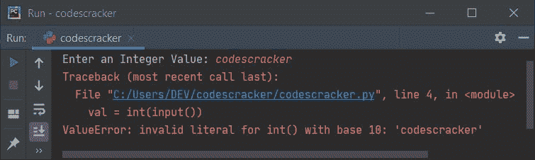

要使用用户定义的代码处理无效输入，请用下面给出的程序修改之前的程序:

```
print("Enter an Integer Value: ", end="")

try:
    val = int(input())
    print("\nYou've entered:", val)

except ValueError:
    print("\nInvalid Input!")
```

当用户以 **python** (一个字符串类型值)的形式提供输入时，该程序产生以下输出:

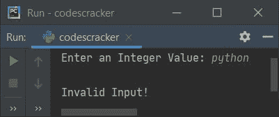

修改上述程序，并创建一个程序，继续接收用户的输入，直到输入一个正确的值。程序是这样的:

```
while True:
    print("Enter an Integer Value: ", end="")
    try:
        val = int(input())
        break

    except ValueError:
        print("\nInvalid Input!..Try Again!\n")
        continue

print("\nYou've entered:", val)
```

下面是它在用户输入下的运行示例，第一次是 **hello** ，第二次是 **23.43** ，第三次是 **23codescracker** ，第四次是 **23403** (有效的一个):

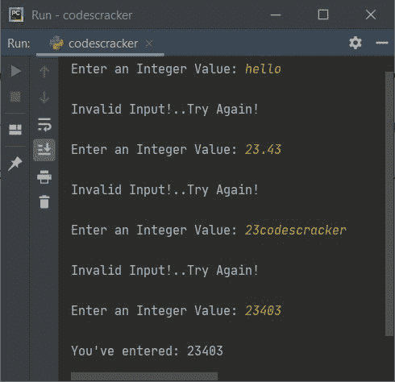

**注意-****int()**方法将字符串转换为整型值。

try 中的第一条语句是:

```
val = int(input())
```

声明，代码只要从用户输入一个整数值。但是如果用户输入了一个无效的输入，那么代码会引发一个错误(ValueError)，程序流会转到它的**而不是**的主体，并打印一条错误消息，无论 用户定义了什么或者编写了什么消息来打印。

现在如果你想检查变量 **val** 的类型，那么使用下面的程序:

```
print("Enter an Integer Value: ", end="")
val = int(input())

print("\nType of Variable \'val\' =", type(val))
```

下面是它的示例输出，整数输入表示为 **54** :

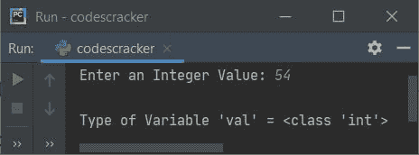

## 从用户处获取浮点输入

这个程序从用户那里接收浮点值。浮点值是包含小数部分的值。例如 **12.4** 、 **23.43** 等。

```
print("Enter a Floating-point Value: ", end="")

try:
    val = float(input())
    print("\nYou've entered:", val)

except ValueError:
    print("\nInvalid Input!")
```

下面是它使用浮点输入 **10.56** 运行的示例:

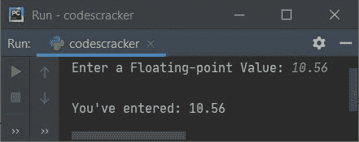

**注意-** 如果你输入一个整数值，而不是一个浮点值，那么整数值被视为一个浮点值 。例如，如果用户输入 **10** ，那么 **10** 变成 **10.0** 。

## 获取用户输入的字符

这个程序接收用户输入的字符。字符输入是指长度为 1 的任何东西。

```
print("Enter a Floating-point Value: ", end="")

val = input()

if len(val)==1:
    print("\nYou've entered:", val)
else:
    print("\nInvalid Input!")
```

下面是使用字符输入 **#** 运行的示例:

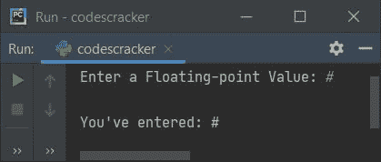

## 从用户处获取字符串输入

要从用户那里获得字符串输入，使用 **input()** 的方式与本文第一个程序中使用的方式类似。 的问题是，**写一个 Python 程序来接收用户的字符串输入。**这个问题的答案如下:

```
print("Enter String: ", end="")
val = input()
print("\nYou've entered:", val)
```

下面是它的示例运行，输入字符串说**欢迎来到 codescracker.com**:

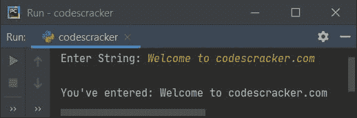

## 如何采取连续输入

为了在 Python 中接收来自用户的连续输入，使用**列表**和**用于**循环，如下面给出的程序 所示。问题是，**使用 for 循环**编写一个 Python 程序来接收 10 个用户输入。以下节目是它的回答:

```
print("Enter 10 Values: ")

nums = []
for i in range(10):
    val = input()
    nums.insert(i, val)

print("\nYou've entered:")
for i in range(10):
    print(nums[i], end=" ")

print()
```

下面是它的示例运行，有 10 个值，比如 **10，20，codes，45.24，30，40，cracker，50，60，70** :

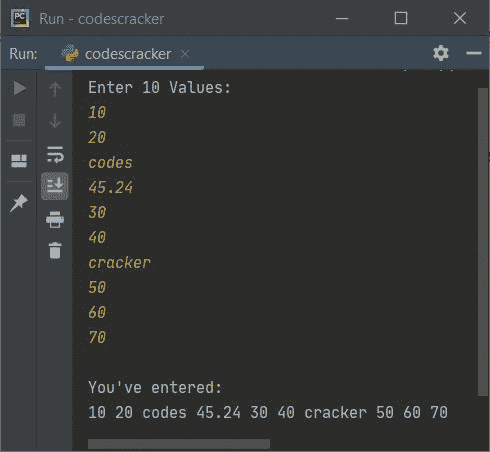

**注意-****插入 ()** 方法将一个元素插入到列表中所需的索引号处。第一个参数 指定了索引号，而它的第二个参数引用了必须插入的值

**注意-****range()**方法返回一系列值。默认情况下，它从 0 开始，每次将 递增 1。继续，直到值作为其参数传递。

以下声明:

```
nums = []
```

声明定义了一个空列表。以下代码块的预演(来自上述程序):

```
for i in range(10):
    val = input()
    nums.insert(i, val)
```

就像这样:

*   最初 **i=0** ，由于 **i** 的值小于 10，因此条件评估为真， 程序流程进入循环内部
*   在循环内部，使用 **input()** ，用户接收到一个值，并将其初始化为 **val** 变量
*   并且使用下面的语句:
    `nums.insert(i, val)`
    声明，变量 **val** 的值被初始化为 **nums[i]** 或 **nums[0]**
*   现在， **i** 的值增加。因此 **i=1** ，由于 **1** 小于 10，因此条件再次评估 为真，并且程序流程再次进入循环
*   再次接收一个值，并将其初始化为 **val** 。并且 **val** 的值被存储到 **nums[I]**或 **nums[1]**
*   这样，我从用户那里接收了 10 个输入，并逐一存储到一个名为 **nums[]** 的列表中
*   也就是说，第一个数字存储在 **nums[0]** ，第二个存储在 **nums[1]** ，第三个存储在**nums[2]** 等等，直到第十个存储在 **nums[9]**

现在使用另一个**为**循环打印列表 **nums[]** 的值，如上面给出的程序所示。

要仅接收特定类型的连续值，如仅接收整数值，请参考以下程序:

```
print("Enter 10 Values: ")

nums = []
for i in range(10):
    while True:
        try:
            val = int(input())
            nums.insert(i, val)
            break
        except ValueError:
            print("Invalid Input!..Try Again!")
            continue

print("\nYou've entered:")
for i in range(10):
    if i<9:
        print(nums[i], end=", ")
    else:
        print(nums[i])
```

这是它的示例运行，用户输入与之前的示例运行相同，但有一些额外的值。由于上述程序将**字符串** 和**浮点**值视为无效值，因此我必须输入一些有效的整数值来代替它们:

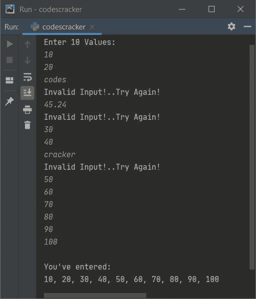

## 接收给定大小的连续用户输入

这个程序允许用户输入大小和值。例如，如果用户输入 **8** 作为尺寸，则允许输入任意 8 个值。

```
print("How many values to enter ? ", end="")
try:
    tot = int(input())
    print("Enter " +str(tot)+ " Values: ", end="")
    mylist = []
    for i in range(tot):
        mylist.append(input())

    print("\nYou've entered:")
    for i in range(tot):
        if i<(tot-1):
            print(mylist[i], end=", ")
        else:
            print(mylist[i])

except ValueError:
    print("\nInvalid Input!")
```

下面是本文的最后一个运行示例，其中 **5** 是要输入的值的大小，而 **11、22、33、44、55** 是五个数字:

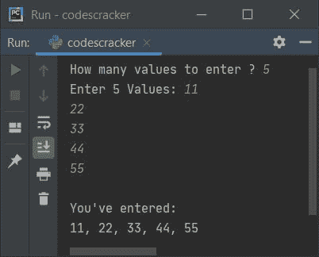

#### 其他语言的相同程序

*   [Java 从用户处获取输入](/java/program/java-program-take-input-from-user.htm)
*   [C 获取用户的输入](/c/program/c-program-receive-input.htm)
*   [C++从用户那里获得输入](/cpp/program/cpp-program-receive-input.htm)

[Python 在线测试](/exam/showtest.php?subid=10)

* * *

* * *