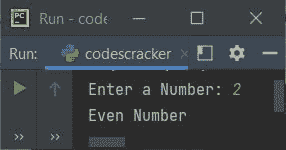

# Python 程序：检查偶数或奇数

> 原文：<https://codescracker.com/python/program/python-program-check-even-odd.htm>

在本文中，我们用 Python 创建了一些程序，来检查用户在运行时输入的数字是偶数还是奇数。以下是程序列表:

*   检查偶数或奇数的简单程序
*   使用单行 if-else 检查偶数或奇数
*   使用功能
*   使用类

## 检查偶数或奇数

问题是，**写一个 Python 程序，检查给定的数是偶数还是奇数。**下面是它的回答:

```
print("Enter the Number: ")
num = int(input())
if num%2==0:
    print("\nIt is an Even Number")
else:
    print("\nIt is an Odd Number")
```

下面是它的运行示例:


现在提供输入，比如说 **27** 并按`ENTER`键检查它是偶数还是奇数:


#### 先前程序的修改版本

在这个程序中，我们使用了 **end=** 来跳过使用 **print()** 自动换行的打印。名为 **str()** 的 方法用于将任何类型的值转换为字符串类型，因为使用 **+** 运算符的串联只发生在相似的类型中。因此，我们将 **num** 的值转换为字符串:

```
print("Enter a Number: ", end="")
num = int(input())

if num%2==0:
    print("\n" +str(num)+ " is an Even Number")
else:
    print("\n" +str(num)+ " is an Odd Number")
```

下面是用户输入的示例运行:


### 使用单行 if-else 检查偶数或奇数

这个程序使用单行 if-else 语句来检查和打印一个数字是偶数还是奇数:

```
print("Enter a Number: ", end="")
num = int(input())

print("Even Number") if num%2==0 else print("Odd Number")
```

下面是用户输入的示例运行， **2** :



## 使用函数检查偶数或奇数

这个程序做的工作和前面的程序一样，但是使用了一个名为 **checkEvenOdd()** 的用户定义函数。 该函数以用户输入的数字作为参数，打印消息，无论它是偶数还是奇数:

```
def checkEvenOdd(n):
    print("Even Number") if n % 2 == 0 else print("Odd Number")

print("Enter a Number: ", end="")
num = int(input())

checkEvenOdd(num)
```

#### 具有返回值的相同程序

这个程序类似于以前的程序。唯一的区别是，如果 number 是偶数，函数返回值 1，而不是从函数内部打印消息。

```
def checkEvenOdd(n):
    if n%2==0:
        return 1

print("Enter a Number: ", end="")
num = int(input())

chk = checkEvenOdd(num)
if chk==1:
    print("Even Number")
else:
    print("Odd Number")
```

## 使用类检查偶数或奇数

这是最后一个程序，使用**类**创建，这是 Python 的一个面向对象的特性，用来做同样的工作，即检查偶数或奇数。

```
class CodesCracker:
    def checkEvenOdd(self, n):
        if n%2==0:
            return 1

print("Enter a Number: ", end="")
num = int(input())

obj = CodesCracker()
chk = obj.checkEvenOdd(num)
if chk==1:
    print("Even Number")
else:
    print("Odd Number")
```

名为 **obj** 的对象是在 **CodesCracker()** 类中创建的。所以这个对象可以使用**点(.)**运算符。其余的事情类似于一个普通的函数。

#### 其他语言的相同程序

*   [Java 奇偶校验](/java/program/java-program-check-even-odd.htm)
*   [C 检查偶数或奇数](/c/program/c-program-check-even-odd.htm)
*   [C++ 奇偶校验](/cpp/program/cpp-program-check-even-odd.htm)

[Python 在线测试](/exam/showtest.php?subid=10)

* * *

* * *