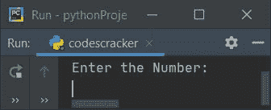
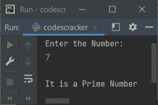
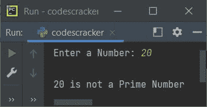
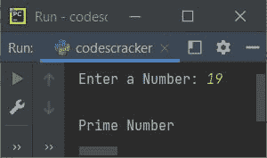

# Python 程序：检查质数

> 原文：<https://codescracker.com/python/program/python-program-check-prime-number.htm>

在本文中，我们用 Python 创建了一些程序，来检查用户输入的数字是否是质数。以下是程序列表:

*   使用循环的**检查质数**
*   使用 **while 循环**
*   使用功能
*   使用类

**注-** 任何自然数比如说 **x** 都可以称为素数，如果它大于 1 并且不是 两个较小自然数的乘积。例如， **2，3，5，7，11，13** 等。都是质数

## 使用 for 循环检查质数

要在 Python 中检查一个给定的数字是否是质数，您必须要求用户输入该数字，然后检查并打印消息，如下面给出的程序所示:

问题是，**写一个 Python 程序用 for 循环**检查素数。以下是它的答案:

```
print("Enter the Number: ")
num = int(input())

p = 0
for i in range(2, num):
    if num%i==0:
        p = 1
        break

if p==0:
    print("\nIt is a Prime Number")
else:
    print("\nIt is not a Prime Number")
```

下面是它的初始输出:



现在提供输入，比如说 **7** ，按`ENTER`键检查它是否是一个质数。 打印消息，如下图所示:



**范围(2，num)** 声明循环的*主体中存在的语句，执行 **num-2** 次，值 **i** 从 2 到比 **num** 的值小 1。*

#### 先前程序的修改版本

这是前一个程序的修改版本。在这个程序中，我们添加了两个额外的东西。那就是**端**和**串()**。**端**用于跳过自动换行的打印。而 **str()** 是 用于将任意类型的值转换为字符串类型:

```
print("Enter a Number: ", end="")
n = int(input())

p = 0
for i in range(2, n):
    if n%i==0:
        p = 1
        break

if p==0:
    print("\n" +str(n)+ " is a Prime Number")
else:
    print("\n" +str(n)+ " is not a Prime Number")
```

以下是用户输入的运行示例， **20** 为编号:



## 使用 while 循环检查质数

该程序使用 **while 循环**完成与前一程序相同的工作。由于 *while 循环*中只有 包含条件检查部分，因此初始化部分写在循环之前，更新 部分包含在其主体内。其余的事情与程序类似，使用**作为循环**

```
print("Enter a Number: ", end="")
n = int(input())

p = 0
i = 2
while i<n:
    if n%i==0:
        p = 1
        break
    i = i+1

if p==0:
    print("\n" +str(n)+ " is a Prime Number")
else:
    print("\n" +str(n)+ " is not a Prime Number")
```

## 使用函数检查质数

这个程序使用了一个用户定义的函数， **checkPrime()** 。它接收一个数字作为参数，如果参数的值是一个质数，则返回 1 。也就是说，如果参数的值可以被从 2 到比数字本身小 1 的任意数字整除，函数返回 1。

```
def checkPrime(x):
    for i in range(2, x):
        if n%i==0:
            return 1

print("Enter a Number: ", end="")
n = int(input())

p = checkPrime(n)
if p==1:
    print("\n" +str(n)+ " is not a Prime Number")
else:
    print("\n" +str(n)+ " is a Prime Number")
```

这个程序产生与前一个程序相似的输出。

## 使用类检查质数

这个程序是使用名为 **CodesCracker** 的**类**创建的，这是 Python 的一个面向对象的特性。

```
class CodesCracker:
    def checkPrime(self, x):
        for i in range(2, x):
            if n%i==0:
                return 1

print("Enter a Number: ", end="")
n = int(input())

obj = CodesCracker()
p = obj.checkPrime(n)
if p==1:
    print("\nNot Prime Number")
else:
    print("\nPrime Number")
```

下面是用户输入的示例运行， **19** :



在 **CodesCracker** 类中创建一个对象 **obj** ，通过**dot(**check prime()**访问其成员函数。)**运算符。

#### 其他语言的相同程序

*   [Java 检查质数与否](/java/program/java-program-check-prime.htm)
*   [C 检查质数是否正确](/c/program/c-program-check-prime.htm)
*   [C++是否检查质数](/cpp/program/cpp-program-check-prime.htm)

[Python 在线测试](/exam/showtest.php?subid=10)

* * *

* * *