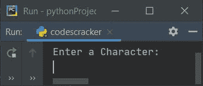
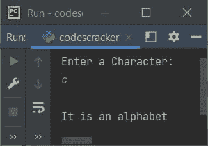
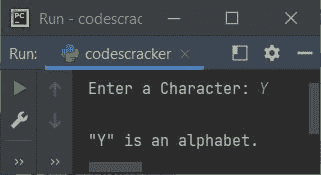
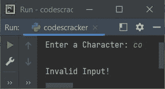

# Python 程序：是否检查字母表

> 原文：<https://codescracker.com/python/program/python-program-check-alphabet.htm>

在本文中，我们用 Python 创建了一些程序，来检查用户输入的字符是否是字母。以下是程序列表:

*   简单的程序来检查字母或没有
*   使用用户定义的函数检查字母表
*   使用类

## 是否检查字母表

要在 Python 中检查给定的字符是否是字母，您必须要求用户输入一个字符，然后检查并打印它是否是字母，如下面给出的程序所示:

```
print("Enter a Character: ")
c = input()
if c>='a' and c<='z':
    print("\nIt is an alphabet")
elif c>='A' and c<='z':
    print("\nIt is an alphabet")
else:
    print("\nIt is not an alphabet!")
```

下面给出的快照显示了这个 Python 程序产生的初始输出:



现在提供输入，比如说 **c** 并按`ENTER`键检查它是否是一个字母，然后 相应地打印信息，如下图所示:



#### 先前程序的修改版本

在这个程序中，我们使用了 **end** 来跳过使用 **print()** 自动换行的打印。 **\"** 用于在输出画面上打印 **"** 。其余的事情与前面的程序相似。

```
print("Enter a Character: ", end="")
c = input()
if len(c)>1:
    print("\nInvalid Input!")
else:
    if c>='a' and c<='z':
        print("\n\"" +c+ "\" is an alphabet.")
    elif c>='A' and c<='z':
        print("\n\"" +c+ "\" is an alphabet.")
    else:
        print("\n\"" +c+ "\" is not an alphabet!")
```

下面是它在用户输入下的运行示例:



下面是另一个使用用户输入运行的示例:



## 使用函数检查字母表

这个程序做的工作和前面的程序一样，但是使用了一个名为 **checkAlphabet()** 的用户自定义函数。 该函数接收用户输入的字符作为参数，如果是字母表，则返回 1，否则 返回 2。第三种情况是 0，即当输入长度大于 1 时，该函数返回 0。

```
def checkAlphabet(x):
    if len(x) > 1:
        return 0
    else:
        if c >= 'a' and c <= 'z':
            return 1
        elif c >= 'A' and c <= 'z':
            return 1
        else:
            return 2

print("Enter a Character: ", end="")
c = input()

chk = checkAlphabet(c)
if chk==1:
    print("\n\"" +c+ "\" is an alphabet.")
elif chk==2:
    print("\n\"" +c+ "\" is not an alphabet!")
else:
    print("\nInvalid Input!")

```

这个程序产生与前一个程序相似的输出。

## 使用类检查字母表

这是最后一个使用类(Python 的一个面向对象的特性)检查用户输入的字符是否是字母的程序。

```
class CodesCracker:
    def checkAlphabet(self, x):
        if len(x) > 1:
            return 0
        else:
            if c >= 'a' and c <= 'z':
                return 1
            elif c >= 'A' and c <= 'z':
                return 1
            else:
                return 2

print("Enter a Character: ", end="")
c = input()

obj = CodesCracker()
chk = obj.checkAlphabet(c)

if chk==1:
    print("\n\"" +c+ "\" is an alphabet.")
elif chk==2:
    print("\n\"" +c+ "\" is not an alphabet!")
else:
    print("\nInvalid Input!")
```

在访问类 **CodesCracker** 的成员函数(checkAlphabet())之前，我们必须创建一个对象。因此 我们创建了一个名为 **obj** 的对象，通过这个对象，我们使用**点(。)**运算符。

#### 其他语言的相同程序

*   [Java 是否检查字母表](/java/program/java-program-check-alphabet.htm)
*   [C 检查字母是否正确](/c/program/c-program-check-alphabet.htm)
*   [C++是否检查字母表](/cpp/program/cpp-program-check-alphabet.htm)

[Python 在线测试](/exam/showtest.php?subid=10)

* * *

* * *