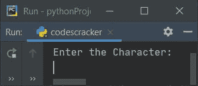
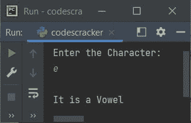
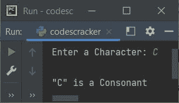
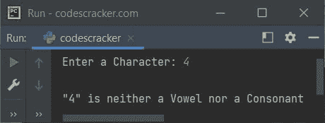
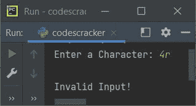
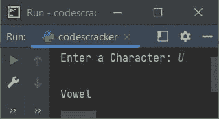

# Python 程序：检查元音或辅音

> 原文：<https://codescracker.com/python/program/python-program-check-vowel.htm>

在本文中，我们用 Python 创建了一些程序来检查用户在运行时输入的字符是否是元音字母。以下是程序列表:

*   使用 **if-else** 检查元音
*   使用**列表**
*   使用**功能**
*   使用**类**

在创建这些程序之前，让我们先简单了解一下元音。

### 什么是元音？

如果一个字的发音是由人发出的，当气息从口中流出而不被牙齿、嘴唇或舌头阻挡时。那么这个字就叫做元音。

### 元音列表

基本上有 5 个元音字母:

*   阿、英、意、欧、友
*   阿、英、意、欧、友

**注-** 有时候， **y** 也可以叫元音。但是所有在这里创建的程序都是基于五个元音。

## 使用 if-else 检查元音或辅音

要检查 Python 中输入的字符是元音还是辅音，您必须让用户输入一个字符，然后检查并打印消息，如下面给出的程序所示。问题是，**写一个 Python 程序来检查元音或辅音**。以下是它的答案:

```
print("Enter the Character: ")
c = input()

if c=='a' or c=='e' or c=='i' or c=='o' or c=='u':
    print("\nIt is a Vowel")
elif c=='A' or c=='E' or c=='I' or c=='O' or c=='U':
    print("\nIt is a Vowel")
else:
    print("\nIt is a Consonant")
```

下面是这个 Python 程序产生的初始输出:



现在提供输入 say **e** 作为字符，按`ENTER`键检查它是元音 还是辅音，并打印消息，如下图所示:



#### 先前程序的修改版本

这是前一个程序的修改版本。这个程序使用 **end** 来跳过使用 **print()** 的自动 换行符的打印。 **len()** 方法用于计算字符串的长度。并且 **\"** 用于 在输出上打印 **"** 。

```
print(end="Enter a Character: ")
c = input()

size = len(c)
if size>1:
    print("\nInvalid Input!")
else:
    if (c>='a' and c<='z') or (c>='A' and c<='Z'):
        if c=='a' or c=='e' or c=='i' or c=='o' or c=='u':
            print("\n\"" +c+ "\" is a Vowel")
        elif c=='A' or c=='E' or c=='I' or c=='O' or c=='U':
            print("\n\"" +c+ "\" is a Vowel")
        else:
            print("\n\"" +c+ "\" is a Consonant")
    else:
        print("\n\"" +c+ "\" is neither a Vowel nor a Consonant")
```

下面是用户输入的示例运行， **C** :



下面是另一个使用用户输入运行的示例， **4** :



这里是最后一个使用用户输入 **4r** (两个字符(字符串)输入)运行的示例:



## 使用列表检查元音或辅音

这个程序是使用 list 创建的。也就是说，我们已经创建了一个包含所有元音的名为**元音**的列表。 因此，通过这个列表，我们检查了用户输入的字符，无论这个字符是否出现在使用中的**的列表中。**

```
print(end="Enter a Character: ")
c = input()

size = len(c)
if size>1:
    print("\nInvalid Input!")
else:
    if (c>='a' and c<='z') or (c>='A' and c<='Z'):
        vowels = ['a', 'e', 'i', 'o', 'u', 'A', 'E', 'I', 'O', 'U']
        if c in vowels:
            print("\n\"" +c+ "\" is a Vowel")
        else:
            print("\n\"" +c+ "\" is a Consonant")
    else:
        print("\n\"" +c+ "\" is neither a Vowel nor a Consonant")
```

这个程序产生与前一个程序完全相同的输出。

## 使用函数检查元音或辅音

这个程序使用了一个名为**check yummer()和**的用户自定义函数来检查用户输入的字符是一个母音还是一个子音。

```
def checkVowel(x):
    if (c>='a' and c<='z') or (c>='A' and c<='Z'):
        vowels = ['a', 'e', 'i', 'o', 'u', 'A', 'E', 'I', 'O', 'U']
        if c in vowels:
            return 1
        else:
            return 2

print(end="Enter a Character: ")
c = input()

size = len(c)
if size>1:
    print("\nInvalid Input!")
else:
    chk = checkVowel(c)
    if chk==1:
        print("\nVowel")
    elif chk==2:
        print("\nConsonant")
    else:
        print("\nNeither Vowel nor Consonant")
```

下面是用户输入的示例运行， **U** :



如果作为参数传递的字符是元音，函数**check emotal()**返回 1，否则返回 2。

## 使用类检查元音或辅音

这是本文的最后一个程序，使用 class(Python 的一个面向对象的特性)创建。这个程序做的工作和前一个程序一样。

```
class CodesCracker:
    def checkVowel(self, x):
        if (c>='a' and c<='z') or (c>='A' and c<='Z'):
            vowels = ['a', 'e', 'i', 'o', 'u', 'A', 'E', 'I', 'O', 'U']
            if c in vowels:
                return 1
            else:
               return 2

print(end="Enter a Character: ")
c = input()

size = len(c)
if size>1:
    print("\nInvalid Input!")
else:
    ob = CodesCracker()
    chk = ob.checkVowel(c)
    if chk==1:
        print("\nVowel")
    elif chk==2:
        print("\nConsonant")
    else:
        print("\nNeither Vowel nor Consonant")
```

这个程序产生与前一个程序相似的输出。创建类 **CodesCracker** 的对象 **ob** 来访问其名为**check 元音()**到**点(。)**运算符

#### 其他语言的相同程序

*   [Java 检查元音与否](/java/program/java-program-check-vowel.htm)
*   [C 检查元音与否](/c/program/c-program-check-vowel.htm)
*   [C++ 是否检查元音](/cpp/program/cpp-program-check-vowel.htm)

[Python 在线测试](/exam/showtest.php?subid=10)

* * *

* * *