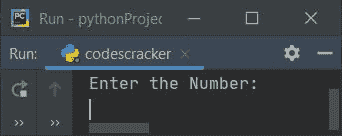
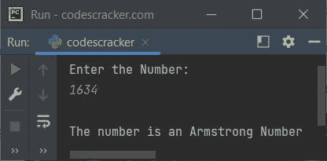
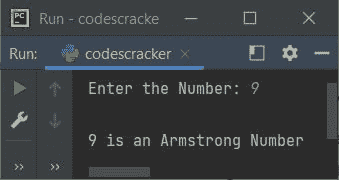
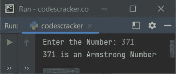
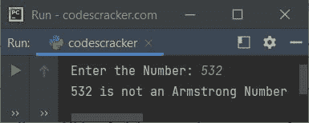

# Python 程序检查阿姆斯特朗数

> 原文：<https://codescracker.com/python/program/python-program-check-armstrong.htm>

在本文中，我们用 Python 创建了一些程序，来检查用户输入的数字是否是阿姆斯特朗数字。以下是程序列表:

*   检查阿姆斯特朗数的简单程序
*   使用用户定义的函数检查阿姆斯特朗数
*   使用类

但是在开始这些程序之前，让我先弄清楚阿姆斯特朗号是什么。

### 什么是阿姆斯特朗数？

一种数，它等于它自己的位数之和，其中每个位数都是位数的幂。例如，153 是一个阿姆斯特朗数，因为:

```
153 = 13 + 53 + 33
    = 1 + 125 + 27
    = 153
```

结果(153)等于数字(153)本身。所以这是一个阿姆斯特朗数字。

**注-** 因为 153 中的位数总数是 3，所以它的每一位数都提高到 3 的幂。

**注-** 1，2，3，4，5，6，7，8，9 都是阿姆斯特朗号码。

## 检查阿姆斯特朗号

在 Python 中，要检查给定的数字是否是 Armstrong 数字，您必须要求用户输入一个数字，然后应用公式，检查并打印消息，如下面给出的程序所示:

```
print("Enter the Number: ")
num = int(input())

temp = num
noOfDigit = 0
res = 0
while num>0:
    num = int(num/10)
    noOfDigit = noOfDigit+1
num = temp
while num>0:
    rem = num%10
    pow = 1
    i = 0
    while i<noOfDigit:
        pow = pow*rem
        i = i+1
    res = res+pow
    num = int(num/10)

if res==temp:
    print("\nThe number is an Armstrong Number")
else:
    print("\nThe number is not an Armstrong Number")
```

下面是这个 Python 程序产生的初始输出:



现在提供输入，比如说 **1634** 并按`ENTER`键来检查它是否是阿姆斯壮号码 。以下是使用该用户输入运行的示例:



由于 **1634** 是一个四位数，因此:

```
1634 = 14 + 64 + 34 + 44
     = 1 + 1296 + 81 + 256
     = 1297 + 337
     = 1634
```

在上面的程序中，下面的代码块:

```
while num>0:
num = int(num/10)
noOfDigit = noOfDigit+1
```

用于计算给定数字的总位数。这个代码块与用户输入 **1634** 的模拟运行如下:

*   初始值， **noOfDigit=0**
*   条件， **num > 0** 或 **1634 > 0** 评估为真，因此程序流程转到*的主体 ，同时循环*并执行这两条语句
*   即 **int(num/10)** 或 **int(1634/10)** 或 **163** 初始化为 **num** 。所以现在**num = 163**T20。并且 **noOfDigit+1** 或 **0+1** 或 **1** 被初始化为 **noOfDigit** 。所以 **noOfDigit=1**
*   现在 *while 循环*的条件再次被求值，即条件**num>0**T7】或 **163 > 0** 再次被求值为真，因此程序流程进入其主体内部并再次执行 那两条语句。这个过程继续，直到条件评估为假
*   这样，在退出该循环后，变量 **noOfDigit** 将其值保持为 4

和下面的代码块:

```
while i<noOfDigit:
    pow = pow*rem
    i = i+1
```

用于计算 digit 的数字幂的值。这段代码的预演如下:

*   初始值， **i=0** ， **noOfDigit=4** ， **pow=1** ， **rem=4** (因为 **1634%10** 等于 4)
*   现在条件 **i < noOfDigit** 或 **0 < 4** 评估为真，因此程序流 进入其主体内部
*   并且 **pow*rem** 或 **1*4** 或 **4** 被初始化为 **pow** 。所以 **pow=4** ，并且 **I**的值增加 1。所以 **i=1**
*   由于第二次求值时的条件，即 **i < noOfDigit** 或 **1 < 4** 再次求值为 真，因此程序流程再次进入循环，并且 **pow*rem** 或 **4*4** 或**16**T19 被初始化为 **pow** 。所以 **pow=16** 而 **i 的值=2**
*   同样在第三次，条件 **i < noOfDigit** 或 **2 < 4** 评估为真，因此 程序流程再次进入循环内部。这个过程一直持续到条件评估为真
*   这样，在退出该循环后，变量 **pow** 保持其值为**1 * 4 * 4 * 4 * 4**T10】或 **256** 等于**4<sup>4</sup>T9】，其中 4 是数字(数字的最后一位)，4 的幂表示数字的总数**

在第二次评估该代码块后， **pow** 保存其值为 **3*3*3*3** ，在第三次**pow**T12】保存 **6*6*6*6** ，在第四次 **pow** 保存 **1*1*1*1**

#### 先前程序的修改版本

这是前一个程序的修改版本。在这个程序中，我们使用了 **end** 来跳过使用 **print()** 的 自动换行符的打印。而 **rem**noOfDigit** 则用来求**rem<sup>noOfDigit</sup>** 的值。 **str()** 方法用于将任何类型的值转换为字符串类型的值。其余的事情与前面的程序相似。

```
print("Enter the Number: ", end="")
num = int(input())

temp = num
noOfDigit = len(str(num))
res = 0
while num>0:
    rem = num%10
    res = res + (rem ** noOfDigit)
    num = int(num/10)

if res==temp:
    print("\n" +str(temp)+ " is an Armstrong Number")
else:
    print("\n" +str(temp)+ " is not an Armstrong Number")
```

下面是用户输入的示例运行， **9** :



## 使用函数检查 Armstrong 编号

这个程序使用名为 **checkArmstrongNum()** 的自定义函数来检查 用户在运行时输入的数字是否是阿姆斯壮数字。

```
def checkArmstrongNum(x):
    noOfDigit = 0
    res = 0
    temp = x
    while x>0:
        x = int(x/10)
        noOfDigit = noOfDigit + 1
    x = temp
    while x>0:
        rem = x%10
        pow = 1
        i = 0
        while i<noOfDigit:
            pow = pow * rem
            i = i + 1
        res = res + pow
        x = int(x/10)

    if res==temp:
        return 1
    else:
        return 0

print("Enter the Number: ", end="")
num = int(input())

chk = checkArmstrongNum(num)
if chk==1:
    print(num, "is an Armstrong Number")
else:
    print(num, "is not an Armstrong Number")
```

下面是用户输入的示例运行， **371** :



这是另一个使用用户输入运行的示例， **532** :



## 使用类检查 Armstrong 编号

这是本文最后一个使用类(Python 的一个面向对象特性)检查 Armstrong 数的程序:

```
class CodesCracker:
    def checkArmstrongNum(self, x):
        noOfDigit = len(str(x))
        res = 0
        temp = x
        while x>0:
            rem = x%10
            res = res + (rem ** noOfDigit)
            x = int(x/10)
        if res==temp:
            return 1
        else:
            return 0

print("Enter the Number: ", end="")
num = int(input())

obj = CodesCracker()
chk = obj.checkArmstrongNum(num)

if chk==1:
    print(num, "is an Armstrong Number")
else:
    print(num, "is not an Armstrong Number")
```

创建一个类型为 **CodesCracker** 类的对象 **obj** 来访问其名为 **checkArmstrongNum()** 的成员函数。)运算符。

#### 其他语言的相同程序

*   [Java 检查阿姆斯特朗与否](/java/program/java-program-find-armstrong-number.htm)
*   [C 检查阿姆斯特朗与否](/c/program/c-program-find-armstrong-number.htm)
*   [C++检查阿姆斯特朗与否](/cpp/program/cpp-program-find-armstrong-number.htm)

[Python 在线测试](/exam/showtest.php?subid=10)

* * *

* * *