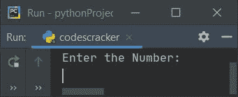
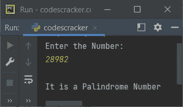
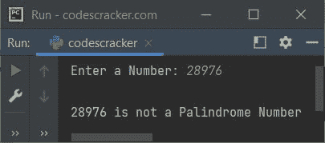
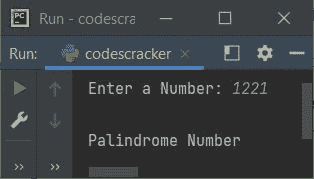

# Python 程序：检查回文数

> 原文：<https://codescracker.com/python/program/python-program-check-palindrome.htm>

在本文中，我们用 Python 创建了一些程序，来检查用户输入的数字是否是回文数字。以下是程序列表:

*   简单的程序来检查回文号码或没有
*   使用函数检查回文数
*   使用类

在开始这些程序之前，让我们简单地了解一下回文数。

### 什么是回文数？

回文数是一个倒数等于该数本身的数。例如，121 的倒数等于数字本身，因此 121 可以称为回文数。而 123 不是回文数，因为它的逆 321 不等于数本身。

## 在 Python 中检查回文数

在 Python 中，要检查一个给定的数字是否是回文数字，你必须要求用户输入一个数字，现在[反转数字](/python/program/python-program-find-reverse-of-number.htm)并将 与原始数字进行比较，以检查回文数字，如下面给出的程序所示:

```
print("Enter the Number: ")
num = int(input())
rev = 0
temp = num
while temp>0:
    rem = temp%10
    rev = rem + (rev*10)
    temp = int(temp/10)
if rev==num:
    print("\nIt is a Palindrome Number")
else:
    print("\nIt is not a Palindrome Number")
```

下面是这个 Python 程序产生的初始输出:



现在提供输入，比如说 **28982** ，按`ENTER`键检查是否是回文号 ，如下图所示:



#### 先前程序的修改版本

在这个程序中， **end** 用于跳过自动换行的打印。使用 **str()** 将任何类型的值转换为字符串类型，使用 **+** 连接字符串:

```
print("Enter a Number: ", end="")
n = int(input())
rv = 0
t = n
while t>0:
    rm = t % 10
    rv = rm + (rv * 10)
    t = int(t / 10)
if rv==n:
    print("\n" + str(n) + " is a Palindrome Number")
else:
    print("\n" + str(n) + " is not a Palindrome Number")
```

下面是用户输入的运行示例， **28976** :



## 使用函数检查回文数

这个程序使用**checkpalindome()**，一个用户定义的函数，接收一个数字，如果 的倒数等于数字(参数的值)本身，则返回 1。

因此，我们将用户输入的值作为参数传递给这个函数。因此，它的返回值被初始化为 **chk** 。因此，在比较 **chk** 的 值时。也就是说，如果它包含 1，就意味着这个数是一个回文数，否则这个数就不是回文数。

```
def checkPalindrome(x):
    t = x
    v = 0
    while t>0:
        r = t%10
        v = r + (v*10)
        t = int(t/10)
    if v==x:
        return 1

print("Enter a Number: ", end="")
n = int(input())

chk = checkPalindrome(n)
if chk==1:
    print("\n" + str(n) + " is a Palindrome Number")
else:
    print("\n" + str(n) + " is not a Palindrome Number")
```

这个程序产生与前一个程序相似的输出。

## 使用类检查回文数

这个节目和以前的节目不太一样。唯一的区别是，该函数被转换成类 **CodesCracker** 的成员函数。因此，要访问名为**check 回文()**， 的成员函数，我们必须创建一个对象，比如类 **CodesCracker** 的 **obj** 。现在使用这个对象通过使用**点(.)**操作员:

```
class CodesCracker:
    def checkPalindrome(self, x):
        t = x
        v = 0
        while t>0:
            r = t%10
            v = r + (v*10)
            t = int(t/10)
        if v==x:
            return 1

print("Enter a Number: ", end="")
n = int(input())

obj = CodesCracker()
chk = obj.checkPalindrome(n)

if chk==1:
    print("\nPalindrome Number")
else:
    print("\nNot a Palindrome Number")
```

下面是用户输入的示例运行， **1221** :



#### 其他语言的相同程序

*   [Java 检查回文与否](/java/program/java-program-check-palindrome.htm)
*   [C 检查回文与否](/c/program/c-program-palindrome-number.htm)
*   [C++检查回文与否](/cpp/program/cpp-program-palindrome-number.htm)

[Python 在线测试](/exam/showtest.php?subid=10)

* * *

* * *