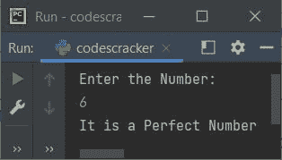

# Python 程序：检查完全数

> 原文：<https://codescracker.com/python/program/python-check-perfect-number.htm>

创建本文是为了介绍 Python 中的程序，该程序检查用户输入的数字是否是完美的数字。下面是本文涉及的程序列表:

*   使用循环的**检查完全数**
*   在循环时使用**检查完全数**

### 什么是完美的数字？

一个完全数是一个等于它的正约数之和的数，不包括这个数本身。即数字 **6** 有除数 1、2、3(不包括 6 本身)。而 **1+2+3** 等于 6。因此 6 是一个 完全数。

## 使用`for`循环检查完全数

问题是，**用 Python 写一个程序，用`for`循环**检查一个数是否是完美的。以下是它的答案:

```
print("Enter the Number:")
num = int(input())
sum = 0
for i in range(1, num):
  if num%i==0:
    sum = sum+i
if num==sum:
  print("It is a Perfect Number")
else:
  print("It is not a Perfect Number")
```

下面是它的运行示例:


现在输入如 **6** ，按`ENTER`键检查并打印是否是一个完整的 数字，如下图所示:



#### 先前程序的修改版本

这是之前程序的修改版本，使用 **end=** 和 **str()** 。其余的事情几乎与之前的 程序相似。 **end=** 用于跳过自动换行的打印。而 **str()** 将任意类型转换为字符串类型。

```
print(end="Enter the Number: ")
num = int(input())
sum = 0
for i in range(1, num):
  if num%i==0:
    sum = sum+i
if num==sum:
  print("\n" + str(num) + " is a Perfect Number")
else:
  print("\n" + str(num) + " is not a Perfect Number")
```

下面是用户输入 **496** 的运行示例:


## 使用`while`循环检查完全数

问题是，**写一个 Python 程序，用`while`循环**检查完全数。以下是它的答案:

```
print(end="Enter the Number: ")
num = int(input())
sum = 0
i = 1
while i<num:
  if num%i==0:
    sum = sum+i
  i = i+1
if num==sum:
  print("\n" + str(num) + " is a Perfect Number")
else:
  print("\n" + str(num) + " is not a Perfect Number")
```

[Python 在线测试](/exam/showtest.php?subid=10)

* * *

* * *